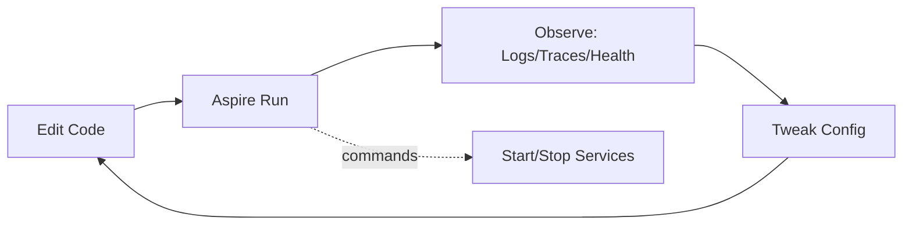

# 02_.NET Aspire: Developer Loop

**Learning Level**: Practitioner  
**Prerequisites**: .NET basics, containers, Aspire overview  
**Estimated Time**: 20–30 minutes

> Navigation: [Enterprise Development](./README.md) › Aspire: Developer Loop

## 🎯 Objectives

- Understand local app composition and run experience
- Learn hot reload, environment wiring, and troubleshooting basics

## Conceptual Foundation (Original Synthesis)

The developer loop is the tight, repeatable cycle you perform dozens of times per day:

1) change code → 2) run locally → 3) observe → 4) repeat.

With Aspire, this loop scales from a single process to a multi‑service composition without manual scripts.

### Core actions in the loop

- Compose: define which services and dependencies run locally
- Run: start the composition with coherent config and service discovery
- Observe: view logs, traces, and health from one place
- Iterate: hot reload changes with near‑instant feedback

## Dev Loop at a glance

```text
[Edit Code] -> [Aspire Run] -> [Observe Telemetry] -> [Tweak Config] -> [Edit Code]
      \
       '--> [Start/Stop Individual Services]
```



## Practical Steps

- Keep services small and fast to boot; prefer stateless in dev
- Use environment variables and appsettings.* for local overrides
- Turn on structured logging; include correlation IDs in logs
- Make “health” endpoints cheap and deterministic
- Script common tasks with a single entrypoint (e.g., task file)

## Hot Reload & Debugging

- Favor incremental builds and hot reload to cut feedback time
- Attach the debugger only when needed; rely on logs/traces for most cycles
- Use breakpoints sparingly; they stall the whole composition

## Troubleshooting Patterns

- If one service fails to start, run it alone with verbose logging
- Verify config sources by printing effective settings at startup
- Check health endpoints and dependency readiness before blaming code

## Minimal Checklist

- [ ] One command to run all local services
- [ ] Standardized ports and health endpoints
- [ ] Consistent logging format and correlation IDs
- [ ] Environment‑based config layering documented
- [ ] Quick way to run a single service in isolation

## Next Steps

- Continue with [03_Service Wiring & Dependencies](./03_DotNet-Aspire-Service-Wiring-and-Dependencies.md)
