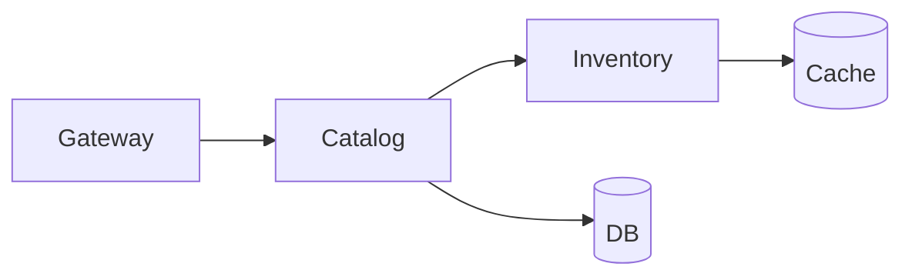

# 04_.NET Aspire: Observability

**Learning Level**: Practitioner  
**Prerequisites**: Aspire overview  
**Estimated Time**: 20–30 minutes

> Navigation: [Enterprise Development](./README.md) › Aspire: Observability

## 🎯 Objectives

- Establish a clean baseline for metrics, logs, and traces
- Correlate telemetry across services and dependencies
- Ship local telemetry to a dashboard; ship prod telemetry to a managed backend

## Conceptual Foundation (Original Synthesis)

Observability answers “What’s happening now?” and “Why did that happen?” without adding new code each time. In .NET Aspire, OpenTelemetry (OTel) provides a unified pipeline for:

- Traces: request flows across services (spans + attributes)
- Metrics: numeric time series (latency, throughput, errors)
- Logs: structured records with levels, scopes, and context

Aspire streamlines the dev experience (local dashboard + automatic wiring) and nudges production toward a consistent OTel export (to your chosen backend).

### Telemetry flow at a glance

```text
[App Code]
  → [OTel SDK: instrumentation for ASP.NET Core, HttpClient, SqlClient]
  → [Processors: sampling, filtering, enrichment]
  → [Exporter: Console (dev) | OTLP (collector) | Managed backend]
  → [Dashboard/Backend: local Aspire dashboard or hosted observability]
```

```mermaid
flowchart LR
  A[App Code] --> B[OpenTelemetry SDK]
  B --> C[Processors\n(sample, filter, enrich)]
  C --> D{Exporter}
  D --> E[Console (Dev)]
  D --> F[OTLP Collector]
  D --> G[Managed Backend]
  F --> H[Aspire Dashboard]
```

## Minimal Implementation Guide

### 1) Add OpenTelemetry to a service

Use the built-in extensions to capture traces and metrics. Keep exporters simple in dev; prefer OTLP for anything beyond local.

```csharp
// Program.cs
using OpenTelemetry;
using OpenTelemetry.Metrics;
using OpenTelemetry.Resources;
using OpenTelemetry.Trace;

var builder = WebApplication.CreateBuilder(args);

builder.Services.AddOpenTelemetry()
  .ConfigureResource(rb => rb.AddService(serviceName: "CatalogService"))
  .WithTracing(t => t
    .AddAspNetCoreInstrumentation()
    .AddHttpClientInstrumentation()
    .AddSqlClientInstrumentation()
    .AddOtlpExporter())
  .WithMetrics(m => m
    .AddAspNetCoreInstrumentation()
    .AddRuntimeInstrumentation()
    .AddProcessInstrumentation()
    .AddMeter("Catalog.Metrics")
    .AddOtlpExporter());

// Optional: structured logging with scopes
builder.Logging.ClearProviders();
builder.Logging.AddConsole(options => options.IncludeScopes = true);

var app = builder.Build();
app.MapGet("/health/live", () => Results.Ok());
app.Run();
```

Notes:

- Add resource attributes (service name, version, env) to separate services in the backend.
- Prefer OTLP exporter for portability; keep Console exporter for quick local checks.

### 2) Correlate logs with traces

Use scopes and W3C Trace Context so logs carry trace/span IDs automatically.

```csharp
// Any controller/service
private static readonly ActivitySource Activity = new("CatalogService");

public async Task<Product> GetProduct(string id, ILogger logger)
{
  using var span = Activity.StartActivity("GetProduct");
  using (logger.BeginScope(new Dictionary<string, object> { ["productId"] = id }))
  {
    logger.LogInformation("Fetching product");
    // downstream HTTP/SQL calls will inherit the trace context
    var product = await _repo.LoadAsync(id);
    span?.SetTag("result.found", product is not null);
    return product;
  }
}
```

### 3) Define a few helpful metrics

Start small: latency, throughput, error ratio (RED). Add domain counters when useful.

```csharp
// Metrics.cs
using System.Diagnostics.Metrics;

public static class CatalogMetrics
{
  private static readonly Meter Meter = new("Catalog.Metrics", "1.0.0");
  public static readonly Counter<long> ProductsViewed = Meter.CreateCounter<long>("catalog.products.viewed");

  public static void RecordView() => ProductsViewed.Add(1);
}
```

### 4) Configure via environment

```text
OTEL_SERVICE_NAME=CatalogService
OTEL_EXPORTER_OTLP_ENDPOINT=http://localhost:4317
OTEL_TRACES_SAMPLER=parentbased_traceidratio
OTEL_TRACES_SAMPLER_ARG=0.1
ASPNETCORE_LOGGING__CONSOLE__INCLUDESCOPES=true
```

Tip: In dev, use AlwaysOn sampler; in prod, use parent-based ratio sampling (e.g., 5–10%) unless regulations require full capture.

## Dashboards and Views

- Local: Use the Aspire dashboard to inspect live traces, spans, and service maps while composing services locally.
- Managed: Point OTLP to your hosted observability of choice; reproduce the same views (service map, RED metrics, error traces).

### Quick service map mental model

```text
[Gateway] → [Catalog] → [DB]
  ↘ [Inventory] → [Cache]
```



## Practical Guardrails

- Sampling: AlwaysOn in dev; ParentBased + Ratio in prod. Keep the ability to temporarily bump sampling on incidents.
- Redaction: never log secrets/PII. Add processors that scrub sensitive fields.
- Cardinality: avoid high-cardinality labels in metrics (e.g., userId). Prefer aggregate categories.
- Timeouts: pair telemetry with explicit timeouts on all outbound calls to avoid hanging spans.
- Retention: pick log retention based on compliance and cost. Rotate aggressively on verbose tiers.

## Checklist

- [ ] Traces, metrics, and logs enabled with consistent resource attributes
- [ ] Logs include scopes and trace/span IDs
- [ ] Dev: exporter to console and local dashboard
- [ ] Prod: OTLP exporter to managed backend with parent-based sampling
- [ ] Redaction and PII filters in place
- [ ] Quick dashboards: service map + RED panel (rate, errors, duration)

## Common Pitfalls

- No correlation: logs can’t be tied to traces → hard incident timelines
- Over-logging at Info in hot paths → noisy and expensive
- High-cardinality metrics → storage blowup and slow queries
- Missing timeouts → spans remain open and traces mislead

## Related Topics

- [01_Aspire Overview](./01_DotNet-Aspire-Overview.md)
- [02_Developer Loop](./02_DotNet-Aspire-Dev-Loop.md)
- [03_Service Wiring & Dependencies](./03_DotNet-Aspire-Service-Wiring-and-Dependencies.md)

## Next Steps

- Continue with [05_Deployment Paths](./05_DotNet-Aspire-Deployment-Paths.md)
