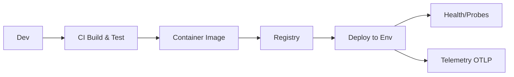

# 05_.NET Aspire: Deployment Paths

**Learning Level**: Practitioner  
**Prerequisites**: Aspire overview  
**Estimated Time**: 25–40 minutes

> Navigation: [Enterprise Development](./README.md) › Aspire: Deployment Paths

## 🎯 Objectives

- Go from local Aspire composition to repeatable CI/CD deployments
- Produce container images and version them consistently
- Roll out changes safely with health probes and progressive strategies

## Conceptual Foundation (Original Synthesis)

Aspire makes local composition easy: multiple services, wiring, and an observability dashboard. Deployment turns that into artifacts (images), environments (dev/test/prod), and rollouts (blue/green, canary). The key is to define a small, stable contract per service:

- Entrypoint and port exposed
- Health endpoints (liveness/readiness)
- Configuration via environment variables
- Secrets injected by the environment (not in code)
- Telemetry exported consistently (OTLP)

### End-to-end flow

```text
Dev → Commit → CI (build+test+scan) → Image (tag: version+sha) → Registry → Deploy → Env (secrets, config, probes)
```



## Practical Implementation

### 1) Containerize a service (minimal Dockerfile)

```dockerfile
# Dockerfile
FROM mcr.microsoft.com/dotnet/aspnet:8.0 AS base
WORKDIR /app
EXPOSE 8080

FROM mcr.microsoft.com/dotnet/sdk:8.0 AS build
WORKDIR /src
COPY . ./
RUN dotnet publish -c Release -o /out --no-restore

FROM base AS final
WORKDIR /app
COPY --from=build /out ./
ENTRYPOINT ["dotnet", "CatalogService.dll"]
```

Notes:

- Use a stable port (e.g., 8080) and set ASPNETCORE_URLS accordingly in the environment.
- Keep images small; multi-stage publish trims SDK.

### 2) Standardize configuration

Define env vars that work locally and in prod. Keep the same names across environments.

```text
ASPNETCORE_URLS=http://0.0.0.0:8080
OTEL_SERVICE_NAME=CatalogService
OTEL_EXPORTER_OTLP_ENDPOINT=http://otel-collector:4317
ConnectionStrings__CatalogDb=Server=db;Database=catalog;User Id=app;Password=${SECRET_DB_PASSWORD}
```

Health probes and endpoints:

- Liveness: /health/live (process is running)
- Readiness: /health/ready (dependencies OK enough to receive traffic)

### 3) Version images and releases

- Image tags: use semantic version + short SHA, e.g., catalog:1.4.2-abc1234
- Immutable deployments: never retag the same digest; promote by tag or digest
- Attach build metadata labels (commit, build time) for traceability

### 4) Rollout strategies (safe changes)

- Blue/Green: keep old and new side-by-side; switch traffic at once
- Canary: shift a small percent first; expand as metrics stay healthy
- Feature flags: decouple deploy from release; enable per slice

```text
[v1 GREEN] ←100%→ [v2 BLUE]
            switch

[v1] 90% | 10% [v2] → 50/50 → 0/100
```

### 5) CI/CD skeleton (conceptual)

- Build: restore, test, code quality, security scan
- Package: dotnet publish, containerize
- Scan image: vulnerability scanning (shift-left and at registry)
- Push: tag and push to registry
- Deploy: apply manifests or templates; set env/secret refs
- Verify: health probes; smoke tests; observe RED metrics

## Service Contract Checklist

- [ ] Container image builds reproducibly
- [ ] Exposes a single, documented port
- [ ] Liveness/Readiness routes implemented
- [ ] Configuration via env vars; no secrets in code
- [ ] OTLP endpoint and service name set
- [ ] Graceful shutdown (SIGTERM) honored
- [ ] Startup time acceptable under probe thresholds

## Common Rollout Pitfalls

- Missing readiness probe → traffic hits cold or failing instances
- No timeouts/retries on outbound calls → cascading failures during rollout
- Chatty logs at Info → cost spikes on canary expansion
- Per-request DB connections → connection pool exhaustion under ramp-up

## Related Topics

- [04_Observability](./04_DotNet-Aspire-Observability.md)
- [03_Service Wiring & Dependencies](./03_DotNet-Aspire-Service-Wiring-and-Dependencies.md)

## Next Steps

- Continue with [06_Checklist & Pitfalls](./06_DotNet-Aspire-Checklist-and-Pitfalls.md)
