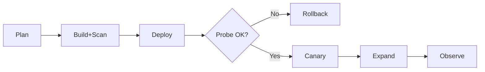

# 06_.NET Aspire: Checklist and Pitfalls

**Learning Level**: Practitioner  
**Prerequisites**: Aspire overview, observability, deployment paths  
**Estimated Time**: 15–25 minutes

> Navigation: [Enterprise Development](./README.md) › Aspire: Checklist and Pitfalls

## 🎯 Objectives

- Provide a concise pre-flight checklist for Aspire-based services
- Call out common mistakes and how to avoid them

## Service Pre‑Flight Checklist

- Architecture & Contracts
  - [ ] Clear service responsibility and boundaries
  - [ ] Idempotent handlers for at-least-once retries
  - [ ] Stable HTTP routes and versioned APIs
- Configuration & Secrets
  - [ ] All config via env vars; no secrets in code or images
  - [ ] Distinct config per environment (dev/test/prod) with sane defaults
  - [ ] Feature flags for risky toggles
- Health & Resilience
  - [ ] Liveness and readiness endpoints
  - [ ] Timeouts, retries with backoff, and circuit breakers on outbound calls
  - [ ] Graceful shutdown on SIGTERM; short startup time to meet probe windows
- Data & Storage
  - [ ] Connection pooling sized for instance count and expected QPS
  - [ ] Migrations automated and backward compatible (expand→migrate→contract)
  - [ ] PII classification and data retention policies applied
- Observability
  - [ ] OTLP exporter configured; consistent resource attributes (service, version, env)
  - [ ] RED dashboards per service; golden signals monitored
  - [ ] Error budgets defined; alerts with actionable thresholds
- Delivery & Rollouts
  - [ ] Container images tagged with semver+sha; SBOM and vulnerability scan
  - [ ] Canary or blue/green path documented; smoke tests post-deploy
  - [ ] Rollback procedure verified; config/flag-based kill switches

## Common Pitfalls (and Fixes)

- Over-logging at Info in hot paths
  - Symptom: log cost spikes and slow search queries
  - Fix: lower to Debug/Trace; add sampling; aggregate info at boundaries
- Readiness probes returning 200 while dependencies are down
  - Symptom: traffic routed to unready instances
  - Fix: include minimal dependency checks or use deferred readiness
- High-cardinality labels (userId, requestId) in metrics
  - Symptom: expensive storage and slow queries
  - Fix: bucket or aggregate; send IDs as trace attributes or logs instead
- No timeouts on HttpClient/SQL
  - Symptom: hung requests and misleading traces under incident
  - Fix: set per-call timeouts; use Polly policies for retries/circuit-breakers
- Breaking schema changes deployed before code
  - Symptom: runtime errors during rollout
  - Fix: expand→migrate→contract; keep code backward compatible until migration completes

## Quick Visual

```text
[Plan] -> [Build+Scan] -> [Deploy] -> [Probe OK?] -> [Canary] -> [Expand] -> [Observe]
                                   ↘ [Fail] -> [Rollback]
```



## Related Topics

- [05_Deployment Paths](./05_DotNet-Aspire-Deployment-Paths.md)
- [04_Observability](./04_DotNet-Aspire-Observability.md)

## Next Steps

- Integrate this checklist into PR templates or release checklists
