# 🔷 C# and .NET Development Track

**Enterprise-grade programming with Microsoft's premier development platform**

---

## 🎯 Track Overview

This comprehensive C# track covers everything from language fundamentals to advanced enterprise development patterns. Designed for developers building robust, scalable applications in the Microsoft ecosystem, with particular emphasis on modern C# features, .NET performance, and enterprise architecture patterns.

---

## 📚 Learning Progression Structure

### **Module Organization**

```mermaid
graph TD
    subgraph "🔰 Foundation Layer"
        FUND[01_Fundamentals<br/>Language Syntax & Core Concepts]
        OOP[02_Object-Oriented-Mastery<br/>Classes, Inheritance, Polymorphism]
    end
    
    subgraph "🚀 Advanced Layer"
        GEN[03_Generics-and-Variance<br/>Type Safety & Covariance]
        ASYNC[04_Async-and-Parallel<br/>Modern Concurrency Patterns]
        LINQ[05_LINQ-and-Expressions<br/>Functional Programming Features]
    end
    
    subgraph "🏗️ Architecture Layer"
        PATTERNS[06_Design-Patterns<br/>Enterprise Patterns & Practices]
        PERF[07_Performance-Optimization<br/>Memory & Execution Tuning]
        TESTING[08_Testing-and-Quality<br/>Unit Testing & Code Quality]
    end
    
    subgraph "🌐 Ecosystem Layer"
        DOTNET[09_NET-Ecosystem<br/>Framework & Library Mastery]
        ENTERPRISE[10_Enterprise-Development<br/>Real-world Applications]
    end
    
    FUND --> OOP --> GEN
    OOP --> ASYNC
    GEN --> LINQ --> PATTERNS
    ASYNC --> PATTERNS
    PATTERNS --> PERF --> TESTING
    TESTING --> DOTNET --> ENTERPRISE
    
    classDef foundation fill:#e8f5e8,stroke:#388e3c,stroke-width:2px
    classDef advanced fill:#e3f2fd,stroke:#1976d2,stroke-width:2px
    classDef architecture fill:#f3e5f5,stroke:#7b1fa2,stroke-width:2px
    classDef ecosystem fill:#fff3e0,stroke:#f57f17,stroke-width:2px
    
    class FUND,OOP foundation
    class GEN,ASYNC,LINQ advanced
    class PATTERNS,PERF,TESTING architecture
    class DOTNET,ENTERPRISE ecosystem
```



---

## 📚 Module Descriptions

### **🔰 Foundation Layer**

#### **[01_Fundamentals/](01_Fundamentals/)** - C# Language Essentials

- **Purpose**: Master C# syntax, data types, and core programming concepts
- **Content**: Variables, control flow, methods, error handling, basic collections
- **Duration**: 2-3 weeks for beginners, 1 week review for experienced developers
- **Outcomes**: Write clean, readable C# code with proper syntax and conventions

#### **[02_Object-Oriented-Mastery/](02_Object-Oriented-Mastery/)** - OOP Excellence

- **Purpose**: Deep understanding of object-oriented programming in C#
- **Content**: Classes, inheritance, encapsulation, polymorphism, interfaces, abstract classes
- **Duration**: 3-4 weeks comprehensive study
- **Outcomes**: Design robust object hierarchies and implement clean OOP patterns

### **🚀 Advanced Layer**

#### **[03_Generics-and-Variance/](03_Generics-and-Variance/)** - Type Safety Mastery

- **Purpose**: Master generic programming and variance concepts
- **Content**: Generic classes/methods, constraints, covariance, contravariance, type safety
- **Duration**: 2-3 weeks focused study
- **Outcomes**: Build type-safe, reusable components with proper variance handling

#### **[04_Async-and-Parallel/](04_Async-and-Parallel/)** - Modern Concurrency

- **Purpose**: Master asynchronous programming and parallelism
- **Content**: async/await, Task-based programming, parallel collections, synchronization
- **Duration**: 3-4 weeks with practical exercises
- **Outcomes**: Build responsive, scalable applications with proper concurrency

#### **[05_LINQ-and-Expressions/](05_LINQ-and-Expressions/)** - Functional Programming

- **Purpose**: Leverage C#'s functional programming features
- **Content**: LINQ queries, lambda expressions, delegates, expression trees
- **Duration**: 2-3 weeks
- **Outcomes**: Write expressive, maintainable code using functional patterns

### **🏗️ Architecture Layer**

#### **[06_Design-Patterns/](06_Design-Patterns/)** - Enterprise Patterns

- **Purpose**: Implement proven design patterns in C#
- **Content**: Gang of Four patterns, enterprise patterns, dependency injection
- **Duration**: 4-5 weeks comprehensive study
- **Outcomes**: Apply appropriate patterns to solve complex design problems

#### **[07_Performance-Optimization/](07_Performance-Optimization/)** - High-Performance C #

- **Purpose**: Optimize C# applications for maximum performance
- **Content**: Memory management, GC optimization, span/memory, performance profiling
- **Duration**: 3-4 weeks
- **Outcomes**: Build high-performance applications with optimal resource usage

#### **[08_Testing-and-Quality/](08_Testing-and-Quality/)** - Code Excellence

- **Purpose**: Ensure code quality through comprehensive testing
- **Content**: Unit testing, integration testing, mocking, code coverage, static analysis
- **Duration**: 3-4 weeks
- **Outcomes**: Build maintainable code with comprehensive test coverage

### **🌐 Ecosystem Layer**

#### **[09_NET-Ecosystem/](09_NET-Ecosystem/)** - Platform Mastery

- **Purpose**: Master the .NET ecosystem and tooling
- **Content**: .NET runtime, NuGet packages, tooling, deployment, cross-platform development
- **Duration**: 2-3 weeks
- **Outcomes**: Effectively leverage the full .NET ecosystem for development

#### **[10_Enterprise-Development/](10_Enterprise-Development/)** - Real-World Applications

- **Purpose**: Build enterprise-grade applications
- **Content**: Architecture patterns, microservices, cloud integration, security, monitoring
- **Duration**: 6-8 weeks project-based learning
- **Outcomes**: Design and implement production-ready enterprise applications

---

## 🎯 Learning Paths

### **🔰 Beginner Path** (3-4 months)

```
01_Fundamentals → 02_Object-Oriented-Mastery → 03_Generics-and-Variance → 08_Testing-and-Quality
```

### **🚀 Intermediate Path** (4-5 months)

```
02_Object-Oriented-Mastery → 03_Generics-and-Variance → 04_Async-and-Parallel → 
05_LINQ-and-Expressions → 06_Design-Patterns → 07_Performance-Optimization
```

### **🏗️ Enterprise Path** (6-8 months)

```
Complete all modules with emphasis on 06_Design-Patterns → 07_Performance-Optimization → 
08_Testing-and-Quality → 09_NET-Ecosystem → 10_Enterprise-Development
```

### **🎓 Architect Path** (8-12 months)

```
All modules + deep architectural projects + contribution to open source .NET projects
```

---

## 🔗 Integration with Other Tracks

### **Prerequisites from Other Tracks**

- **[02_software-design-principles/](../02_software-design-principles/)** - Fundamental design principles and patterns
- **Basic Programming Concepts** - Variables, loops, functions (if completely new to programming)

### **Enables Other Tracks**

- **AI/ML Development**: C# ML.NET, cognitive services integration
- **Web Development**: ASP.NET Core, Blazor, Web APIs
- **Desktop Applications**: WPF, WinUI, MAUI cross-platform apps
- **Cloud Development**: Azure services, serverless functions, microservices
- **Game Development**: Unity game engine programming

### **Synergies**

- **[01_Python/](../01_Python/)** - Compare language paradigms and choose appropriate tools
- **[02_software-design-principles/](../02_software-design-principles/)** - Apply universal principles in C# context

---

## 🛠️ Development Environment Setup

### **Essential Tools**

- **Visual Studio 2022** or **Visual Studio Code**
- **.NET 8 SDK** (latest LTS version)
- **Git** for version control
- **NuGet Package Manager**
- **Performance Profilers** (dotMemory, PerfView)

### **Recommended Extensions**

- **C# Dev Kit** (VS Code)
- **IntelliCode**
- **Code Coverage tools**
- **Static Analysis tools** (SonarLint, CodeMaid)

---

## 📊 Success Metrics

### **Technical Proficiency**

- [ ] Write idiomatic C# code following .NET conventions
- [ ] Implement robust error handling and logging
- [ ] Design type-safe generic components
- [ ] Build asynchronous, responsive applications
- [ ] Apply appropriate design patterns
- [ ] Optimize applications for performance
- [ ] Create comprehensive test suites

### **Professional Skills**

- [ ] Contribute to .NET open source projects
- [ ] Mentor junior developers
- [ ] Lead technical architecture decisions
- [ ] Design scalable enterprise systems

---

## 🎓 Certification Pathways

### **Microsoft Certifications**

- **Microsoft Certified: Azure Developer Associate**
- **Microsoft Certified: .NET Developer**
- **Microsoft Certified: Azure Solutions Architect**

### **Industry Recognition**

- **Contribute to .NET Foundation projects**
- **Speak at .NET conferences**
- **Publish NuGet packages**
- **Technical blog writing and thought leadership**

---

## 🌟 Special Features of This Track

### **🔷 Modern C# Focus**

- Emphasis on latest C# features (C# 12, .NET 8)
- Pattern matching, records, nullable reference types
- Source generators and modern performance features

### **🏢 Enterprise Readiness**

- Real-world patterns and practices
- Scalability and maintainability focus
- Production deployment considerations

### **🔧 Practical Application**

- Hands-on projects throughout
- Integration with popular .NET libraries
- Open source contribution opportunities

### **📈 Career Development**

- Interview preparation
- Portfolio project guidance
- Mentorship and community engagement

---

**🎯 Mission**: Transform developers into C# and .NET experts capable of building world-class enterprise applications with confidence, performance, and maintainability.**

---

**📅 Last Updated**: August 8, 2025  
**🔗 Maintained By**: Swamy's Tech Skills Academy  
**📍 Position**: Core Development Track - Microsoft Technology Stack
