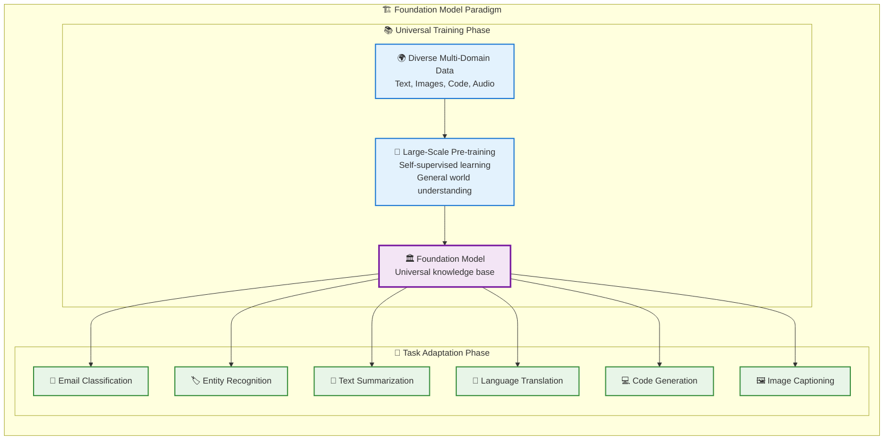
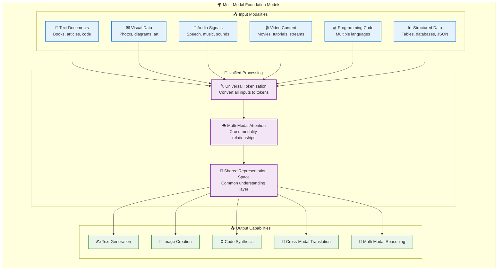

# 08_Foundation-Models-Architecture

**Learning Level**: Intermediate  
**Prerequisites**: [01_AI-Fundamentals-Overview](01_AI-Fundamentals-Overview.md), [02_AI-Domain-Relationships](02_AI-Domain-Relationships.md)  
**Estimated Time**: 25 minutes

## 🎯 Learning Objectives

By the end of this content, you will:

- Understand the multi-modal foundation model architecture pattern
- Recognize the training → adaptation → task specialization pipeline
- Map foundation model capabilities to downstream applications
- Connect this architecture to transformer and LLM concepts

## 📋 Foundation Model Architecture Pattern

### **The Paradigm Shift: From Fragmented AI to Unified Intelligence**

The development of foundation models represents one of the most significant architectural breakthroughs in artificial intelligence history. To understand why foundation models are revolutionary, we must first examine the limitations of the previous paradigm.

#### **The Era of Narrow AI: Task-Specific Silos**

Before foundation models, AI development followed a **fragmented specialization model**:

```text
Traditional AI Development Pattern:

Email Spam Detection     ──→  [Custom Dataset] ──→ [Spam Filter Model] ──→ Spam/Not Spam
Named Entity Recognition ──→  [NER Dataset]    ──→ [NER Model]        ──→ Names/Places/Orgs
News Summarization      ──→  [Summary Dataset] ──→ [Summary Model]    ──→ Article Summary
Translation             ──→  [Language Pairs]  ──→ [Translation Model] ──→ Target Language
```

**Challenges of the Narrow AI Approach:**

- **Resource Intensive**: Each task required unique datasets, architectures, and training pipelines
- **Knowledge Isolation**: No knowledge transfer between related tasks
- **Brittle Performance**: Models failed when data distributions shifted slightly
- **Maintenance Overhead**: Each model required separate updates and monitoring
- **Limited Generalization**: Excellent within narrow domains, poor outside them

#### **Foundation Models: The Unified Architecture Revolution**

Foundation models introduced a fundamentally different approach - **train once, adapt many times**:



### **The Foundation Model Hierarchy: Understanding the Relationship**

Your diagram perfectly illustrates the hierarchical relationship between foundation models and specialized implementations like LLMs:

```text
Foundation Models Architecture Hierarchy:

🏛️ Foundation Models (Outermost Layer)
├── 🎯 Core Capabilities:
│   ├── Pre-training on vast, diverse datasets
│   ├── Transfer learning across domains
│   ├── Large model architecture generalization
│   └── Multi-modal knowledge integration
│
└── 🗣️ Large Language Models (Specialized Subset)
    ├── 🤖 Specific Foundation Models:
    │   ├── GPT-3.5/4 (Generative Pre-trained Transformer)
    │   ├── LLaMA (Large Language Model Meta AI)
    │   ├── Gemini (Google's multimodal model)
    │   ├── Mistral (Efficient European model)
    │   ├── Claude (Anthropic's constitutional AI)
    │   └── ... (continuously evolving)
    │
    └── 📝 Language-Specific Optimizations:
        ├── Text understanding and generation
        ├── Conversational interfaces
        ├── Code synthesis and analysis
        └── Reasoning over textual information
```

#### **The Transfer Learning Revolution**

The key innovation enabling foundation models is **sophisticated transfer learning**:

```text
Knowledge Transfer Workflow:

Step 1: General Understanding    ──→  Foundation Model learns:
├── Language syntax and grammar       ├── Physical world properties
├── Logical reasoning patterns        ├── Mathematical relationships  
├── Cultural and social concepts      └── Cross-domain connections

Step 2: Task-Specific Adaptation ──→  Fine-tuning aligns knowledge:
├── Minimal additional data required  ├── Preserves general capabilities
├── Rapid specialization possible     └── Robust performance across variations

Step 3: Deployment Efficiency    ──→  Practical advantages:
├── Reduced training time            ├── Lower data requirements
├── Better generalization           └── Cost-effective scaling
```

### Core Architecture Flow

```text
Input Data Types → Foundation Training → Task Adaptation → Specialized Applications

[Text Data]           ┐
[Image Data]          ├── [Foundation Model] ──→ [Adaptation Layer] ──→ [Task-Specific Outputs]
[Speech Data]         │         ↓
[Structured Data]     │    [Transformer Core]
[3D Signals]          ┘
```

### Multi-Modal Input Processing

Foundation models excel at unified processing across data types:

- **Text**: Natural language understanding and generation
- **Images**: Visual pattern recognition and description
- **Speech**: Audio processing and transcription
- **Structured Data**: Tabular and relational information
- **3D Signals**: Spatial and temporal data patterns

#### **Beyond Language: The Multi-Modal Revolution**

While Large Language Models represent the most successful application of foundation models to date, the architecture extends far beyond text processing:



**Examples of Multi-Modal Capabilities:**

- **Visual Question Answering**: Understanding images and answering questions about them
- **Code-to-Documentation**: Generating explanations from programming code
- **Image-to-Text**: Describing visual content in natural language
- **Audio Transcription + Analysis**: Converting speech to text and analyzing sentiment
- **Cross-Modal Search**: Finding images based on text descriptions

#### **The "Base Brain" Architecture Concept**

Foundation models function as a **universal cognitive foundation** - trained once, then repurposed countless times:

```text
The Base Brain Analogy:

🧠 Human Brain Development:
├── Early Development: General cognitive capabilities form
├── Specialized Learning: Specific skills build on foundation  
├── Transfer Application: Knowledge applies across domains
└── Continuous Adaptation: New skills leverage existing knowledge

🤖 Foundation Model Development:
├── Pre-training Phase: General world understanding develops
├── Fine-tuning Phase: Task-specific capabilities emerge
├── Transfer Learning: Knowledge applies across applications
└── Continuous Improvement: New tasks build on existing foundation
```

**Scalability and Adaptability Benefits:**

1. **Economic Efficiency**
   - One expensive training phase enables multiple applications
   - Reduced compute requirements for task-specific adaptations
   - Shared infrastructure across different use cases

2. **Knowledge Synergy**
   - Learning in one domain improves performance in related areas
   - Cross-pollination of insights across different tasks
   - Emergent capabilities that weren't explicitly trained

3. **Rapid Deployment**
   - New applications can be developed in days rather than months
   - Minimal data requirements for achieving good performance
   - Quick adaptation to new domains and requirements

4. **Consistent Performance**
   - Robust baseline capabilities across diverse tasks
   - Reduced risk of catastrophic failures in new domains
   - Predictable behavior patterns across applications

#### **Foundation Models as the Gateway to AI Agents**

Foundation models provide the **cognitive foundation** necessary for autonomous AI agents:

```text
Foundation Model → Agent Progression:

🏛️ Foundation Capabilities:
├── Language understanding and generation
├── Reasoning and problem-solving
├── Knowledge synthesis across domains
└── Multi-modal information processing

⚡ Agent Enhancements:
├── Goal-oriented behavior 
├── Memory and state persistence
├── Tool integration and environment interaction
└── Autonomous decision-making

🤖 Result: Intelligent Agents:
├── Conversational AI assistants
├── Code generation and debugging systems
├── Research and analysis automation
├── Creative content generation
└── Multi-step task execution systems
```

This progression represents the natural evolution from **reactive intelligence** (responding to prompts) to **proactive intelligence** (pursuing objectives autonomously).

---

## 🔗 Architecture Principles

### Training → Adaptation → Tasks Pipeline

```text
Stage 1: Foundation Training
├── Large-scale pre-training on diverse data
├── Self-supervised learning objectives
└── General representation learning

Stage 2: Adaptation Methods
├── Fine-tuning on specific domains
├── Few-shot learning techniques
└── Parameter-efficient adaptation

Stage 3: Task Specialization
├── Question & Answer systems
├── Sentiment analysis
├── Information extraction
├── Image captioning
├── Object recognition
├── Instruction following
├── Code generation & understanding
└── Domain-specific applications
```

## 🏗️ Core Implementation Principles

### Unified Foundation

Instead of separate models for each data type:

- **Single Model**: One foundation model handles multiple modalities
- **Shared Representations**: Common embedding space across data types
- **Transfer Learning**: Knowledge flows between different domains

### Scalable Adaptation

Foundation models enable efficient specialization:

- **Parameter Sharing**: Reuse foundation weights
- **Targeted Fine-tuning**: Adapt only necessary components
- **Task Composability**: Combine capabilities for complex applications

## 🧬 Connection to Transformer Architecture

Foundation models typically build on transformer architecture:

```text
Transformer Core Features:
├── Self-attention mechanisms
├── Parallel processing capabilities
├── Scalable to large datasets
└── Multi-modal token processing

Foundation Model Extensions:
├── Cross-modal attention
├── Unified tokenization schemes
├── Large-scale parameter counts
└── Multi-task objective functions
```

## 🎯 Practical Applications Mapping

### Information Processing Tasks

- **Q&A Systems**: Query understanding + knowledge retrieval
- **Information Extraction**: Structure discovery in unstructured data
- **Sentiment Analysis**: Emotional context understanding

### Creative and Generative Tasks

- **Code Generation**: Programming language synthesis
- **Image Captioning**: Visual-to-text translation
- **Instruction Following**: Natural language command execution

### Recognition and Understanding

- **Object Recognition**: Visual pattern classification
- **Code Understanding**: Programming logic analysis
- **Multi-modal reasoning**: Cross-domain inference

## 🚧 Common Pitfalls

### Over-Reliance on Foundation Models

- **Issue**: Assuming foundation models solve all problems
- **Reality**: Task-specific adaptation still critical
- **Approach**: Understand when foundation vs. specialized models fit

### Multi-Modal Complexity

- **Challenge**: Managing different data type requirements
- **Solution**: Start with single modality, expand systematically
- **Practice**: Validate each modality addition independently

## 🔗 Related Topics

### Prerequisites

- AI Fundamentals Overview (foundation concepts)
- Transformer Architecture (core technology)

### Builds Upon

- Large Language Models (text-focused foundation models)
- Deep Learning (underlying neural network concepts)

### Enables

- AI Agents (foundation models as reasoning engines)
- Multi-modal applications (cross-domain AI systems)

### Cross-References

- `../03_DeepLearning/` - Neural network foundations
- `../05_LargeLanguageModels/` - Text-focused foundation models
- `../07_AI-Agents/` - Foundation models in agent architectures

## ➡️ Next Steps

1. Explore transformer architecture details
2. Study specific foundation model implementations
3. Practice adaptation techniques for target domains
4. Design multi-modal application prototypes

---

**Last Updated**: August 29, 2025  
**Next Review**: November 2025  
**Maintained By**: STSA AI Track
