# LLMs, Generative AI, AI Agents, and Agentic AI — A Practical Comparative Guide

Learning Level: Intermediate  
Prerequisites: Basics of transformers and LLMs, prompt engineering fundamentals  
Estimated Time: 60–90 minutes

---

## 🎯 Learning Objectives

By the end of this guide, you can:

- Distinguish LLMs, Generative AI systems, AI Agents, and Agentic AI by purpose, inputs, state, and autonomy
- Choose the right approach for a problem and anticipate failure modes
- Sketch system boundaries and hand-off points between the four layers
- Map your solution to the rest of this track (LLMs → MCP → Agents)

---

## 🔎 One-sentence archetypes

- LLM: A probabilistic language engine that predicts the next token conditioned on context.
- AI Agent: A goal-driven orchestrator that uses tools and calls models to complete tasks.
- Agentic AI: A self-directing system that plans, monitors, adapts, and learns across episodes.

## 🧭 Problem-routing cheat sheet

- Need high-quality text/code completions with tight latency? Start with an LLM.
- Need to synthesize or transform content (summaries, images from text, speech-to-text)? Use Generative AI patterns.
- Need to accomplish multi-step tasks that require tools, APIs, or data sources? Use an AI Agent.
- Need systems that pursue objectives over time, adapt strategies, and coordinate sub-agents? Consider Agentic AI.

---

## Stop conflating: four distinct layers

- LLM
  - A token predictor: maps context → next tokens.
  - No intent, no task execution, no memory beyond the prompt window.
  - Best for fast, constrained completions and structured outputs.

- Generative AI
  - A content creator: turns inputs (text/code/image/audio) into new artifacts.
  - Understands and navigates latent spaces; still waits for explicit instructions.
  - Best for synthesis, transformation, and style-constrained generation.

- AI Agents
  - A task executor: detects intent, plans steps, calls tools/APIs, handles responses.
  - Modular, inspectable pipelines; autonomy limited to the task/session.
  - Best for multi-step work that touches external systems or data.

- Agentic AI
  - An objective-driven system: operates with goals, policies, context, and memory.
  - Reasons, adapts, spawns sub-agents, monitors progress, decides next actions.
  - Best for long-horizon, evolving workflows with minimal human instruction.

> Design shift: this is not just “more features.” It’s a move from prediction → orchestration → autonomy, which changes architecture, tooling, risk, and evaluation.

---

## 🧬 Capability matrix (what changes across the stack)

| Dimension | LLM | Generative AI | AI Agent | Agentic AI |
|---|---|---|---|---|
| Core goal | Predict tokens well | Produce new content | Achieve a task | Pursue objectives over time |
| Inputs | Prompt + context | Multi-modal prompts | Goals + environment state | Objectives + world/organizational state |
| State | Context window | Context + artifacts | Working memory + tools | Long-term memory + policies |
| Tool use | Implicit (via prompting) | Optional (toolformer/routing) | Explicit (APIs, files, MCP) | Orchestrated, dynamic, multi-agent |
| Autonomy | None | Low | Medium | High |
| Planning | None | Light (templates) | Explicit plans | Hierarchical, adaptive |
| Feedback | Human-in-the-loop | Review/critique | Self-check + user | Self-evaluation + governance |
| Typical failure | Hallucination | Low-fidelity or off-style output | Tool misuse, loop failures | Goal drift, safety/regulatory risks |

---

## 🧩 Architecture impact: choosing stack depth

| Layer | Architecture focus | Tooling | State & memory | Orchestration | Risk profile | Primary value |
|---|---|---|---|---|---|---|
| LLM | Prompt design, structured outputs, caching | Model SDKs, routers | Ephemeral context window | None | Content quality, hallucination | Speed, low integration cost |
| Generative AI | Content pipelines, constraints, safety filters | Model providers + media libs | Artifact store, prompt templates | Light templates/workflows | IP/safety/style drift | Consistent content throughput |
| AI Agent | Tool abstraction (MCP), planner, evals, logs | Agent/orchestration frameworks, MCP | Short-term memory, run logs | Deterministic control flow, retries | Tool misuse, loops, side-effects | Task completion across systems |
| Agentic AI | Policies, governance, long-horizon memory, monitoring | Multi-agent frameworks, schedulers, dashboards | Vector/graph memories, metrics store | Dynamic planning, adaptation | Goal drift, runaway cost, compliance | Autonomy and adaptability |

### Quick self-check

- Do you only need a single artifact? → LLM/GenAI.
- Do you need tools/APIs and multi-step plans? → AI Agent.
- Do you need ongoing objectives with monitoring and adaptation? → Agentic AI.

---

## 🔁 Lifecycle patterns (Mermaid + plain-text)

### Mermaid version (optional)

Rendering note: If your viewer doesn't support Mermaid, the diagram below may appear as code. Use the plain-text diagram that follows.

```mermaid
flowchart TB
  subgraph LLM [LLM Inference]
    A1[Prompt and context] --> A2[Token sampling] --> A3[Completion]
  end

  subgraph GEN [Generative AI]
    B1[Inputs: text, image, audio] --> B2[Representation and constraints]
    B2 --> B3[Generation] --> B4[Quality pass: rules and critique] --> B5[Deliver artifact]
  end

  subgraph AGT [AI Agent]
    C1[Goal or task] --> C2[Plan] --> C3[Call tools via MCP]
    C3 --> C4[Update memory] --> C5{Stop criteria met?}
    C5 -- yes --> C6[Deliver result]
    C5 -- no  --> C2
  end

  subgraph AGIC [Agentic AI]
    D1[Objective and policies] --> D2[Situation assessment]
    D2 --> D3[Strategy and subgoals] --> D4[Multi-agent and tool execution]
    D4 --> D5[Monitoring and anomaly handling] --> D6[Adapt strategy]
    D6 --> D7[Evaluate and learn] --> D2
  end
```



```text
LLM Inference:
  [Prompt & Context] -> [Token Sampling] -> [Completion]

Generative AI:
  [Inputs (txt/img/audio)] -> [Representation & Constraints] -> [Generation]
  -> [Quality Pass (rules/critique)] -> [Deliver Artifact]

AI Agent:
  [Goal/Task] -> [Plan] -> [Call Tools via MCP] -> [Update Memory]
  -> [Check Stop Criteria] -> (yes -> Deliver Result | no -> Plan)

Agentic AI:
  [Objective & Policies] -> [Situation Assessment] -> [Strategy & Subgoals]
  -> [Multi-Agent/Tool Execution] -> [Monitoring & Anomaly Handling]
  -> [Adapt Strategy] -> [Evaluate & Learn] -> (loop back to Situation Assessment)
```

Notes:

- MCP = Model Context Protocol (see 06_MCP-Servers/) for secure, standardized tool access.
- Agentic loop adds strategy adaptation and long-horizon evaluation, not just repeated planning.

---

## 🔌 Boundary contracts (inputs/outputs, errors)

- LLM
  - Input: {prompt, context} → Output: {text tokens}
  - Errors: token limit, hallucination, style/format drift
- Generative AI
  - Input: {prompt + constraints} → Output: {content artifact}
  - Errors: low fidelity, safety filters, bias artifacts
- AI Agent
  - Input: {task, tools, data connections} → Output: {task result, logs}
  - Errors: tool failures, plan loops, stale memory
- Agentic AI
  - Input: {objective, policies, resources} → Output: {outcomes, metrics, audit}
  - Errors: goal misalignment, runaway cost, governance breaches

---

## 🧪 Choosing the right level (decision guide)

1) Is the output a single artifact with clear format? Prefer LLM/GenAI.
2) Does the solution require external data/tools or multi-step actions? Prefer Agent.
3) Must the system adapt over time with monitoring and governance? Prefer Agentic AI.

---

## 🛠️ Implementation hints (practical)

- LLMs: Use system prompts, structured outputs (JSON), and small eval sets (rubrics) for stability.
- Generative AI: Add a critique step (self-review) and domain stylebooks; cache high-value artifacts.
- AI Agents: Externalize tools via MCP; maintain short-term memory; add stop/timeout guards.
- Agentic AI: Define policies, observations, reward/score functions; implement safety rails and dashboards.

---

## ⚠️ Common pitfalls

- Blurring boundaries: forcing agents to write content when a single LLM call suffices.
- Unlimited loops: missing stop criteria, budget caps, or watchdogs.
- Hidden state: undocumented memory/state causing nondeterminism.
- Evaluation gaps: no task-ground truth, no replay logs.

---

## 🔗 Related Topics

- 05_LargeLanguageModels/ — foundations and practicals for LLM work
- 06_MCP-Servers/ — how agents call tools and resources
- 07_AI-Agents/ — architectures, development, and deployment
- 04_NaturalLanguageProcessing/ — NLP fundamentals that underpin LLMs

---

Created: August 2025  
Maintainer: Swamy's Tech Skills Academy  
Purpose: Original comparative guide to clarify scope and hand-offs across LLMs, Generative AI, Agents, and Agentic AI.
