# LLM Fundamentals - The Scale Revolution in AI

**Learning Level**: Intermediate  
**Prerequisites**: Basic understanding of neural networks and NLP  
**Estimated Time**: 3-4 hours  

---

## 🎯 Learning Objectives

By completing this module, you will:

- **Understand the scale vs. cleverness paradigm** that revolutionized AI
- **Grasp why LLMs outperform traditional algorithms** despite being "less clever"
- **Connect theoretical understanding** to practical LLM capabilities
- **Prepare for advanced topics** like prompt engineering and agent development

---

## 📊 **The Performance Revolution: Scale Beats Cleverness**

### **Visual Understanding from Research**

The attached diagram reveals a fundamental shift in AI development philosophy:

```mermaid
graph TD
    subgraph "📊 Algorithm Performance Spectrum"
        LLM[🎯 Large Language Models<br/>Massive Scale, Simple Architecture<br/>Superior Performance]
        CNN[🔍 Convolutional Neural Networks<br/>More Algorithmic Cleverness<br/>Limited Performance]
        LSTM[🔄 Long Short-Term Memory<br/>Sophisticated Design<br/>Moderate Performance]
        XGB[⚡ XGBoost<br/>Highly Clever Algorithm<br/>Good but Limited Performance]
    end
    
    subgraph "🎨 Performance Characteristics"
        BETTER[📈 Better Performance<br/>More Capable<br/>Broader Applications]
        WORSE[📉 Worse Performance<br/>Limited Scope<br/>Narrow Applications]
    end
    
    subgraph "🧠 Cleverness Spectrum"
        LESS[Less Clever<br/>Brute Force Approach<br/>Scale-Based Learning]
        MORE[More Clever<br/>Sophisticated Algorithms<br/>Hand-Crafted Features]
    end
    
    LLM --> BETTER
    LLM -.-> LESS
    
    CNN --> WORSE
    CNN -.-> MORE
    
    LSTM --> WORSE
    LSTM -.-> MORE
    
    XGB --> WORSE
    XGB -.-> MORE
    
    classDef llm fill:#ff69b4,stroke:#8b008b,stroke-width:4px
    classDef traditional fill:#87ceeb,stroke:#4682b4,stroke-width:2px
    classDef performance fill:#f0f8ff,stroke:#1e90ff,stroke-width:2px
    classDef cleverness fill:#f5f5dc,stroke:#daa520,stroke-width:2px
    
    class LLM llm
    class CNN,LSTM,XGB traditional
    class BETTER,WORSE performance
    class LESS,MORE cleverness
```

### **🎯 Key Insight: The Paradigm Shift**

**Traditional AI Philosophy**:

- More sophisticated algorithms = better performance
- Hand-craft features and constraints
- Encode human domain expertise into the algorithm
- Optimize for computational efficiency

**LLM Philosophy**:

- Scale beats sophistication
- Minimal constraints, maximum data
- Let the model discover patterns from massive datasets
- Trade computational efficiency for capability

---

## 🧠 **Understanding the "Dumber" Success**

### **Why LLMs Win Despite Being "Less Clever"**

1. **📊 Data Advantage**: Access to virtually all human knowledge
2. **🔢 Parameter Scale**: Billions/trillions of learnable parameters
3. **🎯 Emergent Behavior**: Capabilities emerge from scale, not design
4. **🔄 Generalization**: Single architecture works across domains

### **What Makes Traditional Algorithms "Cleverer"**

- **Hand-crafted features**: Human expertise encoded into the algorithm
- **Domain-specific optimizations**: Tailored for specific problem types
- **Computational efficiency**: Designed to work with limited resources
- **Interpretable logic**: Clear reasoning paths and decision trees

---

## 🏗️ **LLM Architecture: Simple Yet Powerful**

### **The Transformer Foundation**

```mermaid
graph TD
    subgraph "🏗️ LLM Architecture Stack"
        INPUT[📝 Text Input<br/>Raw human language]
        TOKENIZE[🔤 Tokenization<br/>Convert to numbers]
        EMBED[📊 Embeddings<br/>Vector representations]
        TRANS[🧠 Transformer Layers<br/>Attention mechanisms]
        OUTPUT[🎯 Predictions<br/>Next token probabilities]
    end
    
    subgraph "⚡ Scale Factors"
        DATA[📚 Training Data<br/>Petabytes of text]
        PARAMS[🔢 Parameters<br/>Billions to trillions]
        COMPUTE[💻 Computation<br/>Massive GPU clusters]
    end
    
    INPUT --> TOKENIZE --> EMBED --> TRANS --> OUTPUT
    
    DATA -.-> TRANS
    PARAMS -.-> TRANS
    COMPUTE -.-> TRANS
    
    classDef architecture fill:#e8f5e8,stroke:#388e3c,stroke-width:2px
    classDef scale fill:#fff3e0,stroke:#f57f17,stroke-width:2px
    
    class INPUT,TOKENIZE,EMBED,TRANS,OUTPUT architecture
    class DATA,PARAMS,COMPUTE scale
```

### **🎯 Simplicity + Scale = Breakthrough Performance**

**Core Insight**: The Transformer architecture is relatively simple:

- **Attention mechanisms**: Learn what to focus on
- **Feed-forward networks**: Transform information
- **Layer normalization**: Stabilize training
- **Residual connections**: Enable deep learning

But when scaled to massive size with enormous datasets, it achieves unprecedented capabilities.

---

## 🔄 **The Training Revolution**

### **From Clever Algorithms to Clever Data**

```mermaid
graph LR
    subgraph "🎯 Traditional ML"
        FEAT[🔧 Feature Engineering<br/>Human crafted features]
        ALG[⚙️ Algorithm Selection<br/>Careful model choice]
        TUNE[🎛️ Hyperparameter Tuning<br/>Manual optimization]
        PERF1[📊 Limited Performance]
    end
    
    subgraph "🚀 LLM Approach"
        DATA[📚 Massive Data Collection<br/>Internet-scale corpus]
        SCALE[📈 Scale Everything<br/>More data, more parameters]
        TRAIN[🏃 Self-Supervised Learning<br/>Predict next token]
        PERF2[🎯 Breakthrough Performance]
    end
    
    FEAT --> ALG --> TUNE --> PERF1
    DATA --> SCALE --> TRAIN --> PERF2
    
    classDef traditional fill:#e3f2fd,stroke:#1976d2,stroke-width:2px
    classDef modern fill:#f3e5f5,stroke:#7b1fa2,stroke-width:2px
    
    class FEAT,ALG,TUNE,PERF1 traditional
    class DATA,SCALE,TRAIN,PERF2 modern
```

---

## 🎯 **Practical Implications**

### **What This Means for Developers**

1. **🏗️ Architecture Choices**: Focus on scalable, simple designs
2. **📊 Data Strategy**: Prioritize data quality and quantity over algorithm sophistication
3. **🔧 Tool Selection**: Embrace LLM-based solutions over hand-crafted algorithms
4. **📈 Performance Expectations**: Expect continued improvement through scale

### **Building on LLM Foundations**

- **🤖 Agent Development**: Use LLMs as reasoning engines
- **🔧 Tool Integration**: Connect LLMs to external capabilities
- **📝 Prompt Engineering**: Design effective LLM interactions
- **🎯 Fine-Tuning**: Adapt pre-trained models to specific domains

---

## 🔗 **Connection to Agent Development**

### **Why Understanding This Matters for Agentic AI**

```mermaid
graph TD
    subgraph "🏗️ LLM Foundation"
        UNDERSTAND[🧠 Language Understanding<br/>Comprehend instructions]
        REASON[🤔 Reasoning Capability<br/>Plan and strategize]
        GENERATE[✍️ Text Generation<br/>Communicate effectively]
    end
    
    subgraph "🤖 Agent Capabilities"
        GOALS[🎯 Goal Pursuit<br/>Work toward objectives]
        TOOLS[🛠️ Tool Usage<br/>Interact with world]
        MEMORY[💭 Memory Systems<br/>Learn from experience]
    end
    
    UNDERSTAND --> GOALS
    REASON --> TOOLS
    GENERATE --> MEMORY
    
    classDef foundation fill:#e8f5e8,stroke:#388e3c,stroke-width:2px
    classDef capability fill:#ffebee,stroke:#c62828,stroke-width:2px
    
    class UNDERSTAND,REASON,GENERATE foundation
    class GOALS,TOOLS,MEMORY capability
```

**Critical Connection**: Agents are LLMs + additional capabilities. Understanding LLM strengths and limitations is essential for effective agent design.

---

## 🎓 **Knowledge Check**

### **Conceptual Understanding**

- [ ] Can explain why LLMs outperform more "clever" algorithms
- [ ] Understand the scale vs. sophistication trade-off
- [ ] Recognize the paradigm shift from hand-crafted to data-driven AI
- [ ] Connect LLM capabilities to agent development requirements

### **Practical Implications**

- [ ] Know when to choose LLM-based vs. traditional algorithmic approaches
- [ ] Understand the resource requirements for LLM deployment
- [ ] Recognize the limitations that lead to agent development needs
- [ ] Can design systems that leverage LLM strengths effectively

---

## 🚀 **Next Steps**

1. **[03_Transformer-Deep-Dive.md](03_Transformer-Deep-Dive.md)** - Detailed architecture understanding
2. **[05_Prompt-Engineering.md](05_Prompt-Engineering.md)** - Practical LLM interaction
3. **[07_LLM-to-Agent-Bridge.md](07_LLM-to-Agent-Bridge.md)** - Connecting to autonomous systems

---

*🎯 **Key Takeaway**: The LLM revolution demonstrates that in modern AI, scale and simplicity often beat algorithmic sophistication - a fundamental insight for all subsequent AI development.*
