# LLM Fundamentals - The Scale Revolution in AI

**Learning Level**: Intermediate  
**Prerequisites**: Basic understanding of neural networks and NLP  
**Estimated Time**: 3-4 hours  

---

## 🎯 Learning Objectives

By completing this module, you will:

- **Understand the scale vs. cleverness paradigm** that revolutionized AI
- **Grasp why LLMs outperform traditional algorithms** despite being "less clever"
- **Recognize emergent capabilities** that arise at scale without explicit programming
- **Connect theoretical understanding** to practical LLM capabilities
- **Prepare for advanced topics** like prompt engineering and agent development

---

## 📊 **The Performance Revolution: Scale Beats Cleverness**

### **Visual Understanding from Research**

The attached diagram reveals a fundamental shift in AI development philosophy:

```mermaid
graph TD
    subgraph "📊 Algorithm Performance Spectrum"
        LLM[🎯 Large Language Models<br/>Massive Scale, Simple Architecture<br/>Superior Performance]
        CNN[🔍 Convolutional Neural Networks<br/>More Algorithmic Cleverness<br/>Limited Performance]
        LSTM[🔄 Long Short-Term Memory<br/>Sophisticated Design<br/>Moderate Performance]
        XGB[⚡ XGBoost<br/>Highly Clever Algorithm<br/>Good but Limited Performance]
    end
    
    subgraph "🎨 Performance Characteristics"
        BETTER[📈 Better Performance<br/>More Capable<br/>Broader Applications]
        WORSE[📉 Worse Performance<br/>Limited Scope<br/>Narrow Applications]
    end
    
    subgraph "🧠 Cleverness Spectrum"
        LESS[Less Clever<br/>Brute Force Approach<br/>Scale-Based Learning]
        MORE[More Clever<br/>Sophisticated Algorithms<br/>Hand-Crafted Features]
    end
    
    LLM --> BETTER
    LLM -.-> LESS
    
    CNN --> WORSE
    CNN -.-> MORE
    
    LSTM --> WORSE
    LSTM -.-> MORE
    
    XGB --> WORSE
    XGB -.-> MORE
    
    classDef llm fill:#ff69b4,stroke:#8b008b,stroke-width:4px
    classDef traditional fill:#87ceeb,stroke:#4682b4,stroke-width:2px
    classDef performance fill:#f0f8ff,stroke:#1e90ff,stroke-width:2px
    classDef cleverness fill:#f5f5dc,stroke:#daa520,stroke-width:2px
    
    class LLM llm
    class CNN,LSTM,XGB traditional
    class BETTER,WORSE performance
    class LESS,MORE cleverness
```



### **🎯 Key Insight: The Paradigm Shift**

**Traditional AI Philosophy**:

- More sophisticated algorithms = better performance
- Hand-craft features and constraints
- Encode human domain expertise into the algorithm
- Optimize for computational efficiency

**LLM Philosophy**:

- Scale beats sophistication
- Minimal constraints, maximum data
- Let the model discover patterns from massive datasets
- Trade computational efficiency for capability

---

## 🧠 **Understanding the "Dumber" Success**

### **Why LLMs Win Despite Being "Less Clever"**

1. **📊 Data Advantage**: Access to virtually all human knowledge
2. **🔢 Parameter Scale**: Billions/trillions of learnable parameters
3. **🎯 Emergent Behavior**: Capabilities emerge from scale, not design
4. **🔄 Generalization**: Single architecture works across domains

### **What Makes Traditional Algorithms "Cleverer"**

- **Hand-crafted features**: Human expertise encoded into the algorithm
- **Domain-specific optimizations**: Tailored for specific problem types
- **Computational efficiency**: Designed to work with limited resources
- **Interpretable logic**: Clear reasoning paths and decision trees

---

## 🏗️ **LLM Architecture: Simple Yet Powerful**

### **The Transformer Foundation**

```mermaid
graph TD
    subgraph "🏗️ LLM Architecture Stack"
        INPUT[📝 Text Input<br/>Raw human language]
        TOKENIZE[🔤 Tokenization<br/>Convert to numbers]
        EMBED[📊 Embeddings<br/>Vector representations]
        TRANS[🧠 Transformer Layers<br/>Attention mechanisms]
        OUTPUT[🎯 Predictions<br/>Next token probabilities]
    end
    
    subgraph "⚡ Scale Factors"
        DATA[📚 Training Data<br/>Petabytes of text]
        PARAMS[🔢 Parameters<br/>Billions to trillions]
        COMPUTE[💻 Computation<br/>Massive GPU clusters]
    end
    
    INPUT --> TOKENIZE --> EMBED --> TRANS --> OUTPUT
    
    DATA -.-> TRANS
    PARAMS -.-> TRANS
    COMPUTE -.-> TRANS
    
    classDef architecture fill:#e8f5e8,stroke:#388e3c,stroke-width:2px
    classDef scale fill:#fff3e0,stroke:#f57f17,stroke-width:2px
    
    class INPUT,TOKENIZE,EMBED,TRANS,OUTPUT architecture
    class DATA,PARAMS,COMPUTE scale
```



### **🎯 Simplicity + Scale = Breakthrough Performance**

**Core Insight**: The Transformer architecture is relatively simple:

- **Attention mechanisms**: Learn what to focus on
- **Feed-forward networks**: Transform information
- **Layer normalization**: Stabilize training
- **Residual connections**: Enable deep learning

But when scaled to massive size with enormous datasets, it achieves unprecedented capabilities.

---

## 🔄 **The Training Revolution**

### **From Clever Algorithms to Clever Data**

```mermaid
graph LR
    subgraph "🎯 Traditional ML"
        FEAT[🔧 Feature Engineering<br/>Human crafted features]
        ALG[⚙️ Algorithm Selection<br/>Careful model choice]
        TUNE[🎛️ Hyperparameter Tuning<br/>Manual optimization]
        PERF1[📊 Limited Performance]
    end
    
    subgraph "🚀 LLM Approach"
        DATA[📚 Massive Data Collection<br/>Internet-scale corpus]
        SCALE[📈 Scale Everything<br/>More data, more parameters]
        TRAIN[🏃 Self-Supervised Learning<br/>Predict next token]
        PERF2[🎯 Breakthrough Performance]
    end
    
    FEAT --> ALG --> TUNE --> PERF1
    DATA --> SCALE --> TRAIN --> PERF2
    
    classDef traditional fill:#e3f2fd,stroke:#1976d2,stroke-width:2px
    classDef modern fill:#f3e5f5,stroke:#7b1fa2,stroke-width:2px
    
    class FEAT,ALG,TUNE,PERF1 traditional
    class DATA,SCALE,TRAIN,PERF2 modern
```



---

## 🎯 **Practical Implications**

### **What This Means for Developers**

1. **🏗️ Architecture Choices**: Focus on scalable, simple designs
2. **📊 Data Strategy**: Prioritize data quality and quantity over algorithm sophistication
3. **🔧 Tool Selection**: Embrace LLM-based solutions over hand-crafted algorithms
4. **📈 Performance Expectations**: Expect continued improvement through scale

### **Building on LLM Foundations**

- **🤖 Agent Development**: Use LLMs as reasoning engines
- **🔧 Tool Integration**: Connect LLMs to external capabilities
- **📝 Prompt Engineering**: Design effective LLM interactions
- **🎯 Fine-Tuning**: Adapt pre-trained models to specific domains

---

## ⚡ **Emergent Capabilities: When Scale Creates New Intelligence**

### **The Emergence Phenomenon**

One of the most remarkable aspects of large language models is the appearance of **emergent capabilities** - abilities that spontaneously arise at scale without being explicitly programmed. These capabilities represent a fundamental shift from narrow, task-specific AI to genuinely intelligent behavior.

```mermaid
graph TD
    subgraph "📏 Scale Progression"
        SMALL[🔬 Small Models<br/>< 1B parameters<br/>Basic pattern matching]
        MEDIUM[🔍 Medium Models<br/>1B - 10B parameters<br/>Improved fluency]
        LARGE[🧠 Large Models<br/>10B - 100B+ parameters<br/>Emergent capabilities]
    end
    
    subgraph "⚡ Emergent Abilities"
        CONTEXT[📚 In-Context Learning<br/>Learn from examples in prompt]
        REASONING[🧮 Chain-of-Thought<br/>Multi-step problem solving]
        ANALOGY[🔗 Analogical Reasoning<br/>Pattern transfer across domains]
        LOGIC[⚖️ Arithmetic & Logic<br/>Mathematical computations]
        LANGUAGE[🎭 Abstract Language<br/>Metaphors and humor]
        MULTITASK[🎯 Multi-Task Mastery<br/>Simultaneous capabilities]
    end
    
    SMALL --> MEDIUM --> LARGE
    
    LARGE --> CONTEXT
    LARGE --> REASONING
    LARGE --> ANALOGY
    LARGE --> LOGIC
    LARGE --> LANGUAGE
    LARGE --> MULTITASK
    
    classDef scale fill:#e3f2fd,stroke:#1976d2,stroke-width:2px
    classDef emergent fill:#f3e5f5,stroke:#7b1fa2,stroke-width:2px
    classDef highlight fill:#ffebee,stroke:#c62828,stroke-width:3px
    
    class SMALL,MEDIUM scale
    class LARGE highlight
    class CONTEXT,REASONING,ANALOGY,LOGIC,LANGUAGE,MULTITASK emergent
```



### **🧠 Six Revolutionary Emergent Capabilities**

#### **1. 📚 In-Context Learning: Learning Without Training**

**What It Is**: The ability to learn new tasks simply by seeing examples in the prompt, without any fine-tuning or parameter updates.

**Before LLMs**: Small models required explicit retraining for each new task.

**With Large LLMs**: Models can adapt to new tasks instantly through examples.

```text
Traditional Approach:
Task: Sentiment Analysis → Collect Dataset → Train Model → Deploy

LLM In-Context Learning:
Task: Sentiment Analysis → Show Examples in Prompt → Instant Capability

Example:
"Classify sentiment as positive or negative:
'I love this product!' → Positive
'This is terrible.' → Negative
'The weather is amazing today!' → ?"

LLM Response: "Positive"
```

**Practical Applications**:

- Rapid prototyping of new AI applications
- Custom classification without training data
- Adaptive user interfaces that learn preferences
- Quick domain adaptation for specialized tasks

#### **2. 🧮 Chain-of-Thought Reasoning: Thinking Step by Step**

**What It Is**: The ability to break down complex problems into intermediate reasoning steps, dramatically improving problem-solving accuracy.

**Mathematical Example**:

```text
Problem: "Sarah has 3 boxes with 8 apples each. She gives away 5 apples. How many apples does she have left?"

Without Chain-of-Thought:
LLM → "19 apples" (often incorrect)

With Chain-of-Thought:
LLM → "Let me think step by step:
1. Sarah starts with 3 boxes × 8 apples = 24 apples
2. She gives away 5 apples
3. 24 - 5 = 19 apples remaining
Answer: 19 apples" (consistently correct)
```

**Logical Reasoning Example**:

```text
Problem: "If all birds can fly, and penguins are birds, can penguins fly?"

Chain-of-Thought Response:
"Let me analyze this step by step:
1. Premise: All birds can fly
2. Premise: Penguins are birds
3. Logical conclusion: Penguins can fly
4. However, this conflicts with real-world knowledge that penguins cannot fly
5. This indicates the first premise is incorrect - not all birds can fly"
```

#### **3. 🔗 Analogical Reasoning: Pattern Transfer Mastery**

**What It Is**: The ability to identify and apply patterns across different domains, similar to human cognitive processing.

**Classic Examples**:

```text
Verbal Analogies:
"Cat is to kitten as dog is to..." → "puppy"
"King is to kingdom as president is to..." → "country/nation"
"Warm is to hot as cool is to..." → "cold"

Conceptual Analogies:
"Explain photosynthesis using the analogy of a factory"
→ "Photosynthesis is like a solar-powered factory where:
   - Sunlight = energy source
   - Chloroplasts = factory machines
   - CO2 + Water = raw materials
   - Glucose = manufactured product
   - Oxygen = beneficial byproduct"
```

**Advanced Pattern Recognition**:

- Cross-domain problem solving (applying business strategies to personal challenges)
- Scientific reasoning (using known phenomena to understand new discoveries)
- Creative problem solving (adapting solutions from one field to another)

#### **4. ⚖️ Arithmetic and Logic: Computational Emergence**

**What It Is**: The spontaneous development of mathematical and logical reasoning capabilities, despite not being explicitly trained for computation.

**Mathematical Capabilities**:

```text
Multi-digit Arithmetic:
347 × 89 = 30,883 (computed step by step)

Algebraic Reasoning:
"If 2x + 5 = 15, what is x?"
→ "2x = 15 - 5 = 10, so x = 5"

Word Problems:
"A train traveling at 60 mph needs to cover 180 miles. How long will it take?"
→ "Time = Distance ÷ Speed = 180 ÷ 60 = 3 hours"
```

**Logical Reasoning**:

```text
Syllogistic Logic:
- All humans are mortal
- Socrates is human
- Therefore, Socrates is mortal

Conditional Logic:
"If it's raining, then the ground is wet. The ground is not wet. What can we conclude?"
→ "It's not raining (modus tollens)"
```

#### **5. 🎭 Abstract Language Understanding: Metaphors and Humor**

**What It Is**: The ability to understand and generate abstract language patterns including metaphors, idioms, and humor.

**Metaphor Interpretation**:

```text
"Time is money" → Understanding efficiency and value relationships
"Her voice is music to my ears" → Recognizing aesthetic appreciation
"The classroom was a zoo" → Interpreting chaos and disorder
```

**Humor Generation**:

```text
Puns: "I wondered why the baseball kept getting bigger. Then it hit me."
Wordplay: "The math teacher called in sick with algebra."
Situational: "I told my wife she was drawing her eyebrows too high. She looked surprised."
```

**Cultural and Contextual Understanding**:

- Recognizing sarcasm and irony
- Understanding cultural references
- Adapting communication style to context
- Interpreting implicit meanings and subtext

#### **6. 🎯 Multi-Task Generalization: Universal Capability**

**What It Is**: The ability to simultaneously handle multiple different types of tasks without task-specific training or configuration.

**Simultaneous Capabilities in Single Session**:

```text
Temperature Conversion: "Convert 25°C to Fahrenheit" → "77°F"
Summarization: "Summarize this article..." → [Coherent summary]
Q&A: "What's the capital of Japan?" → "Tokyo"
Code Generation: "Write a Python function to sort a list" → [Working code]
Creative Writing: "Write a haiku about mountains" → [Original poem]
Analysis: "Analyze the pros and cons of remote work" → [Balanced analysis]
```

**Cross-Task Learning Transfer**:

- Knowledge from translation improves text generation
- Mathematical reasoning enhances logical analysis
- Creative capabilities inform problem-solving approaches
- Language understanding supports code comprehension

### **🔬 Why Emergent Capabilities Matter**

#### **Scientific Significance**

- **Unexpected Intelligence**: Capabilities not explicitly programmed into the system
- **Scale-Dependent**: Only appear when models reach sufficient size
- **Human-Like**: Resemble cognitive abilities previously thought unique to humans
- **Transferable**: Apply across domains without additional training

#### **Practical Implications**

- **Reduced Development Time**: One model handles multiple tasks
- **Lower Maintenance Costs**: Fewer specialized systems to maintain
- **Improved Flexibility**: Adaptive to new requirements without retraining
- **Enhanced Capability**: Performance exceeds sum of individual components

#### **Connection to Foundation Models**

Emergent capabilities validate the foundation model approach:

- Train once on diverse data → Multiple capabilities emerge
- Scale effects create qualitatively new behaviors
- General intelligence enables specialized applications
- Transfer learning works at unprecedented levels

---

## 🔗 **Connection to Agent Development**

### **Why Understanding This Matters for Agentic AI**

```mermaid
graph TD
    subgraph "🏗️ LLM Foundation"
        UNDERSTAND[🧠 Language Understanding<br/>Comprehend instructions]
        REASON[🤔 Reasoning Capability<br/>Plan and strategize]
        GENERATE[✍️ Text Generation<br/>Communicate effectively]
    end
    
    subgraph "🤖 Agent Capabilities"
        GOALS[🎯 Goal Pursuit<br/>Work toward objectives]
        TOOLS[🛠️ Tool Usage<br/>Interact with world]
        MEMORY[💭 Memory Systems<br/>Learn from experience]
    end
    
    UNDERSTAND --> GOALS
    REASON --> TOOLS
    GENERATE --> MEMORY
    
    classDef foundation fill:#e8f5e8,stroke:#388e3c,stroke-width:2px
    classDef capability fill:#ffebee,stroke:#c62828,stroke-width:2px
    
    class UNDERSTAND,REASON,GENERATE foundation
    class GOALS,TOOLS,MEMORY capability
```



**Critical Connection**: Agents are LLMs + additional capabilities. Understanding LLM strengths and limitations is essential for effective agent design.

---

## 🎓 **Knowledge Check**

### **Conceptual Understanding**

- [ ] Can explain why LLMs outperform more "clever" algorithms
- [ ] Understand the scale vs. sophistication trade-off
- [ ] Recognize emergent capabilities and their significance
- [ ] Identify the six key emergent abilities (in-context learning, chain-of-thought, analogical reasoning, arithmetic/logic, abstract language, multi-task generalization)
- [ ] Recognize the paradigm shift from hand-crafted to data-driven AI
- [ ] Connect LLM capabilities to agent development requirements

### **Applied Understanding**

- [ ] Know when to choose LLM-based vs. traditional algorithmic approaches
- [ ] Understand how to leverage emergent capabilities in applications
- [ ] Recognize the relationship between model scale and capability emergence
- [ ] Understand the resource requirements for LLM deployment
- [ ] Recognize the limitations that lead to agent development needs
- [ ] Can design systems that leverage LLM strengths effectively

---

## 🚀 **Next Steps**

1. **[03_Transformer-Deep-Dive.md](03_Transformer-Deep-Dive.md)** - Detailed architecture understanding
2. **[05_Prompt-Engineering.md](05_Prompt-Engineering.md)** - Practical LLM interaction
3. **[07_LLM-to-Agent-Bridge.md](07_LLM-to-Agent-Bridge.md)** - Connecting to autonomous systems

---

*🎯 **Key Takeaway**: The LLM revolution demonstrates that scale and simplicity often beat algorithmic sophistication, with emergent capabilities providing unprecedented intelligence that bridges the gap from language models to autonomous agents.*
