# Framework Fundamentals 101 - TensorFlow, PyTorch & JAX

**Learning Level**: Beginner to Intermediate  
**Prerequisites**: Python programming, basic neural network understanding  
**Estimated Time**: 4-6 hours hands-on practice  

---

## 🎯 Learning Objectives

By completing this module, you will:

- **Master the three essential deep learning frameworks** for LLM development
- **Understand when to choose** TensorFlow vs PyTorch vs JAX
- **Build practical confidence** in implementing transformer components
- **Set up development environments** for LLM experimentation

---

## 🏗️ **The Three Pillars of Modern AI Development**

### **Framework Comparison Overview**

```mermaid
graph TD
    subgraph "🔥 PyTorch Ecosystem"
        PYTORCH[🔥 PyTorch<br/>Dynamic Graphs<br/>Research-Friendly]
        LIGHTNING[⚡ PyTorch Lightning<br/>Organized Training]
        HF[🤗 Hugging Face<br/>Transformer Library]
    end
    
    subgraph "🧠 TensorFlow Ecosystem"
        TF[🧠 TensorFlow<br/>Production Ready<br/>Google Ecosystem]
        KERAS[🎨 Keras<br/>High-Level API]
        SERVING[🚀 TF Serving<br/>Production Deployment]
    end
    
    subgraph "⚡ JAX Ecosystem"
        JAX[⚡ JAX<br/>High Performance<br/>Functional Programming]
        FLAX[🌿 Flax<br/>Neural Networks]
        OPTAX[🎯 Optax<br/>Optimization]
    end
    
    subgraph "🎯 Use Cases"
        RESEARCH[🔬 Research & Prototyping]
        PRODUCTION[🏭 Production Deployment]
        PERFORMANCE[⚡ High Performance Computing]
    end
    
    PYTORCH --> RESEARCH
    TF --> PRODUCTION
    JAX --> PERFORMANCE
    
    classDef pytorch fill:#ee4c2c,stroke:#c33,color:#fff,stroke-width:2px
    classDef tensorflow fill:#ff6f00,stroke:#cc5500,color:#fff,stroke-width:2px
    classDef jax fill:#306998,stroke:#1e4d72,color:#fff,stroke-width:2px
    classDef usecase fill:#f0f8ff,stroke:#4682b4,stroke-width:2px
    
    class PYTORCH,LIGHTNING,HF pytorch
    class TF,KERAS,SERVING tensorflow
    class JAX,FLAX,OPTAX jax
    class RESEARCH,PRODUCTION,PERFORMANCE usecase
```



---

## 🔥 **PyTorch: The Research Champion**

### **Why PyTorch for LLMs?**

- **Dynamic Computation Graphs**: Perfect for experimental architectures
- **Intuitive Debugging**: Debug neural networks like regular Python code
- **Hugging Face Integration**: Seamless transformer model access
- **Research Community**: Most cutting-edge models released in PyTorch first

### **Essential PyTorch for LLMs**

```python
import torch
import torch.nn as nn
import torch.nn.functional as F
from torch.utils.data import DataLoader
from transformers import AutoTokenizer, AutoModel

# 1. Basic Tensor Operations (Foundation)
def basic_pytorch_operations():
    """Essential PyTorch operations for LLM development"""
    
    # Create tensors (like NumPy arrays but GPU-accelerated)
    x = torch.randn(2, 3, 4)  # Random tensor
    y = torch.zeros(2, 3, 4)   # Zero tensor
    
    # GPU acceleration
    device = torch.device('cuda' if torch.cuda.is_available() else 'cpu')
    x = x.to(device)
    
    # Matrix operations (core of neural networks)
    weights = torch.randn(4, 8, requires_grad=True)  # Learnable parameters
    output = torch.matmul(x, weights)  # Matrix multiplication
    
    return output

# 2. Building Transformer Components
class SimpleAttention(nn.Module):
    """Simplified attention mechanism in PyTorch"""
    
    def __init__(self, embed_size, heads):
        super(SimpleAttention, self).__init__()
        self.embed_size = embed_size
        self.heads = heads
        self.head_dim = embed_size // heads
        
        # Linear transformations for Q, K, V
        self.values = nn.Linear(self.head_dim, self.head_dim, bias=False)
        self.keys = nn.Linear(self.head_dim, self.head_dim, bias=False)
        self.queries = nn.Linear(self.head_dim, self.head_dim, bias=False)
        self.fc_out = nn.Linear(heads * self.head_dim, embed_size)
    
    def forward(self, values, keys, query, mask):
        # Multi-head attention implementation
        N = query.shape[0]  # Batch size
        value_len, key_len, query_len = values.shape[1], keys.shape[1], query.shape[1]
        
        # Split embedding into multiple heads
        values = values.reshape(N, value_len, self.heads, self.head_dim)
        keys = keys.reshape(N, key_len, self.heads, self.head_dim)
        queries = query.reshape(N, query_len, self.heads, self.head_dim)
        
        # Apply linear transformations
        values = self.values(values)
        keys = self.keys(keys)
        queries = self.queries(queries)
        
        # Attention computation
        energy = torch.einsum("nqhd,nkhd->nhqk", [queries, keys])
        
        if mask is not None:
            energy = energy.masked_fill(mask == 0, float("-1e20"))
        
        attention = torch.softmax(energy / (self.embed_size ** (1/2)), dim=3)
        out = torch.einsum("nhql,nlhd->nqhd", [attention, values]).reshape(
            N, query_len, self.heads * self.head_dim
        )
        
        return self.fc_out(out)

# 3. Working with Pre-trained Models
def load_pretrained_model():
    """Load and use a pre-trained transformer model"""
    
    # Load tokenizer and model
    tokenizer = AutoTokenizer.from_pretrained('bert-base-uncased')
    model = AutoModel.from_pretrained('bert-base-uncased')
    
    # Encode text
    text = "Understanding transformers is crucial for LLM development"
    inputs = tokenizer(text, return_tensors='pt')
    
    # Get embeddings
    with torch.no_grad():
        outputs = model(**inputs)
        embeddings = outputs.last_hidden_state
    
    return embeddings

print("🔥 PyTorch Setup Complete!")
print(f"Version: {torch.__version__}")
print(f"CUDA Available: {torch.cuda.is_available()}")
```

### **🎯 PyTorch Development Workflow**

```mermaid
graph LR
    subgraph "🔥 PyTorch LLM Workflow"
        DATA[📚 Data Loading<br/>DataLoader & Datasets]
        MODEL[🏗️ Model Definition<br/>nn.Module classes]
        TRAIN[🚀 Training Loop<br/>Forward/Backward pass]
        EVAL[📊 Evaluation<br/>Model performance]
        SAVE[💾 Model Saving<br/>state_dict & checkpoints]
    end
    
    DATA --> MODEL --> TRAIN --> EVAL --> SAVE
    EVAL --> TRAIN
    
    classDef pytorch fill:#ee4c2c,stroke:#c33,color:#fff,stroke-width:2px
    
    class DATA,MODEL,TRAIN,EVAL,SAVE pytorch
```



---

## 🧠 **TensorFlow: The Production Powerhouse**

### **Why TensorFlow for LLMs?**

- **Production Ready**: Excellent deployment and serving infrastructure
- **Ecosystem Integration**: Google Cloud, TPU optimization
- **TensorFlow Serving**: Scalable model serving in production
- **Keras Simplicity**: High-level API for rapid prototyping

### **Essential TensorFlow for LLMs**

```python
import tensorflow as tf
from tensorflow.keras import layers, Model
import numpy as np

# 1. Basic TensorFlow Operations
def basic_tensorflow_operations():
    """Essential TensorFlow operations for LLM development"""
    
    # Create tensors
    x = tf.random.normal([2, 3, 4])
    y = tf.zeros([2, 3, 4])
    
    # GPU acceleration
    with tf.device('/GPU:0' if tf.config.list_physical_devices('GPU') else '/CPU:0'):
        # Matrix operations
        weights = tf.Variable(tf.random.normal([4, 8]))
        output = tf.matmul(x, weights)
    
    return output

# 2. Building Transformer Components with Keras
class MultiHeadAttention(layers.Layer):
    """Multi-head attention layer in TensorFlow/Keras"""
    
    def __init__(self, embed_size, num_heads):
        super(MultiHeadAttention, self).__init__()
        self.embed_size = embed_size
        self.num_heads = num_heads
        self.head_dim = embed_size // num_heads
        
        assert (self.head_dim * num_heads == embed_size), "Embed size must be divisible by num_heads"
        
        self.wq = layers.Dense(embed_size)
        self.wk = layers.Dense(embed_size)
        self.wv = layers.Dense(embed_size)
        self.dense = layers.Dense(embed_size)
    
    def split_heads(self, x, batch_size):
        """Split the last dimension into (num_heads, head_dim)"""
        x = tf.reshape(x, (batch_size, -1, self.num_heads, self.head_dim))
        return tf.transpose(x, perm=[0, 2, 1, 3])
    
    def call(self, query, key, value, mask=None):
        batch_size = tf.shape(query)[0]
        
        # Linear transformations
        q = self.wq(query)
        k = self.wk(key)
        v = self.wv(value)
        
        # Split into multiple heads
        q = self.split_heads(q, batch_size)
        k = self.split_heads(k, batch_size)
        v = self.split_heads(v, batch_size)
        
        # Scaled dot-product attention
        scaled_attention = self.scaled_dot_product_attention(q, k, v, mask)
        scaled_attention = tf.transpose(scaled_attention, perm=[0, 2, 1, 3])
        
        # Concatenate heads
        concat_attention = tf.reshape(scaled_attention, 
                                    (batch_size, -1, self.embed_size))
        
        # Final linear layer
        output = self.dense(concat_attention)
        return output
    
    def scaled_dot_product_attention(self, q, k, v, mask):
        """Calculate the attention weights"""
        matmul_qk = tf.matmul(q, k, transpose_b=True)
        
        # Scale by square root of key dimension
        dk = tf.cast(tf.shape(k)[-1], tf.float32)
        scaled_attention_logits = matmul_qk / tf.math.sqrt(dk)
        
        # Add mask if provided
        if mask is not None:
            scaled_attention_logits += (mask * -1e9)
        
        # Apply softmax
        attention_weights = tf.nn.softmax(scaled_attention_logits, axis=-1)
        output = tf.matmul(attention_weights, v)
        
        return output

# 3. High-level Model Building
def create_simple_transformer():
    """Create a simple transformer model using Keras"""
    
    # Input layers
    inputs = layers.Input(shape=(None,), dtype=tf.int32)
    
    # Embedding layer
    embedding = layers.Embedding(vocab_size=10000, output_dim=512)(inputs)
    
    # Multi-head attention
    attention = MultiHeadAttention(embed_size=512, num_heads=8)
    attention_output = attention(embedding, embedding, embedding)
    
    # Add & Norm
    add_norm1 = layers.LayerNormalization()(layers.Add()([embedding, attention_output]))
    
    # Feed forward
    ffn = layers.Dense(2048, activation='relu')(add_norm1)
    ffn = layers.Dense(512)(ffn)
    
    # Add & Norm
    outputs = layers.LayerNormalization()(layers.Add()([add_norm1, ffn]))
    
    # Create model
    model = Model(inputs=inputs, outputs=outputs)
    return model

print("🧠 TensorFlow Setup Complete!")
print(f"Version: {tf.__version__}")
print(f"GPU Available: {len(tf.config.list_physical_devices('GPU')) > 0}")
```

### **🎯 TensorFlow Production Pipeline**

```mermaid
graph LR
    subgraph "🧠 TensorFlow Production Pipeline"
        DESIGN[🎨 Keras Model Design<br/>High-level API]
        TRAIN[🚀 Training<br/>tf.data + fit()]
        EXPORT[📦 SavedModel Export<br/>tf.saved_model]
        SERVE[🌐 TF Serving<br/>Production API]
        MONITOR[📊 Monitoring<br/>TensorBoard & metrics]
    end
    
    DESIGN --> TRAIN --> EXPORT --> SERVE --> MONITOR
    MONITOR --> TRAIN
    
    classDef tensorflow fill:#ff6f00,stroke:#cc5500,color:#fff,stroke-width:2px
    
    class DESIGN,TRAIN,EXPORT,SERVE,MONITOR tensorflow
```

---

## ⚡ **JAX: The Performance Beast**

### **Why JAX for LLMs?**

- **Extreme Performance**: Compiled with XLA for maximum speed
- **Functional Programming**: Pure functions and immutable data
- **Advanced Features**: Auto-vectorization, automatic differentiation
- **Research Edge**: Cutting-edge performance optimizations

### **Essential JAX for LLMs**

```python
import jax
import jax.numpy as jnp
from jax import grad, jit, vmap, random
import flax.linen as nn
from flax.training import train_state
import optax

# 1. Basic JAX Operations
def basic_jax_operations():
    """Essential JAX operations for LLM development"""
    
    # JAX arrays are immutable
    key = random.PRNGKey(42)
    x = random.normal(key, (2, 3, 4))
    
    # Functional transformations
    @jit  # Just-in-time compilation for speed
    def matrix_multiply(x, weights):
        return jnp.dot(x, weights)
    
    weights = random.normal(random.split(key)[0], (4, 8))
    output = matrix_multiply(x, weights)
    
    return output

# 2. Flax Neural Network Components
class MultiHeadAttention(nn.Module):
    """Multi-head attention in JAX/Flax"""
    embed_size: int
    num_heads: int
    
    def setup(self):
        self.head_dim = self.embed_size // self.num_heads
        assert self.embed_size % self.num_heads == 0
        
        self.wq = nn.Dense(self.embed_size)
        self.wk = nn.Dense(self.embed_size)
        self.wv = nn.Dense(self.embed_size)
        self.out_proj = nn.Dense(self.embed_size)
    
    def __call__(self, x, mask=None):
        batch_size, seq_len, _ = x.shape
        
        # Linear projections
        q = self.wq(x)
        k = self.wk(x)
        v = self.wv(x)
        
        # Reshape for multi-head attention
        q = q.reshape(batch_size, seq_len, self.num_heads, self.head_dim)
        k = k.reshape(batch_size, seq_len, self.num_heads, self.head_dim)
        v = v.reshape(batch_size, seq_len, self.num_heads, self.head_dim)
        
        # Transpose for attention computation
        q = jnp.transpose(q, (0, 2, 1, 3))
        k = jnp.transpose(k, (0, 2, 1, 3))
        v = jnp.transpose(v, (0, 2, 1, 3))
        
        # Scaled dot-product attention
        attention_scores = jnp.matmul(q, jnp.transpose(k, (0, 1, 3, 2)))
        attention_scores = attention_scores / jnp.sqrt(self.head_dim)
        
        if mask is not None:
            attention_scores = jnp.where(mask, attention_scores, -jnp.inf)
        
        attention_weights = nn.softmax(attention_scores, axis=-1)
        attended_values = jnp.matmul(attention_weights, v)
        
        # Concatenate heads
        attended_values = jnp.transpose(attended_values, (0, 2, 1, 3))
        attended_values = attended_values.reshape(batch_size, seq_len, self.embed_size)
        
        # Final projection
        output = self.out_proj(attended_values)
        return output

class SimpleTransformer(nn.Module):
    """Simple transformer block in JAX/Flax"""
    embed_size: int
    num_heads: int
    ffn_dim: int
    
    def setup(self):
        self.attention = MultiHeadAttention(self.embed_size, self.num_heads)
        self.norm1 = nn.LayerNorm()
        self.norm2 = nn.LayerNorm()
        self.ffn = nn.Sequential([
            nn.Dense(self.ffn_dim),
            nn.relu,
            nn.Dense(self.embed_size)
        ])
    
    def __call__(self, x, mask=None):
        # Multi-head attention with residual connection
        attn_output = self.attention(x, mask)
        x = self.norm1(x + attn_output)
        
        # Feed-forward with residual connection
        ffn_output = self.ffn(x)
        x = self.norm2(x + ffn_output)
        
        return x

# 3. Training Setup with JAX
def create_train_state(model, rng, learning_rate):
    """Create training state for JAX model"""
    dummy_input = jnp.ones((1, 10, 512))  # Batch, seq_len, embed_size
    params = model.init(rng, dummy_input)['params']
    
    tx = optax.adam(learning_rate)
    return train_state.TrainState.create(
        apply_fn=model.apply,
        params=params,
        tx=tx
    )

@jit
def train_step(state, batch):
    """Compiled training step for maximum performance"""
    def loss_fn(params):
        predictions = state.apply_fn({'params': params}, batch['input'])
        loss = jnp.mean((predictions - batch['target']) ** 2)
        return loss
    
    loss, grads = jax.value_and_grad(loss_fn)(state.params)
    state = state.apply_gradients(grads=grads)
    return state, loss

print("⚡ JAX Setup Complete!")
print(f"JAX Version: {jax.__version__}")
print(f"Available Devices: {jax.devices()}")
```

### **🎯 JAX High-Performance Pipeline**

```mermaid
graph LR
    subgraph "⚡ JAX Performance Pipeline"
        PURE[🔧 Pure Functions<br/>Functional design]
        JIT[⚡ JIT Compilation<br/>XLA optimization]
        VMAP[🔄 Vectorization<br/>Batch processing]
        PMAP[🌐 Parallelization<br/>Multi-device]
        FAST[🚀 Maximum Performance<br/>Research-grade speed]
    end
    
    PURE --> JIT --> VMAP --> PMAP --> FAST
    
    classDef jax fill:#306998,stroke:#1e4d72,color:#fff,stroke-width:2px
    
    class PURE,JIT,VMAP,PMAP,FAST jax
```



---

## 🎯 **Framework Selection Guide**

### **Decision Matrix for LLM Projects**

```mermaid
graph TD
    subgraph "🤔 Project Requirements"
        REQ[Project Requirements]
    end
    
    subgraph "🔥 Choose PyTorch If..."
        PY1[🔬 Research & Experimentation]
        PY2[🤗 Using Hugging Face Models]
        PY3[🐛 Need Easy Debugging]
        PY4[📚 Learning & Prototyping]
    end
    
    subgraph "🧠 Choose TensorFlow If..."
        TF1[🏭 Production Deployment]
        TF2[☁️ Google Cloud Integration]
        TF3[📱 Mobile/Edge Deployment]
        TF4[🏢 Enterprise Environment]
    end
    
    subgraph "⚡ Choose JAX If..."
        JAX1[⚡ Maximum Performance Needed]
        JAX2[🧮 Heavy Mathematical Computing]
        JAX3[🔬 Cutting-edge Research]
        JAX4[📊 Large-scale Training]
    end
    
    REQ --> PY1
    REQ --> TF1
    REQ --> JAX1
    
    classDef pytorch fill:#ee4c2c,stroke:#c33,color:#fff,stroke-width:2px
    classDef tensorflow fill:#ff6f00,stroke:#cc5500,color:#fff,stroke-width:2px
    classDef jax fill:#306998,stroke:#1e4d72,color:#fff,stroke-width:2px
    classDef decision fill:#f0f8ff,stroke:#4682b4,stroke-width:2px
    
    class PY1,PY2,PY3,PY4 pytorch
    class TF1,TF2,TF3,TF4 tensorflow
    class JAX1,JAX2,JAX3,JAX4 jax
    class REQ decision
```



### **🛠️ Setup Commands**

```bash
# PyTorch Installation
pip install torch torchvision torchaudio
pip install transformers datasets accelerate

# TensorFlow Installation  
pip install tensorflow
pip install tensorflow-text tensorflow-hub

# JAX Installation
pip install jax jaxlib
pip install flax optax
```

---

## 🎓 **Practical Exercises**

### **Exercise 1: Framework Comparison**

Implement the same simple attention mechanism in all three frameworks:

- [ ] **PyTorch Version**: Use `nn.Module` and autograd
- [ ] **TensorFlow Version**: Use Keras layers and `tf.GradientTape`
- [ ] **JAX Version**: Use Flax and functional transformations

### **Exercise 2: Pre-trained Model Loading**

Load and use a pre-trained transformer in each framework:

- [ ] **PyTorch**: Load BERT from Hugging Face
- [ ] **TensorFlow**: Load transformer from TensorFlow Hub
- [ ] **JAX**: Load and convert a model using Flax

### **Exercise 3: Performance Benchmarking**

Compare training speed for the same model:

- [ ] Measure training time for 1000 steps
- [ ] Compare memory usage
- [ ] Analyze compilation overhead (JAX JIT)

---

## 🔗 **Integration with LLM Track**

### **Connection to Other Modules**

This framework knowledge directly enables:

- **[03_Transformer-Deep-Dive.md](03_Transformer-Deep-Dive.md)** - Implement architectures hands-on
- **[04_Training-and-Fine-Tuning.md](04_Training-and-Fine-Tuning.md)** - Use frameworks for model training
- **[07_LLM-to-Agent-Bridge.md](07_LLM-to-Agent-Bridge.md)** - Build agent systems with proper tools

### **Real-World Application**

Understanding these frameworks is essential for:

- **🔬 Research**: Implementing novel architectures
- **🏭 Production**: Deploying LLM-based applications
- **🎯 Optimization**: Maximizing performance and efficiency
- **🤖 Agent Development**: Building the foundation for autonomous systems

---

## 🎯 **Success Metrics**

### **Knowledge Validation**

- [ ] Can explain the strengths of each framework
- [ ] Can implement basic transformer components in all three
- [ ] Understands when to choose each framework
- [ ] Can set up development environments efficiently

### **Practical Skills**

- [ ] Load and use pre-trained models in each framework
- [ ] Implement custom attention mechanisms
- [ ] Compare performance characteristics
- [ ] Debug and optimize neural network code

---

*🎯 **Critical Foundation**: Mastering these frameworks provides the practical tools needed to implement the theoretical LLM concepts and build toward autonomous agent development.*
