# Agentic AI Learning Lexicon - Essential Concepts Guide

**Learning Level**: Reference/All Levels  
**Prerequisites**: Basic understanding of AI concepts  
**Estimated Time**: Progressive reference - consult as you advance through topics  

---

## 🎯 Learning Purpose

This lexicon serves as your comprehensive companion for mastering Agentic AI concepts. Rather than just definitions, each entry provides educational context, learning progression insights, and practical understanding to accelerate your journey from novice to practitioner.

**How to Use This Guide**:

- **Beginners**: Start with foundational concepts marked with 🟢
- **Intermediate**: Focus on implementation concepts marked with 🟡
- **Advanced**: Explore architectural patterns marked with 🔴

---

## 🗺️ Agentic AI Conceptual Hierarchy

Understanding how Agentic AI fits within the broader AI landscape is crucial for proper context and learning progression.

### **Conceptual Relationship Map**

```mermaid
graph TB
    AI[🧠 Artificial Intelligence<br/>All forms of machine intelligence]
    ML[🤖 Machine Learning<br/>Learning from data patterns]
    DL[🧬 Deep Learning<br/>Neural network architectures]
    NLP[💬 Natural Language Processing<br/>Understanding & generating text]
    LLM[🗣️ Large Language Models<br/>GPT-4, Claude, Gemini]
    AGENT[🤖 AGENTIC AI<br/>Autonomous Goal Pursuit + Tools<br/>Planning + Memory + Actions]
    
    AI --> ML
    ML --> DL
    DL --> NLP
    NLP --> LLM
    LLM --> AGENT
    
    classDef aiLevel fill:#e1f5fe,stroke:#01579b,stroke-width:2px
    classDef mlLevel fill:#f3e5f5,stroke:#4a148c,stroke-width:2px
    classDef dlLevel fill:#e8f5e8,stroke:#1b5e20,stroke-width:2px
    classDef nlpLevel fill:#fff3e0,stroke:#e65100,stroke-width:2px
    classDef llmLevel fill:#fce4ec,stroke:#880e4f,stroke-width:2px
    classDef agentLevel fill:#ffebee,stroke:#c62828,stroke-width:3px
    
    class AI aiLevel
    class ML mlLevel
    class DL dlLevel
    class NLP nlpLevel
    class LLM llmLevel
    class AGENT agentLevel
```



### **Technology Stack Flow**

```text
Text Data → Transformers → Large Language Models → Agentic AI Products

Examples:
• ChatGPT + Tools + Planning = GPT-4 Agent
• Claude + Memory + Actions = Claude Agent  
• Gemini + Multi-modal + Reasoning = Gemini Agent
• Open Source LLMs + Frameworks = Custom Agents
```

### **Agentic AI as Functional Enhancement**

**Agentic AI** is not a separate technology but a **functional capability** that enhances LLMs with:

- **Autonomous Goal Pursuit**: Planning and executing multi-step workflows
- **Tool Orchestration**: Using external APIs, databases, and services
- **Environmental Awareness**: Understanding and adapting to context changes
- **Memory Integration**: Learning from past interactions and experiences

---

## 📚 Essential Agentic AI Concepts

### **🟢 Agent Autonomy Framework**

**Educational Context**: Understanding autonomy is fundamental to distinguishing traditional AI systems from agentic ones. Think of autonomy as the spectrum from "remote-controlled car" to "self-driving vehicle."

**Core Learning Elements**:

- **Decision Independence**: Ability to choose actions without explicit instructions
- **Environmental Awareness**: Continuous monitoring and adaptation to changing conditions
- **Goal Persistence**: Maintaining focus on objectives despite obstacles
- **Learning Integration**: Improving performance through experience accumulation

**Learning Exercise**:

```python
# Educational Implementation for Understanding Autonomy
class AutonomyLearningFramework:
    def __init__(self, independence_level="beginner"):
        self.decision_tracker = []
        self.learning_history = []
        self.independence_level = independence_level
    
    def demonstrate_autonomy(self, situation):
        """Shows how agents make independent decisions"""
        # Analyze current situation
        analysis = self.assess_environment(situation)
        
        # Make decision based on learned patterns
        decision = self.independent_choice(analysis)
        
        # Record for learning
        self.decision_tracker.append({
            'situation': situation,
            'decision': decision,
            'reasoning': analysis
        })
        
        return decision
    
    def learn_from_outcome(self, outcome):
        """Educational method showing how autonomy improves"""
        lesson = self.extract_learning(outcome)
        self.learning_history.append(lesson)
        
        # Adjust future decision-making
        self.update_decision_patterns(lesson)
```

**🔗 Learning Connections**:

- **Prerequisites**: Basic AI concepts, decision-making algorithms
- **Related Topics**: Multi-agent systems, reinforcement learning
- **Advanced Applications**: Autonomous vehicle systems, trading algorithms

---

### **🟡 Behavioral Architecture Patterns**

**Educational Context**: Behavioral architecture is the "nervous system" of an AI agent - it determines how the agent processes information and translates thoughts into actions. Consider it similar to how human behavior emerges from the interaction between conscious thought, subconscious reactions, and learned habits.

**Learning Framework**:

- **Reactive Layer**: Immediate responses to environmental stimuli
- **Deliberative Layer**: Strategic planning and complex reasoning
- **Hybrid Integration**: Balancing quick reactions with thoughtful planning
- **Adaptive Mechanisms**: Evolving behavioral patterns through experience

**Practical Learning Implementation**:

```python
# Educational Behavioral Architecture Demonstration
class LearningBehavioralArchitecture:
    def __init__(self):
        self.reactive_responses = {}
        self.deliberative_planner = DeliberativePlanner()
        self.integration_manager = HybridIntegrationManager()
    
    def process_stimulus(self, environmental_input):
        """Educational method showing behavioral processing"""
        
        # Reactive layer - immediate assessment
        immediate_response = self.reactive_assessment(environmental_input)
        
        # Deliberative layer - strategic consideration
        strategic_plan = self.deliberative_planner.analyze_and_plan(
            environmental_input, 
            self.current_goals
        )
        
        # Integration - combine reactive and deliberative
        final_behavior = self.integration_manager.synthesize(
            immediate_response, 
            strategic_plan, 
            self.current_context
        )
        
        return final_behavior
    
    def demonstrate_learning_evolution(self):
        """Shows how behavioral patterns evolve"""
        return {
            'reactive_improvements': self.track_reactive_evolution(),
            'deliberative_sophistication': self.measure_planning_depth(),
            'integration_efficiency': self.assess_coordination_quality()
        }
```

**🔗 Learning Progression**:

- **Foundation**: Understanding reactive vs. deliberative systems
- **Implementation**: Building layered behavioral systems
- **Mastery**: Creating adaptive, learning behavioral architectures

---

### **🟢 Contextual Memory Systems**

**Educational Context**: Contextual memory is what separates an intelligent conversation partner from a simple question-answering machine. Imagine the difference between talking to someone who remembers your previous conversations versus starting fresh each time.

**Educational Components**:

- **Working Memory**: Active information processing space (like mental "scratch pad")
- **Episodic Memory**: Storing specific experiences and their outcomes
- **Semantic Memory**: General knowledge and learned patterns
- **Memory Consolidation**: Converting short-term experiences into long-term knowledge

**Learning-Focused Implementation**:

```python
# Educational Memory System for Learning Agents
class EducationalMemorySystem:
    def __init__(self, working_memory_size=1000):
        self.working_memory = WorkingMemoryBuffer(working_memory_size)
        self.episodic_storage = EpisodicMemoryStore()
        self.semantic_knowledge = SemanticKnowledgeBase()
        self.consolidation_engine = MemoryConsolidationEngine()
    
    def process_experience(self, new_experience):
        """Demonstrates how agents learn from experience"""
        
        # Add to working memory
        self.working_memory.add(new_experience)
        
        # Extract episodic elements
        episode = self.create_episode(new_experience)
        self.episodic_storage.store(episode)
        
        # Update semantic knowledge if patterns emerge
        if self.detect_learning_pattern(new_experience):
            knowledge_update = self.extract_semantic_learning(new_experience)
            self.semantic_knowledge.integrate(knowledge_update)
    
    def demonstrate_contextual_recall(self, current_situation):
        """Shows how context influences memory retrieval"""
        relevant_episodes = self.episodic_storage.recall_similar(current_situation)
        applicable_knowledge = self.semantic_knowledge.query(current_situation)
        
        return self.synthesize_contextual_understanding(
            relevant_episodes, 
            applicable_knowledge, 
            current_situation
        )
```

**🔗 Learning Journey**:

- **Conceptual Foundation**: Understanding different memory types
- **Technical Implementation**: Building memory systems
- **Advanced Applications**: Context-aware reasoning and learning

---

### **🔴 Dynamic Tool Orchestration**

**Educational Context**: Dynamic tool orchestration represents the pinnacle of agentic capability - the ability to discover, select, and coordinate multiple tools to achieve complex objectives. Think of it as the difference between a craftsperson with a single hammer versus a master builder with access to an entire workshop and the wisdom to choose the right tool for each task.

**Advanced Learning Elements**:

- **Tool Discovery Mechanisms**: Identifying available capabilities in real-time
- **Capability Matching**: Aligning tool functions with current needs
- **Orchestration Strategies**: Coordinating multiple tools for complex workflows
- **Performance Optimization**: Learning which tool combinations work best

**Master-Level Implementation Study**:

```python
# Advanced Educational Tool Orchestration System
class MasterToolOrchestrator:
    def __init__(self):
        self.tool_registry = DynamicToolRegistry()
        self.capability_matcher = IntelligentCapabilityMatcher()
        self.orchestration_engine = WorkflowOrchestrationEngine()
        self.performance_analyzer = ToolPerformanceAnalyzer()
    
    def solve_complex_problem(self, problem_definition):
        """Demonstrates advanced tool orchestration"""
        
        # Decompose problem into sub-problems
        sub_problems = self.decompose_problem(problem_definition)
        
        # For each sub-problem, find optimal tool combinations
        tool_strategies = []
        for sub_problem in sub_problems:
            available_tools = self.tool_registry.discover_for_capability(
                sub_problem.required_capabilities
            )
            
            optimal_combination = self.capability_matcher.optimize_selection(
                available_tools, 
                sub_problem.constraints,
                self.performance_analyzer.get_historical_performance()
            )
            
            tool_strategies.append(optimal_combination)
        
        # Orchestrate coordinated execution
        execution_plan = self.orchestration_engine.create_workflow(
            tool_strategies, 
            sub_problems
        )
        
        return self.execute_with_learning(execution_plan)
    
    def demonstrate_learning_optimization(self):
        """Shows how orchestration improves over time"""
        return {
            'tool_selection_accuracy': self.measure_selection_improvement(),
            'workflow_efficiency': self.track_orchestration_optimization(),
            'novel_combination_discovery': self.identify_emergent_strategies()
        }
```

**🔗 Mastery Pathway**:

- **Foundation**: Understanding individual tool capabilities
- **Integration**: Combining tools for enhanced functionality  
- **Orchestration**: Creating intelligent workflows
- **Innovation**: Discovering novel tool combinations

---

### **🟡 Environmental Interaction Protocols**

**Educational Context**: Environmental interaction is how agents perceive, understand, and act within their operational context. Like how a skilled surgeon adapts techniques based on patient condition, room setup, and available instruments, agents must dynamically adjust to their environment.

**Interaction Framework**:

- **Perception Systems**: How agents gather environmental information
- **Adaptation Mechanisms**: Adjusting behavior based on environmental changes
- **Action Execution**: Implementing decisions within environmental constraints
- **Feedback Processing**: Learning from environmental responses

**Educational Implementation**:

```python
# Environmental Interaction Learning System
class EnvironmentalInteractionFramework:
    def __init__(self, environment_type="dynamic"):
        self.environment_sensors = EnvironmentSensors()
        self.adaptation_engine = AdaptationEngine()
        self.action_executor = ActionExecutor()
        self.feedback_processor = FeedbackProcessor()
    
    def demonstrate_environmental_interaction(self, environment):
        """Shows how agents interact with environments"""
        
        # Perceive current environment state
        environmental_data = self.environment_sensors.scan(environment)
        
        # Analyze environmental constraints and opportunities
        analysis = self.analyze_environmental_context(environmental_data)
        
        # Adapt strategy based on environment
        adapted_strategy = self.adaptation_engine.adapt_to_environment(
            self.current_strategy, analysis
        )
        
        # Execute actions within environmental constraints
        execution_result = self.action_executor.execute(
            adapted_strategy, environment
        )
        
        # Process environmental feedback
        feedback = self.feedback_processor.process_environmental_response(
            execution_result, environment
        )
        
        return {
            'environmental_understanding': analysis,
            'adapted_strategy': adapted_strategy,
            'execution_outcome': execution_result,
            'learning_feedback': feedback
        }
```

**🔗 Environmental Mastery Path**:

- **Perception Skills**: Learning to read environmental cues
- **Adaptation Strategies**: Flexible response to changing conditions
- **Execution Efficiency**: Optimizing actions for specific environments

---

### **🟢 Goal-Oriented Planning Systems**

**Educational Context**: Goal-oriented planning transforms vague intentions into concrete, achievable action sequences. Think of it as the difference between "I want to learn programming" versus a detailed 12-week curriculum with specific milestones, resources, and assessments.

**Planning Components**:

- **Goal Decomposition**: Breaking complex objectives into manageable sub-goals
- **Resource Assessment**: Understanding available capabilities and constraints
- **Timeline Planning**: Sequencing actions for optimal progression
- **Contingency Preparation**: Planning for obstacles and alternative paths

**Educational Planning Framework**:

```python
# Goal-Oriented Planning Education System
class GoalOrientedPlanningFramework:
    def __init__(self):
        self.goal_analyzer = GoalAnalyzer()
        self.resource_assessor = ResourceAssessor()
        self.timeline_planner = TimelinePlanner()
        self.contingency_planner = ContingencyPlanner()
    
    def create_educational_plan(self, learning_objective):
        """Demonstrates systematic goal planning"""
        
        # Analyze and decompose the learning objective
        goal_analysis = self.goal_analyzer.decompose_objective(learning_objective)
        
        # Assess available resources and constraints
        resource_analysis = self.resource_assessor.assess_capabilities(
            goal_analysis['requirements']
        )
        
        # Create timeline with milestones
        learning_timeline = self.timeline_planner.create_progression(
            goal_analysis['sub_goals'],
            resource_analysis['constraints']
        )
        
        # Prepare contingency plans
        contingencies = self.contingency_planner.prepare_alternatives(
            learning_timeline,
            goal_analysis['risk_factors']
        )
        
        return {
            'structured_plan': learning_timeline,
            'milestone_checkpoints': goal_analysis['checkpoints'],
            'resource_requirements': resource_analysis,
            'alternative_paths': contingencies
        }
```

**🔗 Planning Mastery Journey**:

- **Strategic Thinking**: Learning to break down complex goals
- **Resource Management**: Optimizing available capabilities
- **Adaptive Planning**: Adjusting plans based on progress and obstacles

---

### **🟡 Human-Agent Collaboration Patterns**

**Educational Context**: Human-agent collaboration represents the sweet spot where human creativity and intuition combine with agent consistency and scale. Think of it like a jazz ensemble where each musician (human or agent) brings unique strengths to create something greater than the sum of parts.

**Collaboration Models**:

- **Human-in-the-Loop**: Strategic human guidance with agent execution
- **Agent-Assisted Human**: Humans lead, agents provide enhanced capabilities
- **Peer Collaboration**: Equal partnership with complementary strengths
- **Supervisor-Agent**: Human oversight with autonomous agent operation

**Collaboration Framework**:

```python
# Human-Agent Collaboration Learning System
class HumanAgentCollaborationFramework:
    def __init__(self, collaboration_mode="adaptive"):
        self.human_interface = HumanInterface()
        self.agent_capabilities = AgentCapabilities()
        self.collaboration_orchestrator = CollaborationOrchestrator()
        self.feedback_integrator = FeedbackIntegrator()
    
    def establish_collaboration_pattern(self, task_complexity, human_expertise):
        """Demonstrates optimal collaboration setup"""
        
        # Analyze task requirements
        task_analysis = self.analyze_task_requirements(task_complexity)
        
        # Assess human and agent strengths
        capability_mapping = self.map_capabilities(human_expertise, self.agent_capabilities)
        
        # Design collaboration workflow
        collaboration_design = self.collaboration_orchestrator.design_workflow(
            task_analysis, capability_mapping
        )
        
        return {
            'collaboration_pattern': collaboration_design['pattern'],
            'role_distribution': collaboration_design['roles'],
            'communication_protocols': collaboration_design['communication'],
            'success_metrics': collaboration_design['metrics']
        }
    
    def execute_collaborative_task(self, task, collaboration_pattern):
        """Shows collaborative execution in action"""
        # Initialize collaboration session
        session = self.initialize_collaboration_session(task, collaboration_pattern)
        
        # Execute with real-time coordination
        while not session['completed']:
            # Human input/guidance
            human_input = self.human_interface.get_guidance(session['current_state'])
            
            # Agent processing and execution
            agent_response = self.agent_capabilities.process_and_execute(
                human_input, session['context']
            )
            
            # Integrate feedback and adjust
            session = self.feedback_integrator.update_session(
                session, human_input, agent_response
            )
        
        return session['results']
```

**🔗 Collaboration Excellence Path**:

- **Interface Design**: Creating intuitive human-agent communication
- **Role Optimization**: Leveraging complementary strengths
- **Feedback Integration**: Continuous improvement through collaboration

---

### **🔴 Intelligent Reasoning Engines**

**Educational Context**: Intelligent reasoning engines are the "thinking" components that enable agents to move beyond pattern matching to genuine problem-solving. Like the difference between memorizing chess moves versus understanding strategic principles, reasoning engines enable adaptive intelligence.

**Reasoning Capabilities**:

- **Logical Inference**: Drawing conclusions from premises and rules
- **Causal Reasoning**: Understanding cause-and-effect relationships
- **Analogical Thinking**: Applying knowledge from similar situations
- **Meta-Reasoning**: Reasoning about reasoning itself

**Advanced Reasoning Framework**:

```python
# Intelligent Reasoning Engine Educational System
class IntelligentReasoningEngine:
    def __init__(self):
        self.logical_inference = LogicalInferenceEngine()
        self.causal_reasoner = CausalReasoningEngine()
        self.analogical_matcher = AnalogicalReasoningEngine()
        self.meta_reasoner = MetaReasoningEngine()
    
    def demonstrate_multi_modal_reasoning(self, problem_context):
        """Shows integrated reasoning approaches"""
        
        # Apply logical inference
        logical_analysis = self.logical_inference.analyze(problem_context)
        
        # Examine causal relationships
        causal_analysis = self.causal_reasoner.identify_causality(problem_context)
        
        # Find analogous situations
        analogical_insights = self.analogical_matcher.find_similar_patterns(
            problem_context, self.knowledge_base
        )
        
        # Meta-reasoning about reasoning quality
        reasoning_evaluation = self.meta_reasoner.evaluate_reasoning_quality(
            logical_analysis, causal_analysis, analogical_insights
        )
        
        # Synthesize insights
        integrated_reasoning = self.synthesize_reasoning_approaches(
            logical_analysis, causal_analysis, analogical_insights, reasoning_evaluation
        )
        
        return {
            'logical_conclusions': logical_analysis,
            'causal_understanding': causal_analysis,
            'analogical_insights': analogical_insights,
            'reasoning_confidence': reasoning_evaluation,
            'integrated_solution': integrated_reasoning
        }
    
    def learn_from_reasoning_outcomes(self, reasoning_session, actual_outcomes):
        """Demonstrates reasoning improvement through experience"""
        # Analyze reasoning accuracy
        accuracy_analysis = self.analyze_reasoning_accuracy(
            reasoning_session, actual_outcomes
        )
        
        # Update reasoning models
        self.update_reasoning_models(accuracy_analysis)
        
        # Adjust confidence calibration
        self.calibrate_confidence_models(accuracy_analysis)
        
        return accuracy_analysis
```

**🔗 Reasoning Mastery Development**:

- **Logic Foundation**: Understanding formal and informal reasoning
- **Pattern Recognition**: Identifying similarities and analogies
- **Critical Evaluation**: Assessing reasoning quality and confidence

---

### **🟡 Knowledge Integration Architectures**

**Educational Context**: Knowledge integration architectures enable agents to combine information from multiple sources into coherent, actionable understanding. Think of it as the difference between having a library of separate books versus having a knowledgeable librarian who can synthesize insights across multiple sources.

**Integration Dimensions**:

- **Multi-Source Synthesis**: Combining information from diverse sources
- **Temporal Integration**: Understanding how knowledge evolves over time
- **Contextual Adaptation**: Applying knowledge appropriately to specific situations
- **Conflict Resolution**: Handling contradictory information sources

**Knowledge Integration Framework**:

```python
# Knowledge Integration Architecture Educational System
class KnowledgeIntegrationArchitecture:
    def __init__(self):
        self.source_manager = MultiSourceManager()
        self.synthesis_engine = SynthesisEngine()
        self.conflict_resolver = ConflictResolver()
        self.context_adapter = ContextAdapter()
    
    def demonstrate_knowledge_integration(self, query, information_sources):
        """Shows comprehensive knowledge integration"""
        
        # Gather information from multiple sources
        source_data = {}
        for source in information_sources:
            source_data[source] = self.source_manager.query_source(source, query)
        
        # Identify potential conflicts
        conflicts = self.conflict_resolver.identify_conflicts(source_data)
        
        # Resolve conflicts using evidence and credibility
        resolved_data = self.conflict_resolver.resolve_conflicts(
            source_data, conflicts
        )
        
        # Synthesize integrated knowledge
        integrated_knowledge = self.synthesis_engine.synthesize(
            resolved_data, query
        )
        
        # Adapt to current context
        contextualized_knowledge = self.context_adapter.adapt_to_context(
            integrated_knowledge, self.current_context
        )
        
        return {
            'source_contributions': source_data,
            'conflict_resolution': conflicts,
            'integrated_insights': integrated_knowledge,
            'contextualized_response': contextualized_knowledge
        }
```

**🔗 Integration Mastery Path**:

- **Source Evaluation**: Learning to assess information credibility
- **Synthesis Skills**: Combining diverse information coherently
- **Context Sensitivity**: Adapting knowledge to specific situations

---

## 🎓 Learning Progression Guide

### **Beginner Learning Path (🟢)**

1. Start with **Agent Autonomy Framework**
2. Understand **Contextual Memory Systems**
3. Explore **Goal-Oriented Planning Systems**

### **Intermediate Development (🟡)**

1. Study **Behavioral Architecture Patterns**
2. Master **Environmental Interaction Protocols**
3. Practice **Human-Agent Collaboration Patterns**
4. Develop **Knowledge Integration Architectures**

### **Advanced Mastery (🔴)**

1. Master **Dynamic Tool Orchestration**
2. Design **Intelligent Reasoning Engines**
3. Create **Self-Improving Learning Systems**

---

## 🔗 Cross-Domain Connections

**To Software Engineering**: Agent patterns mirror microservices architecture and design patterns

**To Cognitive Science**: Memory systems and behavioral architectures reflect human cognitive models

**To Systems Thinking**: Orchestration principles apply to distributed systems and complex adaptive systems

**To Machine Learning**: Behavioral adaptation uses reinforcement learning and continuous improvement principles

**To Project Management**: Goal-oriented planning reflects structured project methodologies

**To Human-Computer Interaction**: Collaboration patterns draw from UX and interaction design principles

---

## 🛠️ Practical Application Guidelines

### **For Implementation Projects**

- Use the lexicon to understand core concepts before coding
- Reference behavioral patterns when designing agent interactions
- Apply orchestration principles for multi-tool integration
- Design collaboration patterns for human-agent workflows

### **For Learning Progression**

- Start with foundational concepts before advancing to complex patterns
- Practice each concept through hands-on implementation
- Connect new learning to previously mastered concepts
- Build projects that integrate multiple concepts

### **For System Design**

- Consider memory requirements for different agent types
- Plan for environmental adaptation in your deployment context
- Design for goal evolution and learning integration
- Include human collaboration touchpoints in system architecture

---

## 🔍 Concept Interconnection Map

```text
Autonomy Framework ←→ Goal-Oriented Planning
        ↓                    ↓
Behavioral Architecture ←→ Environmental Interaction
        ↓                    ↓
Contextual Memory ←→ Knowledge Integration
        ↓                    ↓
Human Collaboration ←→ Reasoning Engines
        ↓                    ↓
Tool Orchestration (Advanced Integration)
```

---

## 📈 Assessment and Validation

### **Self-Assessment Questions for Each Concept**

**Autonomy Framework**:

- Can you explain the difference between reactive and proactive autonomy?
- How would you design an autonomy system for a specific domain?

**Memory Systems**:

- What are the trade-offs between different memory architectures?
- How do you optimize memory for different types of learning?

**Planning Systems**:

- How do you decompose complex goals into actionable sub-goals?
- What contingency planning strategies work best for uncertain environments?

### **Practical Validation Exercises**

1. **Design Exercise**: Create an agent architecture that combines 3-4 concepts
2. **Implementation Challenge**: Build a simple agent that demonstrates key principles
3. **Analysis Task**: Evaluate existing agent systems using the lexicon framework
4. **Innovation Project**: Extend or combine concepts in novel ways

---

**📚 Next Learning Steps**:

- **Foundational**: Review AI fundamentals in `01_AI/` directory
- **Implementation**: Explore development patterns in `05_Agent-Development-Fundamentals.md`
- **Architecture**: Study system design in `04_Agent-Architectures-Patterns.md`
- **Advanced Systems**: Progress to `07_Agentic-AI-Advanced-Systems.md`

---

**🎯 Key Learning Insight**: This lexicon provides more than definitions - it offers a structured learning pathway through the complex landscape of Agentic AI. Each concept builds upon previous learning while preparing you for more advanced topics. The interconnected nature of these concepts means mastery comes from understanding their relationships, not just individual definitions.

**Educational Approach**: All content in this lexicon is designed following STSA's learning-centered methodology, providing original explanations, practical examples, and clear learning progressions rather than copied definitions from external sources.

---

**Learning Level Reference**:

- 🟢 **Foundational** - Essential concepts for beginners
- 🟡 **Intermediate** - Implementation-focused for practitioners  
- 🔴 **Advanced** - Architectural patterns for system designers

**Content Status**: Original Educational Material following STSA Learning Principles  
**Last Updated**: August 8, 2025  
**Version**: 2.0 - Comprehensive Learning-Centered Edition
