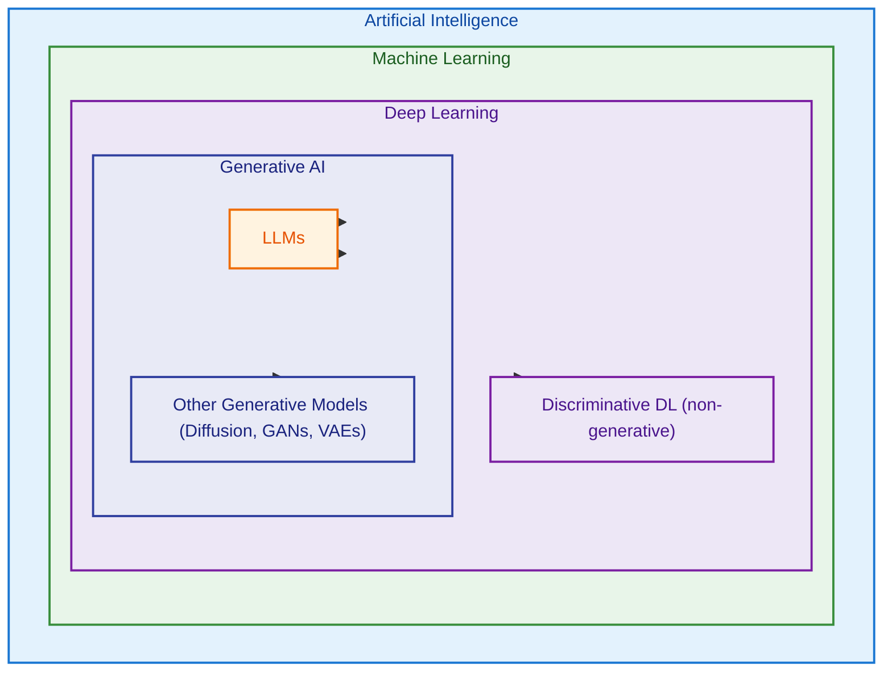

# 🤖 AI and Machine Learning Track

**Learning Level**: Beginner → Advanced  
**Prerequisites**: Python basics, linear algebra (for DL), stats (for ML)  
**Estimated Time**: Variable by domain; see subfolders  
**Next Steps**: Follow domain learning progression and cross-references

---

## 🎯 Track Overview

This track covers the complete AI and ML spectrum, from foundational concepts to advanced implementations. Follow the suggested learning progression or dive into specific areas based on your needs.

---

## 📚 Domains in This Track

### **🤖 [01_AI/](01_AI/)** - Artificial Intelligence (Strategic Overview)

- **Purpose**: AI fundamentals, ethics, and cross-domain strategy
- **Content**: Domain relationships, strategic overview, learning paths
- **Start Here**: For conceptual understanding and navigation
- **Key Files**: `01_AI-Domain-Relationships.md`, `02_Generative-AI-Overview.md`

### **🧠 [02_MachineLearning/](02_MachineLearning/)** - Classical ML Algorithms

- **Purpose**: Traditional machine learning and statistical methods
- **Content**: Supervised/unsupervised learning, model evaluation, classical approaches
- **Prerequisites**: Basic statistics, Python programming
- **Leads To**: Deep learning, specialized applications

### **⚡ [03_DeepLearning/](03_DeepLearning/)** - Neural Networks & Advanced AI

- **Purpose**: Neural networks, deep learning architectures, modern AI
- **Content**: CNNs, RNNs, Transformers, cutting-edge architectures
- **Prerequisites**: Machine learning fundamentals, linear algebra
- **Enables**: Computer vision, NLP, generative AI

### **🗣️ [04_NaturalLanguageProcessing/](04_NaturalLanguageProcessing/)** - Language AI

- **Purpose**: Text processing, language understanding, conversational AI
- **Content**: Language models, NLP tasks, linguistic applications
- **Prerequisites**: Machine learning, basic linguistics
- **Specialization**: Human language processing and generation

### **🧾 [05_LargeLanguageModels/](05_LargeLanguageModels/)** - Modern LLM Foundation

- **Purpose**: Understanding and working with large language models
- **Content**: LLM architecture, scaling laws, prompt engineering, fine-tuning
- **Prerequisites**: NLP fundamentals, transformer understanding
- **Critical Bridge**: Essential foundation for AI Agents and modern applications

### **🔗 [06_MCP-Servers/](06_MCP-Servers/)** - AI System Integration

- **Purpose**: Model Context Protocol for connecting AI with external systems
- **Content**: Server development, client integration, production deployment
- **Prerequisites**: API development, AI application understanding
- **Practical Bridge**: Transform AI concepts into production-ready systems

### **🤖 [07_AI-Agents/](07_AI-Agents/)** - Autonomous AI Systems

- **Purpose**: Goal-oriented AI that can plan, reason, and take autonomous actions
- **Content**: Agent architectures, multi-agent systems, agentic AI frameworks
- **Prerequisites**: AI fundamentals, LLM understanding, programming experience
- **Application Focus**: Building autonomous AI systems for complex workflows

---

## 🚀 Learning Progression

### **🔰 Beginner Path**

1. **Start**: `01_AI/` for conceptual overview
2. **Foundation**: `02_MachineLearning/` for core algorithms
3. **Specialization**: Choose `03_DeepLearning/` or `04_NaturalLanguageProcessing/`

### **🎯 Practitioner Path**

- **Current ML**: Deepen `02_MachineLearning/` expertise
- **Modern AI**: Focus on `03_DeepLearning/` architectures
- **Language AI**: Specialize in `04_NaturalLanguageProcessing/`
- **System Integration**: Master `06_MCP-Servers/` for production AI
- **Autonomous Systems**: Develop `07_AI-Agents/` for intelligent automation
- **Modern LLMs**: Build foundation in `05_LargeLanguageModels/`

### **🧠 Advanced Path**

- **Research**: Latest developments in `03_DeepLearning/`
- **Applications**: Cross-domain projects combining multiple areas
- **Production Systems**: Advanced `06_MCP-Servers/` patterns and deployment
- **Agentic AI**: Sophisticated `07_AI-Agents/` architectures and multi-agent systems
- **LLMs**: Advanced `05_LargeLanguageModels/` techniques
- **Leadership**: Strategic AI understanding from `01_AI/` perspective

---

## 🔗 Cross-Track Connections

### **→ Data Science Track**

- **01_DataScience/**: Statistical foundations for ML
- **02_DataAnalytics/**: Applied insights from AI models
- **03_BigData/**: Infrastructure for large-scale AI

### **→ Development Track**

- **01_Python/**: Implementation foundation for all AI work
- **02_software-design-principles/**: Building robust AI systems

---

## 💡 Quick Start Tips

- **New to AI?** Start with `01_AI/07_AI-Terms-Learning-Order.md` for the complete roadmap
- **Want the big picture?** Read `01_AI/01_AI-Domain-Relationships.md` first
- **Have ML background?** Jump to `03_DeepLearning/` or `04_NaturalLanguageProcessing/`
- **Building AI systems?** Focus on `06_MCP-Servers/` for production integration
- **Want autonomous AI?** Explore `07_AI-Agents/` for goal-oriented systems
- **New to LLMs?** Start with `05_LargeLanguageModels/`
- **Specific project?** Use domain cross-references to find relevant content
- **Team training?** Follow the learning progression paths

---

## ❓ Where is Generative AI?

We do not keep a separate “Generative AI” folder. Generative AI is a cross-cutting capability and is organized by the modality/technique:

- Conceptual/strategy overview → `01_AI/04_Generative-AI-Overview.md`
- Text generation and LLM-specific topics → `05_LargeLanguageModels/`
- Image/audio/video and generative architectures (GANs/VAEs/Diffusion) → `03_DeepLearning/` modules
- Language applications and tasks → `04_NaturalLanguageProcessing/`

This avoids duplication and keeps learning paths clear.

### How these fit together (STSA original view)

ASCII-first visualization of containment and specialization:

```text
+--------------------------------------------------------------+
|                     Artificial Intelligence                   |
|  +----------------------------------------------------------+ |
|  |                     Machine Learning                      | |
|  |  +------------------------------------------------------+ | |
|  |  |                      Deep Learning                    | | |
|  |  |  +-----------------------------------------------+   | | |
|  |  |  |        Generative AI (content creation)        |   | | |
|  |  |  |    +------------------+                        |   | | |
|  |  |  |    |  LLMs (language) |                        |   | | |
|  |  |  |    +------------------+                        |   | | |
|  |  |  +-----------------------------------------------+   | | |
|  |  +------------------------------------------------------+ | |
|  +----------------------------------------------------------+ |
+--------------------------------------------------------------+
```

Clarifications

- Generative AI spans text, image, audio, and video; LLMs specialize in language.
- Not all deep learning is generative; many models are discriminative.
- Many generative models aren’t LLMs (diffusion, GANs, VAEs).
- Agents orchestrate models, tools, memory, and policies; they sit above this stack.

Optional Mermaid (if supported):



### Quick hierarchy recap

- Artificial Intelligence — broadest umbrella; includes learning and symbolic/rule-based systems.
  - Machine Learning — learns patterns from data (supervised, unsupervised, RL).
    - Deep Learning — multi-layer neural networks.
      - Discriminative DL — non-generative tasks (classification, regression).
      - Generative AI — content-producing models (text, images, audio, video).
        - Large Language Models (LLMs) — language/code-focused generative models.
        - Other generative models — diffusion, GANs, VAEs (often images/audio/video).

Sanity notes

- Not all deep learning is generative; many models are discriminative/classifiers.
- Many generative models aren’t LLMs (e.g., diffusion, GANs, VAEs for images/audio/video).

Related reading:

- Strategy: `01_AI/04_Generative-AI-Overview.md`
- LLMs: `05_LargeLanguageModels/`
- Beyond LLMs (diffusion, GANs): `03_DeepLearning/`

**📅 Last Updated**: August 2025  
**🎯 Focus**: Complete AI and ML learning ecosystem with production integration  
**📍 Position**: Core track for artificial intelligence mastery
