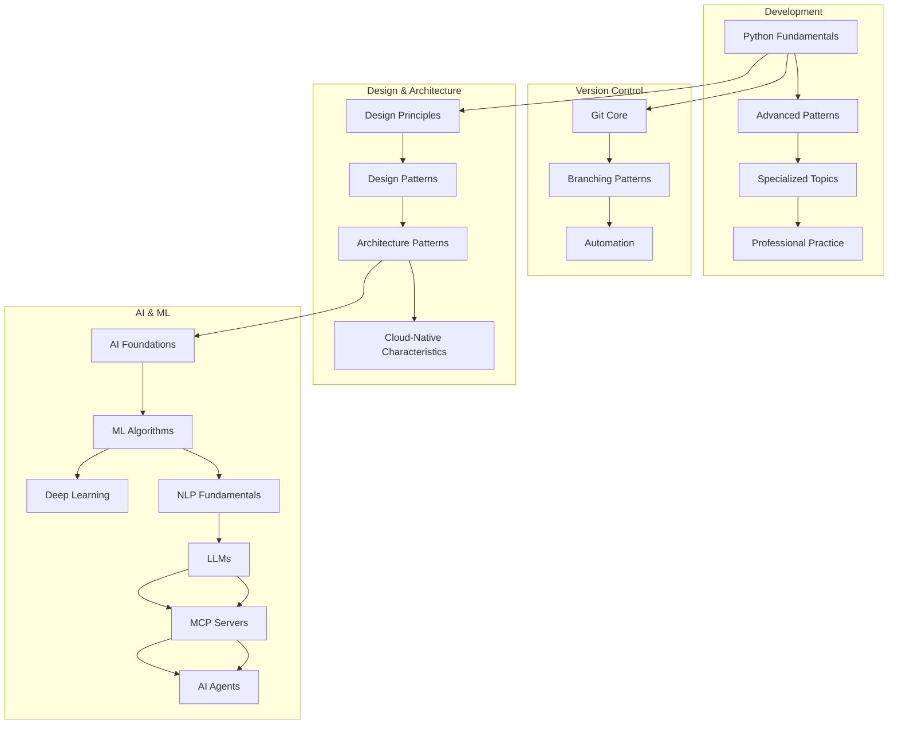

# Reference Library Index

**Purpose**: Master navigation map across domains (Development, AI & ML, Data Science) with prerequisite flow.

**Last Updated**: 2025-08-26

**Status**: Draft

## 🧭 High-Level Domains

- Development (foundational coding, design, tooling)
- AI & ML (intelligent systems lifecycle)
- Data Science (analysis, infrastructure, scale)

## 🔗 Core Pathways

1. Programming Foundations → Software Design → Version Control → Architectural Principles
2. Math/Stats (external) → Machine Learning → Deep Learning → LLMs → MCP Servers → AI Agents
3. Data Foundations → Data Analytics → Data Science Methods → Big Data Architecture

## 🧬 Dependency Graph (ASCII)

```text
[Python Fundamentals] --> [Advanced Patterns] --> [Specialized Topics] --> [Professional Practice]
          |                               
          v                               
   [Git Core] --> [Branching Patterns] --> [Automation]
          |                                
          v                                
[Design Principles] --> [Design Patterns] --> [Architecture Patterns]
                                   |
                                   v
                              [AI Foundations] --> [ML Algorithms] --> [Deep Learning]
                                                       |                   |
                                                       v                   v
                                              [NLP Fundamentals] --> [LLMs] --> [MCP Servers] --> [AI Agents]
```

### Mermaid Visualization (Optional)



## 📂 Domain Indices

See each domain README plus forthcoming PATHWAY.md files.

- Cloud‑Native overview (Development → Architectural Principles): [01_Development/02_software-design-principles/06-architectural-principles/01_Cloud-Native-Distributed-Apps-Key-Characteristics.md](01_Development/02_software-design-principles/06-architectural-principles/01_Cloud-Native-Distributed-Apps-Key-Characteristics.md)

## 🧵 Cross-Domain Threads

| Thread | Touchpoints |
|--------|-------------|
| Governance | AI Ethics, Data Governance, Architecture Principles |
| Performance | Python Perf, ML Optimization, Big Data Engines |
| Reliability | Git Workflows, CI/CD, Deployment, Data Pipelines |
| Security | Secure Coding, Model Guardrails, Data Access Control |
| Experimentation | Branching Strategies, ML Experiments, A/B Analytics |

## 📈 Progress Metrics (Targets)

- Stub Upgrade Rate > 10/week
- Cross-links/page ≥ 3 average
- Numbering gaps: 0

## 🚧 Current Gaps (Snapshot)

- Missing Git modules (Undo, Branching, Rewriting, Automation)
- LLM lifecycle (Evaluation, Retrieval Pipeline, Prompt Patterns)
- Data Science methodology overview

## ✅ Immediate Priorities (P0/P1)

- Remove duplicate folders (Python Fundamentals, AI Agents duplication) via deprecation stubs
- Add structured stubs with metadata
- Introduce taxonomy map

## 🔄 Update Protocol

1. Add new stub with metadata
2. Cross-link at least 2 existing pages
3. Open TODO in `05_Todos/Backlog.md`
4. Replace stub within 30 days
