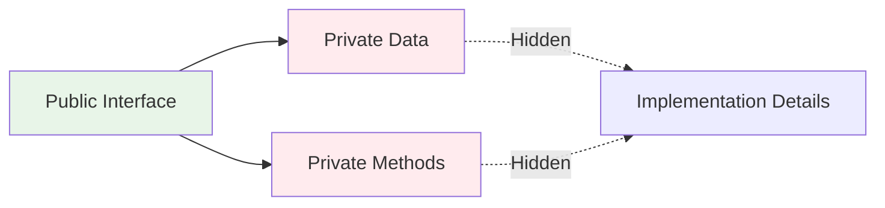
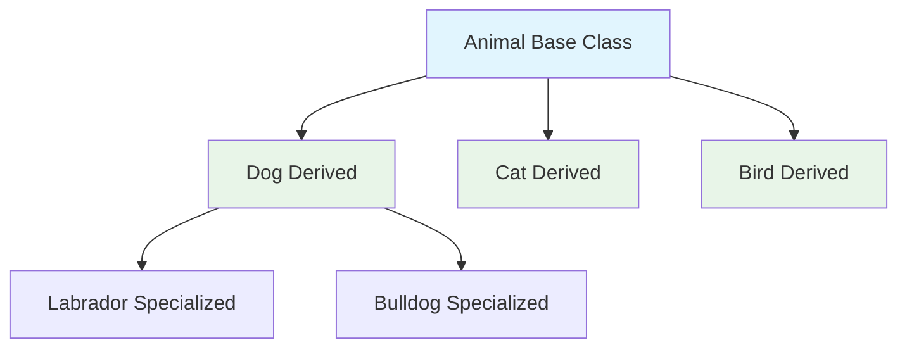
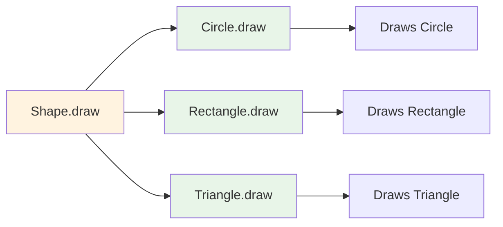
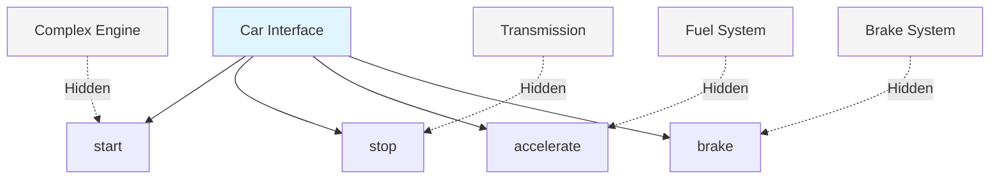
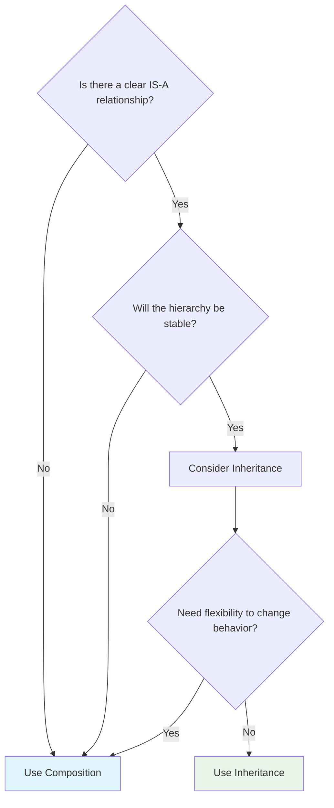
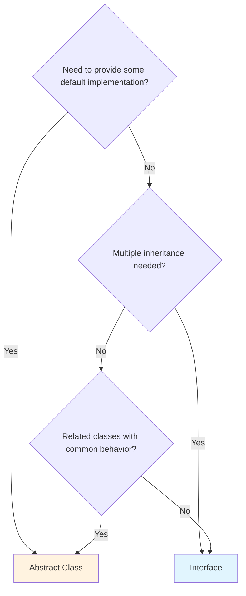

# 🎯 OOP Fundamentals Cheat Sheet

**Language-Agnostic Object-Oriented Programming Reference**

> 📖 **5-minute quick reference** | 🎯 **Focus**: Core concepts and principles | 🔄 **Universal**: Works with any OOP language

---

## 🏛️ The Four Pillars of OOP

### **1. 🔒 Encapsulation**

**Concept**: Bundle data and methods together, hide internal details



**Key Principles:**

- **Data Hiding**: Internal state is private
- **Interface Design**: Public methods provide controlled access
- **Cohesion**: Related data and behavior stay together

**Benefits:**

- ✅ **Security**: Prevents unauthorized access
- ✅ **Maintainability**: Changes to internals don't break external code
- ✅ **Modularity**: Self-contained, reusable components

---

### **2. 🧬 Inheritance**

**Concept**: Create new classes based on existing ones, inheriting properties and behaviors



**Key Principles:**

- **IS-A Relationship**: Dog IS-A Animal
- **Code Reuse**: Inherit common functionality
- **Specialization**: Add or modify behavior in derived classes

**Benefits:**

- ✅ **Code Reuse**: Don't repeat common functionality
- ✅ **Hierarchy**: Natural organization of related classes
- ✅ **Extensibility**: Easy to add new specialized types

---

### **3. 🎭 Polymorphism**

**Concept**: Same interface, different implementations - "many forms"



**Types:**

- **Runtime Polymorphism**: Method overriding (virtual/abstract methods)
- **Compile-time Polymorphism**: Method overloading, operator overloading

**Benefits:**

- ✅ **Flexibility**: Work with objects through common interfaces
- ✅ **Extensibility**: Add new types without changing existing code
- ✅ **Maintainability**: Single interface, multiple implementations

---

### **4. 🔧 Abstraction**

**Concept**: Hide complex implementation details, show only essential features



**Implementation Methods:**

- **Abstract Classes**: Partial implementation, some abstract methods
- **Interfaces**: Pure contracts, no implementation
- **Design Patterns**: Common abstraction strategies

**Benefits:**

- ✅ **Simplicity**: Complex systems become simple to use
- ✅ **Focus**: Users focus on what, not how
- ✅ **Flexibility**: Implementation can change without affecting users

---

## 🎯 SOLID Principles Quick Reference

### **S - Single Responsibility Principle (SRP)**

**Rule**: A class should have only one reason to change

```
❌ BAD: UserManager (handles user data + email + logging)
✅ GOOD: User, EmailService, Logger (separate concerns)
```

### **O - Open/Closed Principle (OCP)**

**Rule**: Open for extension, closed for modification

```
❌ BAD: Modify existing code to add new features
✅ GOOD: Extend through inheritance or composition
```

### **L - Liskov Substitution Principle (LSP)**

**Rule**: Derived classes must be substitutable for their base classes

```
❌ BAD: Square inherits Rectangle but breaks area calculation
✅ GOOD: Derived classes maintain base class contracts
```

### **I - Interface Segregation Principle (ISP)**

**Rule**: Don't force clients to depend on interfaces they don't use

```
❌ BAD: IWorker (work() + eat() + sleep()) - robots don't eat
✅ GOOD: IWorkable, IFeedable, ISleepable (specific interfaces)
```

### **D - Dependency Inversion Principle (DIP)**

**Rule**: Depend on abstractions, not concretions

```
❌ BAD: Class directly creates its dependencies
✅ GOOD: Class receives dependencies through constructor/injection
```

---

## 🔄 Relationships & Composition

### **Inheritance vs Composition**

| Aspect           | Inheritance       | Composition            |
| ---------------- | ----------------- | ---------------------- |
| **Relationship** | IS-A              | HAS-A                  |
| **Coupling**     | Tight             | Loose                  |
| **Flexibility**  | Static            | Dynamic                |
| **Code Reuse**   | Automatic         | Manual                 |
| **When to Use**  | Clear hierarchies | Flexible relationships |

### **Composition Example**

```
Car HAS-A Engine
Car HAS-A Wheels
Car HAS-A Transmission

Benefits: Can swap engines, change wheel types, upgrade transmission
```

### **Inheritance Example**

```
Vehicle -> Car -> SportsCar
Vehicle -> Truck -> DeliveryTruck

Benefits: Automatic inheritance of common vehicle features
```

---

## 🎨 Common Design Patterns

### **Creational Patterns**

- **Factory**: Create objects without specifying exact classes
- **Builder**: Construct complex objects step by step
- **Singleton**: Ensure only one instance exists

### **Structural Patterns**

- **Adapter**: Make incompatible interfaces work together
- **Decorator**: Add behavior without altering structure
- **Facade**: Provide simple interface to complex subsystem

### **Behavioral Patterns**

- **Observer**: Define one-to-many dependency between objects
- **Strategy**: Define family of algorithms, make them interchangeable
- **Command**: Encapsulate requests as objects

---

## ⚡ Quick Decision Trees

### **Inheritance vs Composition Decision**



### **Abstract Class vs Interface Decision**



---

## ⚠️ Common OOP Pitfalls

### **❌ Anti-Patterns to Avoid**

**1. God Object**

- **Problem**: Single class does everything
- **Solution**: Break into smaller, focused classes

**2. Circular Dependencies**

- **Problem**: A depends on B, B depends on A
- **Solution**: Introduce abstraction layer

**3. Inappropriate Inheritance**

- **Problem**: Using inheritance for HAS-A relationships
- **Solution**: Use composition instead

**4. Interface Bloat**

- **Problem**: Interfaces with too many methods
- **Solution**: Split into smaller, focused interfaces

**5. Tight Coupling**

- **Problem**: Classes know too much about each other
- **Solution**: Use dependency injection and abstractions

---

## 🏆 OOP Best Practices

### **✅ Design Guidelines**

**1. Favor Composition over Inheritance**

- More flexible and maintainable
- Avoid deep inheritance hierarchies

**2. Program to Interfaces**

- Depend on abstractions, not concretions
- Makes code more testable and flexible

**3. Keep It Simple (KISS)**

- Don't over-engineer solutions
- Start simple, refactor when needed

**4. You Aren't Gonna Need It (YAGNI)**

- Don't build features you might need later
- Build what you need now

**5. Don't Repeat Yourself (DRY)**

- Extract common functionality
- But don't create artificial abstractions

### **🔍 Code Quality Indicators**

**Good OOP Code:**

- ✅ High cohesion within classes
- ✅ Low coupling between classes
- ✅ Clear, intention-revealing names
- ✅ Small, focused methods and classes
- ✅ Consistent abstraction levels

**Warning Signs:**

- ⚠️ Classes with many responsibilities
- ⚠️ Long parameter lists
- ⚠️ Complex conditional logic
- ⚠️ Duplicate code across classes
- ⚠️ Classes that change for multiple reasons

---

## 🎯 Quick Reference Summary

### **Four Pillars Checklist**

- [ ] **Encapsulation**: Data and methods bundled, internals hidden
- [ ] **Inheritance**: IS-A relationships, code reuse through hierarchy
- [ ] **Polymorphism**: Same interface, different implementations
- [ ] **Abstraction**: Complex details hidden, simple interface exposed

### **SOLID Principles Checklist**

- [ ] **Single Responsibility**: One reason to change
- [ ] **Open/Closed**: Open for extension, closed for modification
- [ ] **Liskov Substitution**: Derived classes substitutable for base
- [ ] **Interface Segregation**: Clients don't depend on unused interfaces
- [ ] **Dependency Inversion**: Depend on abstractions, not concretions

### **Design Decisions**

- **Inheritance**: Use for IS-A relationships and stable hierarchies
- **Composition**: Use for HAS-A relationships and flexibility
- **Abstract Classes**: Use when you need some default implementation
- **Interfaces**: Use for contracts and multiple inheritance

---

**🎯 Next Steps**: Apply these concepts in your chosen programming language and see the C# Specific Cheat Sheet for implementation details.

_This cheat sheet works with Java, C#, C++, Python, TypeScript, and any object-oriented language._
