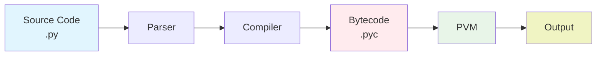

# 🔧 Python Bytecode Documentation

**Complete Guide to Python Bytecode Generation, Management, and Analysis**

---

## 📋 Table of Contents

1. [What is Python Bytecode?](#what-is-python-bytecode)
2. [A. Generate Bytecode](#a-generate-bytecode)
3. [B. .pyc Files](#b-pyc-files)
4. [C. View Bytecode](#c-view-bytecode)
5. [Advanced Topics](#advanced-topics)
6. [Practical Examples](#practical-examples)
7. [Tools and Resources](#tools-and-resources)
8. [Best Practices](#best-practices)
9. [Troubleshooting](#troubleshooting)

---

## 🎯 What is Python Bytecode?

Python bytecode is an intermediate representation of Python code that the Python Virtual Machine (PVM) executes. When you run a Python program, the interpreter:

1. **Parses** your source code (.py files)
2. **Compiles** it to bytecode
3. **Executes** the bytecode in the Python Virtual Machine



---

## 🔄 A. Generate Bytecode

### Automatic Generation

Python automatically generates bytecode when:

- You import a module
- You run a Python script
- The source code is newer than existing bytecode

### Manual Generation Methods

#### 1. Using `py_compile` module

```python
import py_compile

# Compile a single file
py_compile.compile('utils.py')

# Compile to specific location
py_compile.compile('utils.py', 'custom_bytecode.pyc')
```

#### 2. Using `compileall` module

```python
import compileall

# Compile all .py files in a directory
compileall.compile_dir('.')

# Compile with optimization
compileall.compile_dir('.', optimize=1)  # -O flag
compileall.compile_dir('.', optimize=2)  # -OO flag
```

#### 3. Command Line Compilation

```bash
# Compile single file
python -m py_compile utils.py

# Compile entire directory
python -m compileall .

# Compile with optimization levels
python -O -m compileall .   # Level 1: Remove assert statements
python -OO -m compileall .  # Level 2: Remove assert + docstrings
```

#### 4. Using `compile()` function

```python
# Compile source code to code object
source = '''
def hello():
    return "Hello, World!"
'''

code_obj = compile(source, '<string>', 'exec')
exec(code_obj)
```

---

## 📁 B. .pyc Files

### What are .pyc files?

- **Python Compiled files**: Binary files containing bytecode
- **Faster loading**: Skip parsing and compilation steps
- **Platform independent**: Work across different OS with same Python version
- **Version specific**: Include Python version in filename (e.g., `utils.cpython-313.pyc`)

### .pyc File Structure

```
Magic Number (4 bytes)    - Python version identifier
Flags (4 bytes)          - Compilation flags
Modification Time (4 bytes) - Source file timestamp
Size (4 bytes)           - Source file size
Bytecode (remaining)     - Marshalled code object
```

### .pyc File Locations

- **Python 3.2+**: `__pycache__/` directory
- **Python 2**: Same directory as source file
- **Naming convention**: `filename.cpython-<version>.pyc`

### Managing .pyc Files

```python
import os
import shutil

# Remove all .pyc files
def clean_pyc_files(directory):
    for root, dirs, files in os.walk(directory):
        for file in files:
            if file.endswith('.pyc'):
                os.remove(os.path.join(root, file))
        # Remove empty __pycache__ directories
        if '__pycache__' in dirs:
            pycache_path = os.path.join(root, '__pycache__')
            if not os.listdir(pycache_path):
                os.rmdir(pycache_path)
```

### Environment Variables

- `PYTHONDONTWRITEBYTECODE=1`: Prevent .pyc file generation
- `PYTHONPYCACHEPREFIX=path`: Change .pyc file location

---

## 👀 C. View Bytecode

### 1. Using `dis` module (Recommended)

```python
import dis

# View bytecode of a function
def sample_function(x, y):
    return x + y * 2

dis.dis(sample_function)
```

### 2. View bytecode from imported modules

```python
import dis
import utils

# Disassemble specific function
dis.dis(utils.add_numbers)

# Disassemble entire module
dis.dis(utils)
```

### 3. View bytecode from .pyc files directly

```python
import marshal
import dis
import struct

def view_pyc_bytecode(pyc_file):
    with open(pyc_file, 'rb') as f:
        # Skip magic number and flags (8 bytes in Python 3.7+)
        f.read(8)

        # Skip timestamp and size (8 bytes)
        f.read(8)

        # Load the code object
        code = marshal.load(f)

        # Disassemble
        dis.dis(code)

# Example usage
view_pyc_bytecode('__pycache__/utils.cpython-313.pyc')
```

### 4. Command Line Bytecode Viewing

```bash
# View bytecode of a Python file
python -m dis utils.py

# View bytecode of a specific function
python -c "import dis; import utils; dis.dis(utils.add_numbers)"
```

### 5. Interactive Bytecode Exploration

```python
import dis
import types

# Get bytecode as string
def get_bytecode_string(func):
    import io
    import contextlib

    output = io.StringIO()
    with contextlib.redirect_stdout(output):
        dis.dis(func)
    return output.getvalue()

# Example
bytecode_str = get_bytecode_string(utils.add_numbers)
print(bytecode_str)
```

---

## 🚀 Advanced Topics

### Bytecode Optimization Levels

| Level       | Flag      | Description                                                |
| ----------- | --------- | ---------------------------------------------------------- |
| **Level 0** | (default) | No optimization                                            |
| **Level 1** | `-O`      | Remove assert statements and **debug** blocks              |
| **Level 2** | `-OO`     | Remove assert statements, **debug** blocks, and docstrings |

### Code Object Attributes

```python
import utils

func = utils.add_numbers
print(f"Name: {func.__code__.co_name}")
print(f"Filename: {func.__code__.co_filename}")
print(f"Line number: {func.__code__.co_firstlineno}")
print(f"Argument count: {func.__code__.co_argcount}")
print(f"Constants: {func.__code__.co_consts}")
print(f"Variable names: {func.__code__.co_varnames}")
```

### Bytecode Instructions

Common bytecode instructions:

| Instruction     | Description          |
| --------------- | -------------------- |
| `LOAD_FAST`     | Load local variable  |
| `LOAD_GLOBAL`   | Load global variable |
| `LOAD_CONST`    | Load constant        |
| `BINARY_ADD`    | Add two values       |
| `RETURN_VALUE`  | Return from function |
| `CALL_FUNCTION` | Call a function      |

### Security Considerations

- .pyc files are **NOT encrypted**
- Source code can be partially reconstructed
- Use tools like PyInstaller or cx_Freeze for distribution
- Consider code obfuscation for sensitive applications

---

## 💡 Practical Examples

### Example 1: Compare Source vs Bytecode Performance

```python
import dis
import time

def time_function(func, *args, **kwargs):
    start = time.time()
    result = func(*args, **kwargs)
    end = time.time()
    return result, end - start

# Your function here
def fibonacci(n):
    if n <= 1:
        return n
    return fibonacci(n-1) + fibonacci(n-2)

# View bytecode
print("Bytecode for fibonacci function:")
dis.dis(fibonacci)
```

### Example 2: Analyze Bytecode Differences

```python
import dis

def version_a(items):
    result = []
    for item in items:
        result.append(item * 2)
    return result

def version_b(items):
    return [item * 2 for item in items]

print("Version A (loop):")
dis.dis(version_a)

print("\nVersion B (list comprehension):")
dis.dis(version_b)
```

### Example 3: Custom Bytecode Analysis

```python
import dis
import types

def analyze_function(func):
    """Analyze a function's bytecode and provide insights."""
    code = func.__code__

    print(f"Function: {func.__name__}")
    print(f"Arguments: {code.co_argcount}")
    print(f"Local variables: {len(code.co_varnames)}")
    print(f"Constants: {code.co_consts}")
    print(f"Names used: {code.co_names}")

    # Count instruction types
    instructions = list(dis.get_instructions(func))
    instruction_counts = {}
    for instr in instructions:
        instruction_counts[instr.opname] = instruction_counts.get(instr.opname, 0) + 1

    print(f"Instruction counts: {instruction_counts}")
    print(f"Total instructions: {len(instructions)}")

    return instructions

# Example usage
instructions = analyze_function(utils.add_numbers)
```

---

## 🛠️ Tools and Resources

### Built-in Modules

- **`dis`**: Disassemble bytecode
- **`py_compile`**: Compile single files
- **`compileall`**: Compile directories
- **`marshal`**: Serialize Python objects
- **`types`**: Work with Python types

### Third-party Tools

- **`uncompyle6`**: Decompile .pyc files back to source
- **`pycdc`**: C++ decompiler for Python bytecode
- **`dis_plus`**: Enhanced disassembler

### Useful Commands

```bash
# Prevent .pyc generation
export PYTHONDONTWRITEBYTECODE=1

# Custom .pyc location
export PYTHONPYCACHEPREFIX=/tmp/pycache

# Compile with different optimization levels
python -O script.py      # Level 1
python -OO script.py     # Level 2
```

---

## ✅ Best Practices

1. **Don't commit .pyc files** to version control
2. **Use .gitignore** to exclude `__pycache__/` directories
3. **Clean .pyc files** when switching Python versions
4. **Use bytecode analysis** for performance optimization
5. **Understand bytecode** for debugging complex issues

### Recommended .gitignore entries

```gitignore
# Byte-compiled / optimized / DLL files
__pycache__/
*.py[cod]
*$py.class

# C extensions
*.so

# Distribution / packaging
.Python
build/
develop-eggs/
dist/
downloads/
eggs/
.eggs/
lib/
lib64/
parts/
sdist/
var/
wheels/
```

---

## 🔧 Troubleshooting

### Common Issues

| Issue                     | Possible Cause               | Solution                              |
| ------------------------- | ---------------------------- | ------------------------------------- |
| **ImportError**           | Python version compatibility | Check Python version compatibility    |
| **Permission errors**     | No write access              | Ensure write access to directories    |
| **Stale bytecode**        | Source changed               | Delete .pyc files when source changes |
| **Cross-platform issues** | Different architectures      | Recompile when moving between systems |

### Debugging Steps

1. **Delete all .pyc files**
2. **Recompile** with verbose output
3. **Check Python version** compatibility
4. **Verify file permissions**
5. **Use `python -v`** for import debugging

### Debug Commands

```bash
# Verbose import information
python -v script.py

# Don't write bytecode files
python -B script.py

# Check Python version
python --version

# Clear all bytecode files
find . -name "*.pyc" -delete
find . -name "__pycache__" -type d -exec rm -rf {} +
```

---

## 🔗 Connection to Your Learning Journey

This bytecode knowledge supports:

- **OOP Development**: Understanding class compilation and optimization
- **Performance Analysis**: Identifying bottlenecks in your code
- **Debugging Skills**: Using bytecode analysis for complex issues
- **Professional Development**: Advanced Python understanding

---

**📅 Last Updated**: July 18, 2025  
**📌 Source**: Advanced Python fundamentals study  
**🎯 Purpose**: Deep understanding of Python execution internals  
**📍 Learning Context**: Building on compilation and interpretation concepts


These are all items I previously had access to, and this is requesting reinstatement after they lapsed due to a missed deadline. I am developer in CHAR (previously DH team). I need access to work on the projects.