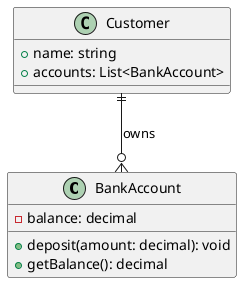

# 🎨 UML for OOP - Object Modeling Reference

**Visual Object-Oriented Design and Modeling Guide**

> 📖 **7-minute reference** | 🎯 **Focus**: Object relationships and class design | 🎨 **Visual**: UML diagrams for OOP concepts

## ✅ **UML-OOP Coverage Map**

This guide focuses on **UML diagrams that directly support OOP design** - practical object modeling, not system architecture:

### 🏗️ **Class Modeling**

✅ Class diagram syntax and notation  
✅ Object relationship visualization  
✅ Inheritance hierarchies  
✅ Interface and abstract class representation

### 🔗 **Relationship Modeling**

✅ Association, Aggregation, Composition visual syntax  
✅ Dependency and generalization arrows  
✅ Multiplicity and role naming  
✅ Bidirectional vs unidirectional relationships

### 💡 **OOP Concept Visualization**

✅ Polymorphism through interfaces  
✅ Encapsulation boundaries  
✅ Design pattern visualization  
✅ Code-to-diagram mapping

---

## 🏛️ Class Diagram Fundamentals

### **Basic Class Notation**

```
┌─────────────────────┐
│      ClassName      │ ← Class name in bold
├─────────────────────┤
│ - privateField      │ ← Attributes section
│ + publicProperty    │   (- private, + public, # protected)
│ # protectedField    │
├─────────────────────┤
│ + publicMethod()    │ ← Methods section
│ - privateMethod()   │   (same visibility rules)
│ # protectedMethod() │
└─────────────────────┘
```

### **Real Example: BankAccount Class**

```
┌─────────────────────┐
│    BankAccount      │
├─────────────────────┤
│ - balance: decimal  │
│ + accountNumber: string │
│ + ownerName: string │
├─────────────────────┤
│ + deposit(amount: decimal): void   │
│ + withdraw(amount: decimal): bool  │
│ + getBalance(): decimal           │
│ - validateAmount(amount): bool    │
└─────────────────────┘
```

### **C# Code Mapping**

```csharp
public class BankAccount
{
    private decimal balance;           // - balance: decimal
    public string AccountNumber { get; set; }  // + accountNumber: string
    public string OwnerName { get; set; }      // + ownerName: string

    public void Deposit(decimal amount) { }    // + deposit(amount: decimal): void
    public bool Withdraw(decimal amount) { }   // + withdraw(amount: decimal): bool
    public decimal GetBalance() => balance;    // + getBalance(): decimal
    private bool ValidateAmount(decimal amount) { } // - validateAmount(amount): bool
}
```

---

## 🔗 Relationship Arrows and Meanings

### **The Big 5 Relationships**

| Relationship    | Arrow Symbol | Meaning                      | Example              |
| --------------- | ------------ | ---------------------------- | -------------------- |
| **Association** | `────────>`  | "uses-a" relationship        | Student → Course     |
| **Aggregation** | `────◇────>` | "has-a" (weak ownership)     | Library ◇── Book     |
| **Composition** | `────◆────>` | "part-of" (strong ownership) | House ◆── Room       |
| **Inheritance** | `────△────>` | "is-a" relationship          | Dog △── Animal       |
| **Dependency**  | `- - - - ->` | "depends-on" temporarily     | Client ····> Service |

### **Association Examples**

```
┌─────────┐                    ┌─────────┐
│ Student │ ────────────────> │ Course  │
└─────────┘    "attends"       └─────────┘
     1                            0..*
```

**C# Implementation:**

```csharp
public class Student
{
    public void AttendCourse(Course course) { } // Uses course temporarily
}
```

### **Aggregation Examples**

```
┌─────────┐                    ┌─────────┐
│ Library │ ◇─────────────────> │  Book   │
└─────────┘   "contains"        └─────────┘
     1                             0..*
```

**C# Implementation:**

```csharp
public class Library
{
    public List<Book> Books { get; set; } = new();
    // Books can exist without the library
}
```

### **Composition Examples**

```
┌─────────┐                    ┌─────────┐
│  House  │ ◆─────────────────> │  Room   │
└─────────┘    "contains"       └─────────┘
     1                             1..*
```

**C# Implementation:**

```csharp
public class House
{
    private readonly List<Room> rooms = new(); // Rooms cannot exist without house

    public House()
    {
        rooms.Add(new Room("Living Room"));  // Created with house
        rooms.Add(new Room("Bedroom"));
    }
}
```

---

## 🧬 Inheritance Visualization

### **Simple Inheritance Hierarchy**

```
                    ┌─────────┐
                    │ Animal  │
                    │---------|
                    │ + name  │
                    │ + speak()│
                    └────△────┘
                         │
            ┌────────────┼────────────┐
            │                         │
       ┌────▽────┐               ┌────▽────┐
       │   Dog   │               │   Cat   │
       │---------|               │---------|
       │ + breed │               │ + color │
       │ + bark()│               │ + meow()│
       └─────────┘               └─────────┘
```

### **Interface Implementation**

```
        ┌─────────────┐
        │ <<interface>>│
        │  IFlyable   │ ← Italic text or <<interface>>
        │-------------|
        │ + takeOff() │
        │ + land()    │
        └──────△──────┘
               │
               │ (implements)
        ┌──────▽──────┐
        │    Bird     │
        │-------------|
        │ + wingspan  │
        │ + takeOff() │
        │ + land()    │
        └─────────────┘
```

---

## 🎭 Polymorphism Visualization

### **Runtime Polymorphism Through Inheritance**

```
┌─────────────┐                ┌─────────────┐
│    Shape    │                │   Client    │
│-------------|                │-------------|
│ + area()    │ ←──────────────│ + calculate()│
└─────△───────┘                └─────────────┘
      │
      │ (inheritance)
┌─────┼─────┐
│           │
▽           ▽
┌─────────┐ ┌─────────┐
│ Circle  │ │Rectangle│
│---------│ │---------|
│+ area() │ │+ area() │
└─────────┘ └─────────┘
```

**Shows how Client can work with any Shape subclass**

### **Interface-Based Polymorphism**

```
┌─────────────┐              ┌─────────────┐
│<<interface>>│              │   Logger    │
│ IRepository │ ←────────────│-------------|
│-------------|              │ + log()     │
│ + save()    │              └─────────────┘
│ + find()    │
└──────△──────┘
       │
       │ (implements)
┌──────┼──────┐
│             │
▽             ▽
┌───────────┐ ┌─────────────┐
│SqlRepo    │ │FileRepo     │
│-----------│ │-------------|
│+ save()   │ │+ save()     │
│+ find()   │ │+ find()     │
└───────────┘ └─────────────┘
```

---

## 🔧 Multiplicity and Constraints

### **Multiplicity Notation**

| Notation      | Meaning                  |
| ------------- | ------------------------ |
| `1`           | Exactly one              |
| `0..1`        | Zero or one (optional)   |
| `1..*`        | One or more              |
| `0..*` or `*` | Zero or more (unlimited) |
| `2..5`        | Between 2 and 5          |

### **Real-World Example: Order System**

```
┌─────────┐     1      0..*  ┌─────────┐     *      1  ┌─────────┐
│Customer │ ◇─────────────── │  Order  │ ◇─────────────│ Product │
│---------|  "places"        │---------|  "contains"   │---------|
│ + name  │                  │ + date  │               │ + name  │
│ + email │                  │ + total │               │ + price │
└─────────┘                  └─────────┘               └─────────┘
```

**Reads as:**

- One Customer can place 0 or more Orders
- One Order contains 1 or more Products
- One Product can be in many Orders

---

## 🎨 Design Pattern Visualization

### **Observer Pattern**

```
┌─────────────┐              ┌─────────────┐
│  Subject    │              │ <<interface>>│
│-------------|              │  Observer   │
│ + observers │ ◇────────────│-------------|
│ + notify()  │       *      │ + update()  │
└─────────────┘              └──────△──────┘
                                     │
                              ┌──────┼──────┐
                              │             │
                              ▽             ▽
                      ┌─────────────┐ ┌─────────────┐
                      │EmailObserver│ │ LogObserver │
                      │-------------│ │-------------|
                      │ + update()  │ │ + update()  │
                      └─────────────┘ └─────────────┘
```

### **Strategy Pattern**

```
┌─────────────┐              ┌─────────────┐
│   Context   │              │ <<interface>>│
│-------------|              │  Strategy   │
│ + strategy  │ ────────────>│-------------|
│ + execute() │       1      │ + execute() │
└─────────────┘              └──────△──────┘
                                     │
                              ┌──────┼──────┐
                              │             │
                              ▽             ▽
                      ┌─────────────┐ ┌─────────────┐
                      │ FastStrategy│ │SlowStrategy │
                      │-------------│ │-------------|
                      │ + execute() │ │ + execute() │
                      └─────────────┘ └─────────────┘
```

---

## 💡 UML-to-Code Workflow

### **Step 1: Design First**

```
1. Draw classes and relationships
2. Define multiplicities
3. Identify abstract classes and interfaces
4. Add method signatures
```

### **Step 2: Validate Design**

```
- Can you trace through use cases?
- Are relationships logical?
- Do multiplicities make sense?
- Is inheritance used appropriately?
```

### **Step 3: Implement in C#**

```csharp
// From UML to C# - systematic translation
public class Customer
{
    public List<Order> Orders { get; set; } = new(); // 0..* relationship

    public void PlaceOrder(Order order)
    {
        Orders.Add(order);
        order.Customer = this; // Bidirectional relationship
    }
}
```

---

## 🎯 Common UML Mistakes to Avoid

### **❌ Over-Complicating Diagrams**

```
// BAD - too much detail
Every method, every parameter, every field shown

// GOOD - focus on relationships
Show key methods, important attributes, clear relationships
```

### **❌ Wrong Relationship Types**

```
// BAD - using association for composition
Library ────> Book (should be composition)

// GOOD - correct relationship
Library ◆───> Book (book is part of library)
```

### **❌ Missing Multiplicities**

```
// BAD - unclear relationships
Customer ────> Order

// GOOD - clear cardinality
Customer 1 ────> 0..* Order
```

---

## 🚀 Tools and Quick Tips

### **Recommended UML Tools**

- **PlantUML** - Text-based diagrams (great for version control)
- **Lucidchart** - Web-based with good templates
- **Draw.io** - Free, browser-based
- **Visual Studio** - Built-in class diagram generation

### **PlantUML Quick Example**



### **🎯 Quick Reference: When to Use UML**

**✅ Use UML When:**

- Designing new classes and relationships
- Communicating design to team members
- Documenting complex inheritance hierarchies
- Planning refactoring of existing code

**❌ Don't Use UML When:**

- Simple classes with obvious relationships
- Rapid prototyping or spikes
- Implementation details are more important than design
- Team doesn't read diagrams

---

## 🔗 Integration with OOP Fundamentals

### **Links to Other OOP Resources**

- **Prerequisites**: Understanding from `01_OOP-Fundamentals-CheatSheet.md`
- **Implementation**: Apply designs using `02_OOP-CSharp-CheatSheet.md`
- **Next Steps**: Advanced patterns in `04_SOLID-Principles-Deep-Dive.md`

### **Workflow Integration**

```
1. Learn OOP concepts (Fundamentals sheet)
2. Design with UML (This sheet)
3. Implement in C# (C# sheet)
4. Apply SOLID principles (SOLID sheet)
```

---

## 📚 Quick Reference Summary

### **Essential UML for OOP**

| Element     | Notation                  | Use Case                        |
| ----------- | ------------------------- | ------------------------------- |
| Class       | Rectangle with 3 sections | Define object structure         |
| Association | Plain arrow               | "uses" relationship             |
| Aggregation | Diamond arrow             | "has" relationship (weak)       |
| Composition | Filled diamond            | "part of" relationship (strong) |
| Inheritance | Triangle arrow            | "is a" relationship             |
| Interface   | `<<interface>>`           | Contract definition             |

### **Remember**

> **UML is a communication tool, not a requirement. Use it when it adds clarity to your object-oriented design, not because you feel you should.**

---

_📝 **Focus**: Visual design supporting object-oriented programming concepts_
