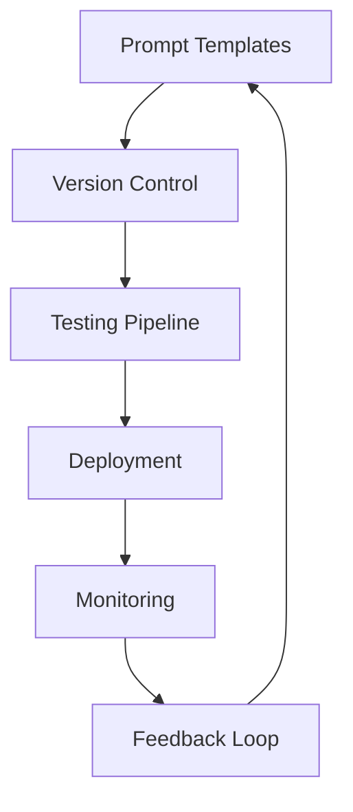

# 🛡️ Production Prompt Engineering

## 🎯 Overview

Enterprise-grade prompt engineering practices for production AI systems, focusing on reliability, security, performance, and maintainability.

---

## 🏗️ Production Architecture

### **Prompt Management System**



### **Core Components**

1. **Template Repository**: Centralized storage for prompt templates
2. **Version Control**: Track changes and manage rollbacks
3. **Testing Framework**: Automated validation and quality assurance
4. **Deployment Pipeline**: Controlled release management
5. **Monitoring System**: Real-time performance tracking
6. **Feedback Loop**: Continuous improvement based on metrics

---

## 📋 Prompt Template Management

### **Template Structure**

```json
{
  "id": "code-review-v2.1",
  "name": "Code Review Assistant",
  "version": "2.1.0",
  "description": "Reviews code for quality, security, and best practices",
  "category": "development",
  "template": "You are a senior software engineer...",
  "parameters": {
    "language": "required",
    "complexity": "optional",
    "focus_areas": "optional"
  },
  "validation": {
    "min_tokens": 50,
    "max_tokens": 2000,
    "required_sections": ["analysis", "recommendations"]
  },
  "metadata": {
    "created": "2024-01-15",
    "author": "engineering-team",
    "tags": ["code", "review", "quality"]
  }
}
```

### **Versioning Strategy**

- **Major Version**: Breaking changes to template structure
- **Minor Version**: New features or significant improvements
- **Patch Version**: Bug fixes and minor adjustments

### **Template Categories**

- **Analysis**: Data analysis, reporting, insights
- **Generation**: Content creation, code generation
- **Transformation**: Format conversion, summarization
- **Validation**: Quality checking, compliance verification

---

## 🧪 Testing and Validation

### **Automated Testing Framework**

```python
class PromptTestSuite:
    def __init__(self, template_id):
        self.template = PromptTemplate.load(template_id)
        self.test_cases = TestCaseLoader.load_for_template(template_id)

    def run_accuracy_tests(self):
        """Test output accuracy against expected results"""
        results = []
        for test_case in self.test_cases:
            output = self.template.execute(test_case.input)
            accuracy = self.evaluate_accuracy(output, test_case.expected)
            results.append(accuracy)
        return results

    def run_performance_tests(self):
        """Test response time and token usage"""
        metrics = []
        for test_case in self.test_cases:
            start_time = time.time()
            output = self.template.execute(test_case.input)
            duration = time.time() - start_time

            metrics.append({
                'duration': duration,
                'tokens_used': count_tokens(output),
                'cost': calculate_cost(output)
            })
        return metrics

    def run_safety_tests(self):
        """Test for harmful or inappropriate outputs"""
        safety_results = []
        for test_case in self.safety_test_cases:
            output = self.template.execute(test_case.input)
            is_safe = SafetyValidator.validate(output)
            safety_results.append(is_safe)
        return safety_results
```

### **Test Categories**

1. **Functional Tests**: Verify correct output format and content
2. **Performance Tests**: Measure response time and resource usage
3. **Safety Tests**: Check for harmful or inappropriate content
4. **Regression Tests**: Ensure changes don't break existing functionality
5. **Load Tests**: Validate performance under high concurrent usage

---

## 📊 Performance Optimization

### **Token Optimization**

```python
class TokenOptimizer:
    def optimize_prompt(self, prompt_text):
        """Reduce token count while maintaining effectiveness"""

        # Remove redundant phrases
        optimized = self.remove_redundancy(prompt_text)

        # Use more efficient phrasing
        optimized = self.improve_efficiency(optimized)

        # Compress examples
        optimized = self.compress_examples(optimized)

        return optimized

    def estimate_cost(self, prompt_text, model="gpt-4"):
        """Calculate estimated API cost"""
        token_count = self.count_tokens(prompt_text)
        rate = self.get_model_rate(model)
        return token_count * rate
```

### **Caching Strategy**

```python
class PromptCache:
    def __init__(self, redis_client):
        self.cache = redis_client
        self.ttl = 3600  # 1 hour default

    def get_cached_response(self, prompt_hash):
        """Retrieve cached response if available"""
        return self.cache.get(f"prompt:{prompt_hash}")

    def cache_response(self, prompt_hash, response, ttl=None):
        """Cache response for future use"""
        cache_ttl = ttl or self.ttl
        self.cache.setex(f"prompt:{prompt_hash}", cache_ttl, response)

    def should_cache(self, prompt_type, input_size):
        """Determine if prompt should be cached"""
        return (
            prompt_type in ['analysis', 'translation'] and
            input_size < 1000  # Don't cache large inputs
        )
```

### **Batch Processing**

```python
class BatchProcessor:
    def __init__(self, batch_size=10, max_concurrent=5):
        self.batch_size = batch_size
        self.max_concurrent = max_concurrent

    async def process_batch(self, prompts):
        """Process multiple prompts efficiently"""
        batches = self.create_batches(prompts)

        tasks = []
        for batch in batches:
            task = asyncio.create_task(self.process_single_batch(batch))
            tasks.append(task)

            if len(tasks) >= self.max_concurrent:
                results = await asyncio.gather(*tasks)
                tasks = []
                yield results

        if tasks:
            results = await asyncio.gather(*tasks)
            yield results
```

---

## 🔒 Security and Safety

### **Input Validation**

```python
class InputValidator:
    def validate_input(self, user_input):
        """Validate and sanitize user input"""

        # Check for injection attempts
        if self.detect_injection(user_input):
            raise SecurityError("Potential injection detected")

        # Sanitize special characters
        sanitized = self.sanitize_input(user_input)

        # Check content appropriateness
        if not self.is_appropriate_content(sanitized):
            raise ContentError("Inappropriate content detected")

        return sanitized

    def detect_injection(self, text):
        """Detect potential prompt injection attempts"""
        injection_patterns = [
            r"ignore.{0,20}previous.{0,20}instructions",
            r"system.{0,10}prompt",
            r"forget.{0,20}everything",
            r"new.{0,10}instructions"
        ]

        for pattern in injection_patterns:
            if re.search(pattern, text, re.IGNORECASE):
                return True
        return False
```

### **Output Filtering**

```python
class OutputFilter:
    def __init__(self):
        self.content_classifier = ContentClassifier()
        self.pii_detector = PIIDetector()

    def filter_output(self, output_text):
        """Filter potentially harmful or sensitive content"""

        # Check for harmful content
        if self.content_classifier.is_harmful(output_text):
            return self.apply_content_filter(output_text)

        # Remove PII
        filtered = self.pii_detector.redact_pii(output_text)

        # Check for policy violations
        if self.violates_policy(filtered):
            return self.apply_policy_filter(filtered)

        return filtered
```

### **Rate Limiting**

```python
class RateLimiter:
    def __init__(self, requests_per_minute=60):
        self.rate_limit = requests_per_minute
        self.requests = defaultdict(list)

    def check_rate_limit(self, user_id):
        """Check if user has exceeded rate limit"""
        now = time.time()
        minute_ago = now - 60

        # Clean old requests
        self.requests[user_id] = [
            req_time for req_time in self.requests[user_id]
            if req_time > minute_ago
        ]

        # Check limit
        if len(self.requests[user_id]) >= self.rate_limit:
            raise RateLimitError("Rate limit exceeded")

        # Record new request
        self.requests[user_id].append(now)
```

---

## 📈 Monitoring and Analytics

### **Real-time Metrics**

```python
class PromptMetrics:
    def __init__(self):
        self.metrics_client = MetricsClient()

    def record_request(self, template_id, duration, tokens, cost):
        """Record request metrics"""
        self.metrics_client.increment(f"prompt.requests.{template_id}")
        self.metrics_client.timing(f"prompt.duration.{template_id}", duration)
        self.metrics_client.gauge(f"prompt.tokens.{template_id}", tokens)
        self.metrics_client.gauge(f"prompt.cost.{template_id}", cost)

    def record_quality_score(self, template_id, score):
        """Record output quality metrics"""
        self.metrics_client.gauge(f"prompt.quality.{template_id}", score)

    def record_error(self, template_id, error_type):
        """Record error occurrences"""
        self.metrics_client.increment(f"prompt.errors.{template_id}.{error_type}")
```

### **Dashboard Metrics**

- **Request Volume**: Requests per minute/hour/day
- **Response Time**: Average, median, 95th percentile
- **Token Usage**: Input/output tokens, cost per request
- **Quality Scores**: User ratings, automated quality metrics
- **Error Rates**: By type and template
- **Cache Hit Rate**: Percentage of cached responses

### **Alerting Rules**

```yaml
alerts:
  - name: "High Error Rate"
    condition: "error_rate > 0.05"
    duration: "5m"
    action: "notify_team"

  - name: "High Response Time"
    condition: "avg_response_time > 30s"
    duration: "2m"
    action: "auto_scale"

  - name: "Cost Spike"
    condition: "hourly_cost > threshold * 1.5"
    duration: "1h"
    action: "cost_alert"
```

---

## 🔄 Continuous Improvement

### **A/B Testing Framework**

```python
class PromptABTest:
    def __init__(self, test_name, variants):
        self.test_name = test_name
        self.variants = variants
        self.traffic_split = 1.0 / len(variants)

    def get_variant(self, user_id):
        """Determine which variant to use for user"""
        hash_value = hash(f"{user_id}{self.test_name}") % 100
        variant_index = int(hash_value * len(self.variants) / 100)
        return self.variants[variant_index]

    def record_result(self, user_id, variant, outcome):
        """Record test result"""
        TestResults.record({
            'test_name': self.test_name,
            'user_id': user_id,
            'variant': variant,
            'outcome': outcome,
            'timestamp': time.time()
        })
```

### **Feedback Collection**

```python
class FeedbackCollector:
    def collect_user_feedback(self, request_id, rating, comments=None):
        """Collect explicit user feedback"""
        feedback = {
            'request_id': request_id,
            'rating': rating,
            'comments': comments,
            'timestamp': time.time()
        }
        self.store_feedback(feedback)

    def collect_implicit_feedback(self, request_id, actions):
        """Collect implicit feedback from user actions"""
        implicit_feedback = {
            'request_id': request_id,
            'actions': actions,  # copy, edit, retry, etc.
            'timestamp': time.time()
        }
        self.store_implicit_feedback(implicit_feedback)
```

---

## 🚀 Deployment Strategies

### **Blue-Green Deployment**

```python
class PromptDeployment:
    def __init__(self):
        self.blue_version = "v1.0"
        self.green_version = "v1.1"
        self.traffic_percentage = 0  # 0% green, 100% blue

    def deploy_green(self, new_version):
        """Deploy new version to green environment"""
        self.green_version = new_version
        self.validate_deployment()

    def switch_traffic(self, percentage):
        """Gradually switch traffic to green"""
        self.traffic_percentage = min(percentage, 100)
        self.update_load_balancer()

    def rollback(self):
        """Rollback to blue version"""
        self.traffic_percentage = 0
        self.update_load_balancer()
```

### **Canary Releases**

```python
class CanaryRelease:
    def __init__(self, template_id, new_version):
        self.template_id = template_id
        self.new_version = new_version
        self.canary_percentage = 5  # Start with 5%

    def increase_canary_traffic(self):
        """Gradually increase canary traffic"""
        if self.metrics_look_good():
            self.canary_percentage = min(self.canary_percentage * 2, 100)
        else:
            self.rollback_canary()

    def metrics_look_good(self):
        """Check if canary metrics are acceptable"""
        error_rate = self.get_error_rate()
        response_time = self.get_avg_response_time()
        quality_score = self.get_quality_score()

        return (
            error_rate < 0.01 and
            response_time < 5.0 and
            quality_score > 0.8
        )
```

---

## 💰 Cost Optimization

### **Cost Monitoring**

```python
class CostOptimizer:
    def __init__(self):
        self.cost_thresholds = {
            'hourly': 100.0,
            'daily': 2000.0,
            'monthly': 50000.0
        }

    def check_cost_alerts(self):
        """Monitor and alert on cost thresholds"""
        current_costs = self.get_current_costs()

        for period, threshold in self.cost_thresholds.items():
            if current_costs[period] > threshold:
                self.send_cost_alert(period, current_costs[period], threshold)

    def optimize_templates(self):
        """Identify high-cost templates for optimization"""
        template_costs = self.analyze_template_costs()
        high_cost_templates = [
            t for t in template_costs
            if t['cost_per_request'] > 0.50
        ]
        return high_cost_templates
```

### **Resource Management**

- **Model Selection**: Choose appropriate models for each use case
- **Token Budgets**: Set limits on token usage per request
- **Request Batching**: Combine multiple requests efficiently
- **Cache Optimization**: Maximize cache hit rates
- **Usage Analytics**: Track and optimize high-volume operations

---

## 📚 Best Practices Summary

### **Development**

- Use version control for all prompts
- Implement comprehensive testing
- Follow security guidelines
- Monitor performance metrics
- Collect and act on feedback

### **Operations**

- Automate deployment pipelines
- Implement proper monitoring
- Set up alerting and escalation
- Plan for disaster recovery
- Regular security audits

### **Optimization**

- Continuously measure and improve
- A/B test different approaches
- Optimize for cost and performance
- Update based on model improvements
- Stay current with best practices

---

_This production guide ensures reliable, secure, and efficient prompt engineering at enterprise scale._
