# 🎯 Learning System Guide

**Master Your Four-Pillar Learning Architecture**

---

## 🌟 Quick Start: Your Learning Success Formula

### **The 3-Step Daily Rhythm**

1. **📋 Plan** (5 min) → Review today's goals in `02_LearningJourney`
2. **🔍 Reference** (as needed) → Use curated materials in `03_ReferenceLibrary`
3. **📝 Document** (10 min) → Capture learning in `01_LeadArchitectKnowledgeBase`

---

## 🔄 Detailed Workflow Examples

### **🗓️ Monday Planning Session (30 minutes)**

**Location**: `02_LearningJourney/Week-XX-Topic.md`

```mermaid
graph TD
    A[📅 Monday Morning] --> B[Review Week Plan]
    B --> C[Set Daily Goals]
    C --> D[Identify Reference Materials]
    D --> E[Schedule Learning Blocks]
    E --> F[Start Day 1]

    B1[Check 03_ReferenceLibrary] -.-> D
    B2[Review 04_LegacyContent if needed] -.-> D

    style A fill:#e8f5e8
    style F fill:#fff3e0
```



**Your Weekly Kickoff Checklist:**

- [ ] Read the week's learning objectives
- [ ] Scan reference materials in `03_ReferenceLibrary`
- [ ] Set up your daily tracking template
- [ ] Block time for 1-hour daily sessions
- [ ] Identify what will go into your portfolio

---

### **⚡ Daily Learning Rhythm (1 hour focus blocks)**

```mermaid
graph LR
    A[Start Learning Session] --> B[Quick Reference Check]
    B --> C[Hands-On Practice]
    C --> D[Document Key Insights]
    D --> E[Update Progress]

    R[03_ReferenceLibrary<br/>📖 Quick Lookup] -.-> B
    J[02_LearningJourney<br/>📝 Track Progress] -.-> A
    J -.-> E
    K[01_LeadArchitectKnowledgeBase<br/>📚 Capture Learning] -.-> D

    style A fill:#e8f5e8
    style C fill:#e1f5fe
    style D fill:#fff3e0
```



**Your Productive Learning Flow:**

1. **⚡ Start (2 min)**: Check today's focus in `02_LearningJourney`
2. **🔍 Reference (5 min)**: Quick lookup in `03_ReferenceLibrary`
3. **🛠️ Practice (45 min)**: Hands-on coding, exercises, implementation
4. **📝 Document (8 min)**: Key insights and code examples into `01_LeadArchitectKnowledgeBase`

---

### **📈 Weekly Portfolio Update (Friday, 20 minutes)**


**Portfolio Building Process:**

- [ ] Review all work completed in `02_LearningJourney`
- [ ] Select your best implementations and insights
- [ ] Create organized documentation in `01_LeadArchitectKnowledgeBase`
- [ ] Clean up and archive weekly notes
- [ ] Plan next week's learning focus

---

## ⚡ Best Practices for Each Folder

### **📝 02_LearningJourney - Your Active Workspace**

**Purpose**: Current week planning, daily tracking, and work-in-progress

#### **Daily Tracking Template**

```markdown
## Day X - [Date]

### 🎯 Today's Focus

- [ ] Main learning objective
- [ ] Practice exercise
- [ ] Key concept to master

### 🔍 Reference Materials Used

- Link to 03_ReferenceLibrary materials

### ✅ Completed

- What I learned
- Code I wrote
- Problems I solved

### 📝 Insights & Notes

- Key takeaways
- Questions for tomorrow
- What to document in Knowledge Base
```

#### **Weekly Structure**

- One file per week: `Week-01-OOP.md`, `Week-02-DesignPatterns.md`
- Daily sections with consistent tracking
- Links to reference materials and resources
- Progress indicators and retrospectives

---

### **📖 03_ReferenceLibrary - Your Quick Reference Desk**

**Purpose**: Curated, actively-used materials for efficient learning

#### **Curation Strategy**


#### **Organization Standards**

- **Subject-based folders**: `Python/`, `AI/`, `Architecture/`
- **Quality over quantity**: Only materials you actively use
- **Clear README files**: Purpose and usage for each section
- **Quick access**: Optimized for fast reference during learning

#### **Reference Library Checklist**

- [ ] Is this material something I reference weekly?
- [ ] Does it provide quick answers to common questions?
- [ ] Is it well-organized and easy to scan?
- [ ] Does it complement my active learning?

---

### **📚 01_LeadArchitectKnowledgeBase - Your Portfolio of Mastery**

**Purpose**: Documented evidence of completed learning and implemented solutions

#### **Documentation Standards**

```markdown
# Week X: [Topic] Mastery

## 🎯 Learning Objectives Achieved

- [ ] Objective 1 with evidence
- [ ] Objective 2 with implementation
- [ ] Objective 3 with examples

## 🛠️ Implementations Created

### Project/Exercise 1

- **Purpose**: What it demonstrates
- **Code**: Link or embedded examples
- **Learning**: Key insights gained

## 🧠 Conceptual Understanding

### Key Concepts Mastered

1. **Concept 1**: Explanation + practical application
2. **Concept 2**: Real-world usage + examples

## 📈 Skills Progression

- **Before**: What I couldn't do
- **After**: What I can now accomplish
- **Evidence**: Concrete examples and implementations
```

#### **Portfolio Building Rules**

- Only document **completed and understood** material
- Include **working code examples** and implementations
- Demonstrate **practical application** of concepts
- Show **progression and skill development**
- Maintain **professional presentation** standards

---

## 🎯 Real Scenarios with Workflow Diagrams

### **Scenario 1: Starting Week 1 OOP Learning (Your Immediate Need!)**


**Week 1 Success Plan:**

1. **Monday**: Read your 21-day OOP plan, set up tracking
2. **Daily**: 1-hour focus blocks with reference materials
3. **Each Day**: Practice exercises → Document key learning
4. **Friday**: Consolidate week's work into portfolio entry
5. **Weekend**: Review progress, plan Week 2

---

### **Scenario 2: Discovering New Reference Material**


**Material Curation Workflow:**

- **Immediate learning need** → Add to current week in `02_LearningJourney`
- **Quick reference value** → Curate and add to `03_ReferenceLibrary`
- **Comprehensive resource** → Archive in `04_LegacyContent` for future exploration

---

### **Scenario 3: Knowledge Consolidation Process**


---

## 📊 Progress Tracking Methodologies

### **Weekly Retrospective Template**

**Location**: End of each `02_LearningJourney/Week-XX.md` file

```markdown
## 📊 Week X Retrospective

### ✅ Completed Objectives

- [x] Objective 1: Evidence of completion
- [x] Objective 2: Implementation created
- [ ] Objective 3: Needs more work (carry to next week)

### 🏆 Key Achievements

1. **Technical Skill**: What I can now build/do
2. **Conceptual Understanding**: What I now understand deeply
3. **Practical Application**: How I'll use this in real work

### 🔍 What Worked Well

- Learning strategies that were effective
- Reference materials that were most helpful
- Time management approaches that worked

### 🎯 Areas for Improvement

- Concepts that need more practice
- Skills that need reinforcement
- Learning approaches to adjust

### ➡️ Next Week Planning

- Carry-forward objectives
- New learning focus
- Reference materials needed
- Time allocation adjustments
```

---

### **Skill Progression Matrix**

**Location**: `01_LeadArchitectKnowledgeBase/SKILL_PROGRESSION.md`

| Skill Area           | Week 1              | Week 2            | Week 3            | Week 4             | Evidence                |
| -------------------- | ------------------- | ----------------- | ----------------- | ------------------ | ----------------------- |
| **OOP Mastery**      | Classes & Objects   | Inheritance       | Polymorphism      | Design Patterns    | Link to implementations |
| **Python Internals** | Basic Understanding | Bytecode Analysis | Memory Management | Performance Tuning | Code examples           |
| **Architecture**     | Monolithic          | Layered           | Microservices     | Domain-Driven      | Real project examples   |

---

## 🚀 Success Tips & Common Pitfalls

### **🎯 Success Accelerators**

1. **Consistency Over Intensity**: 1 hour daily beats 7 hours once weekly
2. **Active Documentation**: Write while you learn, not after
3. **Quality References**: Curate ruthlessly, keep only what you use
4. **Portfolio Focus**: Always ask "How will I document this mastery?"
5. **Weekly Reviews**: Friday retrospectives prevent drift and confusion

### **⚠️ Common Pitfalls to Avoid**

1. **Hoarding Content**: Don't put everything in Reference Library
2. **Skipping Documentation**: Active learning without capture loses value
3. **Week Planning Neglect**: Jumping in without clear objectives wastes time
4. **Portfolio Procrastination**: Don't wait until "later" to document mastery
5. **Single Folder Usage**: Use the system as designed - each folder has a purpose

---

## 🎪 Your Learning System in Action

### **Perfect Week Example: Week 1 OOP**

**Monday**: Plan week, set up tracking, start Day 1 Classes & Objects
**Tuesday-Thursday**: Daily 1-hour practice sessions with documentation
**Friday**: Consolidate learning into portfolio, plan Week 2
**Weekend**: Light review and preparation for Week 2 Inheritance focus

**Folder Activity**:

- `02_LearningJourney`: Active daily tracking and practice
- `03_ReferenceLibrary`: Quick Python reference lookups
- `01_LeadArchitectKnowledgeBase`: Growing portfolio of OOP mastery
- `04_LegacyContent`: Occasional deep-dive when needed

---

## 🎯 Ready to Start?

Your system is set up for success! Here's your immediate action plan:

### **This Week (Week 1 OOP)**

1. [ ] Open `02_LearningJourney/Week-01-OOP.md`
2. [ ] Review the 21-day plan and today's focus
3. [ ] Set up your daily tracking template
4. [ ] Start your first 1-hour learning session
5. [ ] Use this guide as your workflow reference

### **Every Day**

- **Plan** (5 min): Check today's learning objectives
- **Reference** (as needed): Use curated materials for quick answers
- **Document** (10 min): Capture insights and progress

### **Every Week**

- **Monday**: Week planning and setup
- **Friday**: Portfolio consolidation and next week planning

**You have everything you need to succeed. Now execute the system and watch your skills grow systematically!**

---

_💡 Keep this guide bookmarked - it's your operational manual for learning success._
