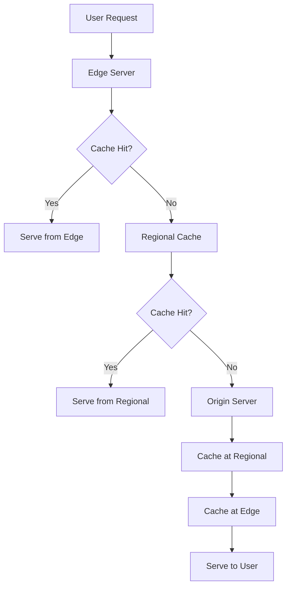

# Chapter 6: Content Delivery Networks (CDN)

## Overview

Content Delivery Networks (CDNs) are geographically distributed networks of servers that deliver web content and services to users based on their geographic location. CDNs improve performance, reduce latency, and enhance user experience by caching content closer to end users while providing additional benefits like DDoS protection and improved availability.

## Learning Objectives

By the end of this chapter, you will understand:

- CDN architecture and how content is distributed globally
- Different types of CDN services and their use cases
- CDN caching strategies and content optimization techniques
- Popular CDN providers and their unique features
- Security features and DDoS protection capabilities
- Performance optimization and analytics

---

## 1. CDN Architecture and Components

### 1.1 Core Components



### 1.2 Geographic Distribution

```python
# CDN Point of Presence (PoP) representation
class CDNPoP:
    def __init__(self, location, capacity, latency_zones):
        self.location = location
        self.capacity = capacity  # Storage and bandwidth
        self.latency_zones = latency_zones  # Geographic coverage
        self.cache_storage = {}
        self.hit_ratio = 0.0
        self.active_connections = 0
    
    def can_serve_location(self, user_location):
        return user_location in self.latency_zones
    
    def get_estimated_latency(self, user_location):
        # Calculate estimated latency based on geographic distance
        base_latency = self._calculate_distance_latency(user_location)
        load_factor = self.active_connections / self.capacity
        return base_latency * (1 + load_factor * 0.5)

class CDNNetwork:
    def __init__(self):
        self.pops = {}
        self.routing_table = {}
        
    def add_pop(self, pop_id, pop):
        self.pops[pop_id] = pop
        self._update_routing_table()
    
    def find_optimal_pop(self, user_location, content_type):
        """Find the best PoP based on latency, capacity, and content availability"""
        candidates = []
        
        for pop_id, pop in self.pops.items():
            if pop.can_serve_location(user_location):
                latency = pop.get_estimated_latency(user_location)
                has_content = content_type in pop.cache_storage
                
                candidates.append({
                    'pop_id': pop_id,
                    'pop': pop,
                    'latency': latency,
                    'has_content': has_content,
                    'score': self._calculate_pop_score(latency, has_content, pop.hit_ratio)
                })
        
        # Sort by score (lower is better)
        candidates.sort(key=lambda x: x['score'])
        return candidates[0] if candidates else None
    
    def _calculate_pop_score(self, latency, has_content, hit_ratio):
        """Calculate a score for PoP selection (lower is better)"""
        score = latency
        if not has_content:
            score *= 2  # Penalty for cache miss
        score *= (2 - hit_ratio)  # Favor high hit ratio PoPs
        return score
```

---

## 2. CDN Caching Strategies

### 2.1 Cache Levels and Hierarchy

```python
class CDNCacheHierarchy:
    def __init__(self):
        self.edge_caches = {}     # Closest to users
        self.regional_caches = {} # Mid-tier caches
        self.origin_shield = {}   # Shield for origin servers
    
    def request_content(self, content_id, user_location):
        # 1. Try edge cache first
        edge_cache = self._get_edge_cache(user_location)
        content = edge_cache.get(content_id)
        
        if content:
            self._record_hit('edge', content_id)
            return content
        
        # 2. Try regional cache
        regional_cache = self._get_regional_cache(user_location)
        content = regional_cache.get(content_id)
        
        if content:
            # Cache at edge for future requests
            edge_cache.set(content_id, content, ttl=3600)
            self._record_hit('regional', content_id)
            return content
        
        # 3. Try origin shield
        origin_shield = self._get_origin_shield(user_location)
        content = origin_shield.get(content_id)
        
        if content:
            # Cache at regional and edge
            regional_cache.set(content_id, content, ttl=7200)
            edge_cache.set(content_id, content, ttl=3600)
            self._record_hit('shield', content_id)
            return content
        
        # 4. Fetch from origin
        content = self._fetch_from_origin(content_id)
        if content:
            # Cache at all levels
            origin_shield.set(content_id, content, ttl=86400)
            regional_cache.set(content_id, content, ttl=7200)
            edge_cache.set(content_id, content, ttl=3600)
            self._record_miss(content_id)
        
        return content
```

### 2.2 Cache Control and Headers

```python
class CDNCacheControl:
    def __init__(self):
        self.cache_rules = {}
    
    def set_cache_policy(self, content_type, policy):
        """Set caching policy for different content types"""
        self.cache_rules[content_type] = policy
    
    def get_cache_headers(self, content_type, file_path):
        """Generate appropriate cache headers"""
        policy = self.cache_rules.get(content_type, {})
        
        headers = {}
        
        # Static assets (CSS, JS, images with versioning)
        if self._is_versioned_static_asset(file_path):
            headers.update({
                'Cache-Control': 'public, max-age=31536000, immutable',  # 1 year
                'Expires': self._get_future_date(365 * 24 * 3600)
            })
        
        # Images and media
        elif content_type.startswith('image/') or content_type.startswith('video/'):
            headers.update({
                'Cache-Control': 'public, max-age=86400',  # 24 hours
                'Expires': self._get_future_date(24 * 3600)
            })
        
        # HTML pages
        elif content_type == 'text/html':
            headers.update({
                'Cache-Control': 'public, max-age=300, must-revalidate',  # 5 minutes
                'ETag': self._generate_etag(file_path)
            })
        
        # API responses
        elif 'api' in file_path:
            headers.update({
                'Cache-Control': 'private, max-age=60',  # 1 minute
                'Vary': 'Authorization, Accept-Encoding'
            })
        
        # Apply custom policy overrides
        if policy:
            headers.update(policy.get('headers', {}))
        
        return headers
    
    def _is_versioned_static_asset(self, file_path):
        """Check if file has version string (hash or version number)"""
        import re
        versioned_patterns = [
            r'\.\w{8,}\.(css|js|png|jpg|gif)$',  # Hash-based versioning
            r'\.v\d+\.(css|js|png|jpg|gif)$',    # Version number
            r'/(v\d+)/.*\.(css|js|png|jpg|gif)$' # Path-based versioning
        ]
        
        return any(re.search(pattern, file_path) for pattern in versioned_patterns)

# Example usage
cache_control = CDNCacheControl()

# Set policies for different content types
cache_control.set_cache_policy('application/json', {
    'headers': {'Cache-Control': 'private, max-age=300'},
    'vary_headers': ['Authorization']
})

cache_control.set_cache_policy('text/css', {
    'headers': {'Cache-Control': 'public, max-age=31536000'},
    'compression': True
})
```

### 2.3 Smart Caching and Predictive Loading

```python
class PredictiveCDNCache:
    def __init__(self):
        self.access_patterns = defaultdict(list)
        self.prediction_models = {}
        self.preload_queue = asyncio.Queue()
    
    def record_access(self, user_id, content_id, timestamp, location):
        """Record user access patterns for prediction"""
        self.access_patterns[user_id].append({
            'content_id': content_id,
            'timestamp': timestamp,
            'location': location
        })
        
        # Keep only recent history (last 30 days)
        cutoff = timestamp - (30 * 24 * 3600)
        self.access_patterns[user_id] = [
            access for access in self.access_patterns[user_id]
            if access['timestamp'] > cutoff
        ]
    
    def predict_next_content(self, user_id, current_content_id):
        """Predict what content user might access next"""
        user_history = self.access_patterns.get(user_id, [])
        
        if len(user_history) < 2:
            return []
        
        # Find sequences where user accessed current content
        sequences = []
        for i, access in enumerate(user_history[:-1]):
            if access['content_id'] == current_content_id:
                next_access = user_history[i + 1]
                if next_access['timestamp'] - access['timestamp'] < 3600:  # Within 1 hour
                    sequences.append(next_access['content_id'])
        
        # Return most frequent next content
        if sequences:
            from collections import Counter
            return Counter(sequences).most_common(3)
        
        return []
    
    async def preload_predicted_content(self, user_id, current_content_id, user_location):
        """Preload predicted content to nearby edge caches"""
        predictions = self.predict_next_content(user_id, current_content_id)
        
        for content_id, confidence in predictions:
            if confidence > 0.3:  # Only preload high-confidence predictions
                await self.preload_queue.put({
                    'content_id': content_id,
                    'user_location': user_location,
                    'priority': confidence
                })
    
    async def background_preloader(self):
        """Background task to preload predicted content"""
        while True:
            preload_task = await self.preload_queue.get()
            
            try:
                # Find optimal edge cache for user location
                edge_cache = self._get_optimal_edge_cache(preload_task['user_location'])
                
                # Check if content is already cached
                if not edge_cache.exists(preload_task['content_id']):
                    # Fetch and cache content
                    content = await self._fetch_content(preload_task['content_id'])
                    if content:
                        await edge_cache.set(
                            preload_task['content_id'], 
                            content, 
                            ttl=1800  # Shorter TTL for predicted content
                        )
            
            except Exception as e:
                print(f"Preload failed for {preload_task['content_id']}: {e}")
            
            finally:
                self.preload_queue.task_done()
```

---

## 3. CDN Types and Services

### 3.1 Traditional CDN (Pull CDN)

```python
class PullCDN:
    def __init__(self, origin_servers):
        self.origin_servers = origin_servers
        self.edge_caches = {}
        self.cache_policies = {}
    
    async def handle_request(self, request_path, edge_location):
        edge_cache = self.edge_caches[edge_location]
        
        # Check edge cache
        cached_content = await edge_cache.get(request_path)
        if cached_content and not self._is_expired(cached_content):
            return self._create_response(cached_content, cache_hit=True)
        
        # Fetch from origin
        origin_response = await self._fetch_from_origin(request_path)
        
        if origin_response.status == 200:
            # Cache the response
            cache_ttl = self._get_cache_ttl(request_path, origin_response.headers)
            await edge_cache.set(request_path, origin_response, ttl=cache_ttl)
        
        return origin_response
    
    def _get_cache_ttl(self, path, headers):
        """Determine TTL based on content type and headers"""
        # Check Cache-Control header from origin
        cache_control = headers.get('Cache-Control', '')
        if 'max-age' in cache_control:
            import re
            match = re.search(r'max-age=(\d+)', cache_control)
            if match:
                return int(match.group(1))
        
        # Default TTL based on file type
        if path.endswith(('.css', '.js', '.png', '.jpg', '.gif')):
            return 86400  # 24 hours for static assets
        elif path.endswith('.html'):
            return 300    # 5 minutes for HTML
        else:
            return 3600   # 1 hour default
```

### 3.2 Push CDN

```python
class PushCDN:
    def __init__(self):
        self.edge_caches = {}
        self.distribution_queue = asyncio.Queue()
        self.replication_status = {}
    
    async def upload_content(self, content_id, content_data, target_locations=None):
        """Upload content to specified edge locations"""
        if target_locations is None:
            target_locations = list(self.edge_caches.keys())
        
        upload_tasks = []
        
        for location in target_locations:
            task = asyncio.create_task(
                self._upload_to_location(content_id, content_data, location)
            )
            upload_tasks.append(task)
        
        # Wait for all uploads to complete
        results = await asyncio.gather(*upload_tasks, return_exceptions=True)
        
        # Track replication status
        self.replication_status[content_id] = {
            'total_locations': len(target_locations),
            'successful_locations': sum(1 for r in results if not isinstance(r, Exception)),
            'failed_locations': [
                target_locations[i] for i, r in enumerate(results) 
                if isinstance(r, Exception)
            ],
            'upload_time': time.time()
        }
        
        return self.replication_status[content_id]
    
    async def _upload_to_location(self, content_id, content_data, location):
        """Upload content to a specific edge location"""
        edge_cache = self.edge_caches[location]
        
        try:
            # Compress content if applicable
            compressed_data = await self._compress_content(content_data)
            
            # Upload to edge cache
            await edge_cache.set(content_id, compressed_data)
            
            # Verify upload
            stored_data = await edge_cache.get(content_id)
            if not stored_data:
                raise Exception(f"Upload verification failed for {location}")
            
            return True
            
        except Exception as e:
            print(f"Upload failed to {location}: {e}")
            raise
    
    async def invalidate_content(self, content_id, locations=None):
        """Remove content from edge caches"""
        if locations is None:
            locations = list(self.edge_caches.keys())
        
        invalidation_tasks = []
        
        for location in locations:
            task = asyncio.create_task(
                self.edge_caches[location].delete(content_id)
            )
            invalidation_tasks.append(task)
        
        results = await asyncio.gather(*invalidation_tasks, return_exceptions=True)
        
        return {
            'content_id': content_id,
            'invalidated_locations': [
                locations[i] for i, r in enumerate(results)
                if not isinstance(r, Exception)
            ],
            'failed_locations': [
                locations[i] for i, r in enumerate(results)
                if isinstance(r, Exception)
            ]
        }
```

### 3.3 Video CDN and Streaming

```python
class VideoCDN:
    def __init__(self):
        self.video_storage = {}
        self.transcoding_queue = asyncio.Queue()
        self.streaming_sessions = {}
    
    async def upload_video(self, video_id, video_file, metadata):
        """Upload and process video for streaming"""
        # Store original video
        self.video_storage[video_id] = {
            'original': video_file,
            'metadata': metadata,
            'transcoded_versions': {},
            'thumbnails': [],
            'upload_time': time.time()
        }
        
        # Queue for transcoding
        await self.transcoding_queue.put({
            'video_id': video_id,
            'priority': metadata.get('priority', 'normal')
        })
        
        return video_id
    
    async def transcode_video(self, video_id):
        """Create multiple quality versions of video"""
        video_data = self.video_storage[video_id]
        original_file = video_data['original']
        
        # Define quality presets
        quality_presets = [
            {'name': '240p', 'width': 426, 'height': 240, 'bitrate': '400k'},
            {'name': '360p', 'width': 640, 'height': 360, 'bitrate': '800k'},
            {'name': '480p', 'width': 854, 'height': 480, 'bitrate': '1200k'},
            {'name': '720p', 'width': 1280, 'height': 720, 'bitrate': '2500k'},
            {'name': '1080p', 'width': 1920, 'height': 1080, 'bitrate': '5000k'}
        ]
        
        transcoding_tasks = []
        
        for preset in quality_presets:
            task = asyncio.create_task(
                self._transcode_to_quality(video_id, original_file, preset)
            )
            transcoding_tasks.append(task)
        
        # Also create thumbnails
        thumbnail_task = asyncio.create_task(
            self._generate_thumbnails(video_id, original_file)
        )
        
        # Wait for all transcoding to complete
        transcoded_versions = await asyncio.gather(*transcoding_tasks)
        thumbnails = await thumbnail_task
        
        # Update video data
        video_data['transcoded_versions'] = {
            preset['name']: version for preset, version in 
            zip(quality_presets, transcoded_versions)
        }
        video_data['thumbnails'] = thumbnails
        
        # Distribute to edge caches
        await self._distribute_video_to_edges(video_id)
        
        return video_data
    
    async def create_streaming_session(self, video_id, user_location, quality='auto'):
        """Create adaptive streaming session"""
        session_id = f"{video_id}_{int(time.time())}_{hash(user_location)}"
        
        # Find optimal edge server
        edge_server = self._find_optimal_edge_server(user_location)
        
        # Determine initial quality based on user's connection
        if quality == 'auto':
            quality = await self._detect_optimal_quality(user_location)
        
        session = {
            'session_id': session_id,
            'video_id': video_id,
            'user_location': user_location,
            'edge_server': edge_server,
            'current_quality': quality,
            'start_time': time.time(),
            'bandwidth_history': [],
            'quality_changes': []
        }
        
        self.streaming_sessions[session_id] = session
        
        # Generate HLS or DASH manifest
        manifest = await self._generate_streaming_manifest(video_id, quality, edge_server)
        
        return {
            'session_id': session_id,
            'manifest_url': manifest['url'],
            'initial_quality': quality
        }
    
    async def _generate_streaming_manifest(self, video_id, quality, edge_server):
        """Generate HLS (m3u8) or DASH manifest for adaptive streaming"""
        video_data = self.video_storage[video_id]
        
        # HLS manifest example
        manifest_content = "#EXTM3U\n#EXT-X-VERSION:3\n"
        
        # Add quality variants
        for quality_name, version_data in video_data['transcoded_versions'].items():
            bandwidth = version_data['bitrate'].replace('k', '000')
            resolution = f"{version_data['width']}x{version_data['height']}"
            
            manifest_content += f"""#EXT-X-STREAM-INF:BANDWIDTH={bandwidth},RESOLUTION={resolution}
{edge_server}/video/{video_id}/{quality_name}/playlist.m3u8
"""
        
        # Store manifest
        manifest_url = f"{edge_server}/video/{video_id}/manifest.m3u8"
        await self._store_manifest(manifest_url, manifest_content)
        
        return {'url': manifest_url, 'content': manifest_content}
```

---

## 4. CDN Security Features

### 4.1 DDoS Protection

```python
class CDNDDoSProtection:
    def __init__(self):
        self.request_counters = defaultdict(lambda: defaultdict(int))
        self.blocked_ips = set()
        self.rate_limits = {
            'per_ip_per_minute': 60,
            'per_ip_per_hour': 1000,
            'global_per_second': 10000
        }
        self.anomaly_detector = AnomalyDetector()
    
    async def check_request(self, request):
        """Check if request should be allowed or blocked"""
        client_ip = request.get_client_ip()
        current_minute = int(time.time() // 60)
        current_hour = int(time.time() // 3600)
        
        # Check if IP is already blocked
        if client_ip in self.blocked_ips:
            return self._create_block_response("IP blocked due to previous violations")
        
        # Update counters
        self.request_counters[client_ip][current_minute] += 1
        self.request_counters[client_ip][f'hour_{current_hour}'] += 1
        
        # Check rate limits
        if self.request_counters[client_ip][current_minute] > self.rate_limits['per_ip_per_minute']:
            await self._temporary_block_ip(client_ip, duration=60)
            return self._create_block_response("Rate limit exceeded")
        
        if self.request_counters[client_ip][f'hour_{current_hour}'] > self.rate_limits['per_ip_per_hour']:
            await self._temporary_block_ip(client_ip, duration=3600)
            return self._create_block_response("Hourly limit exceeded")
        
        # Check for anomalous patterns
        is_anomalous = await self.anomaly_detector.analyze_request(request, client_ip)
        if is_anomalous:
            await self._investigate_ip(client_ip)
            return self._create_challenge_response()  # CAPTCHA or JavaScript challenge
        
        return None  # Allow request
    
    async def _temporary_block_ip(self, ip, duration):
        """Temporarily block an IP address"""
        self.blocked_ips.add(ip)
        
        # Schedule unblock
        asyncio.create_task(self._schedule_unblock(ip, duration))
        
        # Log the block
        await self._log_security_event('ip_blocked', {
            'ip': ip,
            'duration': duration,
            'reason': 'rate_limit_exceeded'
        })
    
    async def _schedule_unblock(self, ip, duration):
        """Schedule IP unblocking"""
        await asyncio.sleep(duration)
        self.blocked_ips.discard(ip)
        
        await self._log_security_event('ip_unblocked', {
            'ip': ip,
            'duration': duration
        })

class AnomalyDetector:
    def __init__(self):
        self.baseline_patterns = {}
        self.suspicious_patterns = [
            r'\.\./',  # Directory traversal
            r'<script',  # XSS attempts
            r'union\s+select',  # SQL injection
            r'exec\s*\(',  # Code execution
        ]
    
    async def analyze_request(self, request, client_ip):
        """Analyze request for anomalous patterns"""
        # Check URL for suspicious patterns
        url = request.get_url()
        for pattern in self.suspicious_patterns:
            if re.search(pattern, url, re.IGNORECASE):
                return True
        
        # Check request frequency patterns
        return await self._check_frequency_anomaly(client_ip)
    
    async def _check_frequency_anomaly(self, client_ip):
        """Check if request frequency is anomalous"""
        current_time = time.time()
        time_window = 300  # 5 minutes
        
        # Get recent requests for this IP
        recent_requests = [
            timestamp for timestamp in self.request_history.get(client_ip, [])
            if current_time - timestamp < time_window
        ]
        
        # Calculate request rate
        request_rate = len(recent_requests) / time_window
        
        # Compare with baseline (simplified)
        baseline_rate = self.baseline_patterns.get(client_ip, 0.1)
        
        # Flag as anomalous if rate is 10x higher than baseline
        return request_rate > baseline_rate * 10
```

### 4.2 Web Application Firewall (WAF)

```python
class CDNWebApplicationFirewall:
    def __init__(self):
        self.rules = []
        self.whitelist = set()
        self.blacklist = set()
        self.custom_rules = {}
    
    def add_rule(self, rule_name, pattern, action='block', severity='medium'):
        """Add a WAF rule"""
        rule = {
            'name': rule_name,
            'pattern': re.compile(pattern, re.IGNORECASE),
            'action': action,  # block, allow, log, challenge
            'severity': severity,
            'created_at': time.time()
        }
        self.rules.append(rule)
    
    def add_owasp_top10_rules(self):
        """Add common OWASP Top 10 protection rules"""
        owasp_rules = [
            # SQL Injection
            ('sql_injection', r'(\bunion\b.+\bselect\b|\bselect\b.+\bfrom\b|\binsert\b.+\binto\b)', 'block', 'high'),
            
            # XSS
            ('xss_script_tag', r'<script[^>]*>.*?</script>', 'block', 'high'),
            ('xss_javascript', r'javascript:\s*[^;]+', 'block', 'high'),
            
            # Command Injection
            ('command_injection', r'(\|\s*\w+|\$\([^)]+\)|`[^`]+`)', 'block', 'high'),
            
            # Directory Traversal
            ('directory_traversal', r'(\.\./|\.\.\\\|%2e%2e%2f|%2e%2e%5c)', 'block', 'medium'),
            
            # XXE
            ('xxe_attack', r'<!entity\s+[^>]+>|<!DOCTYPE\s+[^>]+\[', 'block', 'high'),
            
            # LDAP Injection
            ('ldap_injection', r'(\(\||\)\(|\*\)|\)\()', 'block', 'medium'),
        ]
        
        for rule_name, pattern, action, severity in owasp_rules:
            self.add_rule(rule_name, pattern, action, severity)
    
    async def analyze_request(self, request):
        """Analyze request against WAF rules"""
        # Check whitelist first
        client_ip = request.get_client_ip()
        if client_ip in self.whitelist:
            return {'action': 'allow', 'reason': 'whitelisted'}
        
        # Check blacklist
        if client_ip in self.blacklist:
            return {'action': 'block', 'reason': 'blacklisted'}
        
        # Analyze request components
        components_to_check = [
            ('url', request.get_url()),
            ('user_agent', request.get_header('User-Agent', '')),
            ('referer', request.get_header('Referer', '')),
            ('body', request.get_body() if request.method == 'POST' else '')
        ]
        
        violations = []
        
        for component_name, component_value in components_to_check:
            if not component_value:
                continue
                
            for rule in self.rules:
                if rule['pattern'].search(component_value):
                    violations.append({
                        'rule_name': rule['name'],
                        'component': component_name,
                        'action': rule['action'],
                        'severity': rule['severity'],
                        'matched_text': component_value[:100]  # Truncate for logging
                    })
        
        if violations:
            # Determine overall action (most severe)
            highest_severity_violation = max(violations, key=lambda v: self._severity_score(v['severity']))
            
            # Log violations
            await self._log_waf_violations(request, violations)
            
            return {
                'action': highest_severity_violation['action'],
                'reason': 'waf_rule_violation',
                'violations': violations
            }
        
        return {'action': 'allow', 'reason': 'passed_waf_checks'}
    
    def _severity_score(self, severity):
        """Convert severity to numeric score"""
        scores = {'low': 1, 'medium': 2, 'high': 3, 'critical': 4}
        return scores.get(severity, 1)
```

---

## 5. CDN Performance Optimization

### 5.1 Content Optimization

```python
class CDNContentOptimizer:
    def __init__(self):
        self.compression_algorithms = ['gzip', 'brotli', 'deflate']
        self.image_formats = ['webp', 'avif', 'jpeg', 'png']
        self.optimization_cache = {}
    
    async def optimize_content(self, content, content_type, client_capabilities):
        """Optimize content based on client capabilities"""
        optimized_content = content
        
        # Text compression
        if content_type.startswith('text/') or content_type == 'application/javascript':
            optimized_content = await self._compress_text(optimized_content, client_capabilities)
        
        # Image optimization
        elif content_type.startswith('image/'):
            optimized_content = await self._optimize_image(optimized_content, client_capabilities)
        
        # CSS optimization
        elif content_type == 'text/css':
            optimized_content = await self._optimize_css(optimized_content)
        
        # JavaScript optimization
        elif content_type == 'application/javascript':
            optimized_content = await self._optimize_javascript(optimized_content)
        
        return optimized_content
    
    async def _compress_text(self, content, client_capabilities):
        """Compress text content using best supported algorithm"""
        accept_encoding = client_capabilities.get('accept_encoding', '')
        
        if 'br' in accept_encoding and 'brotli' in self.compression_algorithms:
            return await self._brotli_compress(content)
        elif 'gzip' in accept_encoding:
            return await self._gzip_compress(content)
        else:
            return content
    
    async def _optimize_image(self, image_data, client_capabilities):
        """Optimize images based on client support"""
        accept_header = client_capabilities.get('accept', '')
        
        # Check for modern format support
        if 'image/avif' in accept_header:
            return await self._convert_to_avif(image_data)
        elif 'image/webp' in accept_header:
            return await self._convert_to_webp(image_data)
        else:
            # Fall back to optimized JPEG/PNG
            return await self._optimize_traditional_image(image_data)
    
    async def _optimize_css(self, css_content):
        """Minify and optimize CSS"""
        # Remove comments
        css_content = re.sub(r'/\*.*?\*/', '', css_content, flags=re.DOTALL)
        
        # Remove unnecessary whitespace
        css_content = re.sub(r'\s+', ' ', css_content)
        css_content = re.sub(r';\s*}', '}', css_content)
        css_content = re.sub(r'{\s*', '{', css_content)
        css_content = re.sub(r';\s*', ';', css_content)
        
        # Optimize color values
        css_content = re.sub(r'#([0-9a-fA-F])\1([0-9a-fA-F])\2([0-9a-fA-F])\3', r'#\1\2\3', css_content)
        
        return css_content.strip()
    
    async def _optimize_javascript(self, js_content):
        """Minify JavaScript (simplified)"""
        # Remove single-line comments
        js_content = re.sub(r'//.*$', '', js_content, flags=re.MULTILINE)
        
        # Remove multi-line comments
        js_content = re.sub(r'/\*.*?\*/', '', js_content, flags=re.DOTALL)
        
        # Remove unnecessary whitespace
        js_content = re.sub(r'\s+', ' ', js_content)
        js_content = re.sub(r';\s*}', ';}', js_content)
        js_content = re.sub(r'{\s*', '{', js_content)
        
        return js_content.strip()

class AdaptiveImageDelivery:
    def __init__(self):
        self.device_presets = {
            'mobile': {'max_width': 480, 'quality': 75},
            'tablet': {'max_width': 768, 'quality': 80},
            'desktop': {'max_width': 1920, 'quality': 85},
            'retina': {'max_width': 3840, 'quality': 90}
        }
    
    async def deliver_responsive_image(self, image_path, client_info):
        """Deliver appropriately sized image based on client device"""
        # Detect device type
        device_type = self._detect_device_type(client_info)
        preset = self.device_presets[device_type]
        
        # Generate cache key
        cache_key = f"{image_path}_{device_type}_{preset['quality']}"
        
        # Check if optimized version exists
        optimized_image = await self._get_cached_image(cache_key)
        
        if not optimized_image:
            # Load original image
            original_image = await self._load_image(image_path)
            
            # Resize and optimize
            optimized_image = await self._resize_and_optimize(
                original_image, 
                preset['max_width'], 
                preset['quality']
            )
            
            # Cache the result
            await self._cache_image(cache_key, optimized_image)
        
        return optimized_image
    
    def _detect_device_type(self, client_info):
        """Detect device type from client information"""
        user_agent = client_info.get('user_agent', '').lower()
        viewport_width = client_info.get('viewport_width', 0)
        
        if 'mobile' in user_agent or viewport_width < 768:
            return 'mobile'
        elif 'tablet' in user_agent or viewport_width < 1024:
            return 'tablet'
        elif viewport_width > 1920:
            return 'retina'
        else:
            return 'desktop'
```

### 5.2 Edge Side Includes (ESI)

```python
class EdgeSideIncludes:
    def __init__(self):
        self.esi_cache = {}
        self.fragment_cache = {}
    
    async def process_esi_page(self, html_content, request_context):
        """Process ESI tags in HTML content"""
        # Find all ESI include tags
        esi_pattern = r'<esi:include\s+src="([^"]+)"(?:\s+ttl="(\d+)")?\s*/>'
        includes = re.findall(esi_pattern, html_content)
        
        # Process each include
        for src, ttl in includes:
            # Generate cache key
            cache_key = f"esi_{src}_{hash(str(request_context))}"
            
            # Check fragment cache
            fragment = await self._get_cached_fragment(cache_key)
            
            if not fragment:
                # Fetch fragment
                fragment = await self._fetch_fragment(src, request_context)
                
                # Cache with TTL
                cache_ttl = int(ttl) if ttl else 300  # Default 5 minutes
                await self._cache_fragment(cache_key, fragment, cache_ttl)
            
            # Replace ESI tag with fragment content
            esi_tag = f'<esi:include src="{src}"'
            if ttl:
                esi_tag += f' ttl="{ttl}"'
            esi_tag += '/>'
            
            html_content = html_content.replace(esi_tag, fragment)
        
        return html_content
    
    async def _fetch_fragment(self, src, request_context):
        """Fetch ESI fragment from backend"""
        # Add request context as headers
        headers = {
            'X-ESI-User-ID': request_context.get('user_id', ''),
            'X-ESI-Location': request_context.get('location', ''),
            'X-ESI-Device': request_context.get('device', '')
        }
        
        async with aiohttp.ClientSession() as session:
            async with session.get(src, headers=headers) as response:
                if response.status == 200:
                    return await response.text()
                else:
                    return f"<!-- ESI fragment failed: {src} -->"

# Example usage in HTML
esi_html_example = """
<!DOCTYPE html>
<html>
<head>
    <title>Dynamic Page</title>
</head>
<body>
    <header>
        <!-- Cached navigation - updates every hour -->
        <esi:include src="/api/navigation" ttl="3600"/>
    </header>
    
    <main>
        <!-- User-specific content - cached per user -->
        <esi:include src="/api/user-dashboard" ttl="300"/>
        
        <!-- Product recommendations - personalized -->
        <esi:include src="/api/recommendations" ttl="180"/>
    </main>
    
    <footer>
        <!-- Static footer - cached for 24 hours -->
        <esi:include src="/api/footer" ttl="86400"/>
    </footer>
</body>
</html>
"""
```

---

## 6. CDN Analytics and Monitoring

### 6.1 Real-time Analytics

```python
class CDNAnalytics:
    def __init__(self):
        self.metrics_store = {}
        self.real_time_data = defaultdict(lambda: defaultdict(int))
        self.alert_thresholds = {}
    
    async def record_request(self, request_data):
        """Record CDN request metrics"""
        timestamp = int(time.time())
        edge_location = request_data['edge_location']
        
        # Update real-time counters
        self.real_time_data[edge_location]['requests'] += 1
        self.real_time_data[edge_location]['bytes_served'] += request_data['response_size']
        
        if request_data['cache_hit']:
            self.real_time_data[edge_location]['cache_hits'] += 1
        else:
            self.real_time_data[edge_location]['cache_misses'] += 1
        
        # Record detailed metrics
        metric_key = f"{edge_location}_{timestamp // 60}"  # Per minute
        
        if metric_key not in self.metrics_store:
            self.metrics_store[metric_key] = {
                'requests': 0,
                'cache_hits': 0,
                'cache_misses': 0,
                'bytes_served': 0,
                'response_times': [],
                'status_codes': defaultdict(int),
                'top_content': defaultdict(int)
            }
        
        metrics = self.metrics_store[metric_key]
        metrics['requests'] += 1
        metrics['bytes_served'] += request_data['response_size']
        metrics['response_times'].append(request_data['response_time'])
        metrics['status_codes'][request_data['status_code']] += 1
        metrics['top_content'][request_data['url']] += 1
        
        if request_data['cache_hit']:
            metrics['cache_hits'] += 1
        else:
            metrics['cache_misses'] += 1
        
        # Check for alerts
        await self._check_alerts(edge_location)
    
    async def get_global_metrics(self, time_range='1h'):
        """Get aggregated global metrics"""
        end_time = int(time.time())
        
        if time_range == '1h':
            start_time = end_time - 3600
        elif time_range == '24h':
            start_time = end_time - 86400
        elif time_range == '7d':
            start_time = end_time - 604800
        else:
            start_time = end_time - 3600
        
        aggregated_metrics = {
            'total_requests': 0,
            'total_cache_hits': 0,
            'total_cache_misses': 0,
            'total_bytes_served': 0,
            'edge_locations': {},
            'top_content': defaultdict(int),
            'avg_response_time': 0
        }
        
        response_times = []
        
        # Aggregate metrics from time range
        for metric_key, metrics in self.metrics_store.items():
            metric_time = int(metric_key.split('_')[-1]) * 60
            
            if start_time <= metric_time <= end_time:
                edge_location = '_'.join(metric_key.split('_')[:-1])
                
                aggregated_metrics['total_requests'] += metrics['requests']
                aggregated_metrics['total_cache_hits'] += metrics['cache_hits']
                aggregated_metrics['total_cache_misses'] += metrics['cache_misses']
                aggregated_metrics['total_bytes_served'] += metrics['bytes_served']
                
                # Per edge location metrics
                if edge_location not in aggregated_metrics['edge_locations']:
                    aggregated_metrics['edge_locations'][edge_location] = {
                        'requests': 0, 'cache_hits': 0, 'bytes_served': 0
                    }
                
                edge_metrics = aggregated_metrics['edge_locations'][edge_location]
                edge_metrics['requests'] += metrics['requests']
                edge_metrics['cache_hits'] += metrics['cache_hits']
                edge_metrics['bytes_served'] += metrics['bytes_served']
                
                # Top content
                for url, count in metrics['top_content'].items():
                    aggregated_metrics['top_content'][url] += count
                
                response_times.extend(metrics['response_times'])
        
        # Calculate derived metrics
        total_requests = aggregated_metrics['total_requests']
        if total_requests > 0:
            aggregated_metrics['cache_hit_rate'] = (
                aggregated_metrics['total_cache_hits'] / total_requests
            )
        
        if response_times:
            aggregated_metrics['avg_response_time'] = sum(response_times) / len(response_times)
        
        # Top content (top 10)
        aggregated_metrics['top_content'] = dict(
            sorted(aggregated_metrics['top_content'].items(), 
                   key=lambda x: x[1], reverse=True)[:10]
        )
        
        return aggregated_metrics
    
    async def _check_alerts(self, edge_location):
        """Check if any alert thresholds are exceeded"""
        current_metrics = self.real_time_data[edge_location]
        
        # Check cache hit rate
        total_requests = current_metrics['cache_hits'] + current_metrics['cache_misses']
        if total_requests > 100:  # Only check if we have enough data
            hit_rate = current_metrics['cache_hits'] / total_requests
            
            if hit_rate < self.alert_thresholds.get('min_cache_hit_rate', 0.8):
                await self._send_alert(
                    'low_cache_hit_rate',
                    f"Cache hit rate below threshold in {edge_location}: {hit_rate:.2%}"
                )
        
        # Check request rate
        if current_metrics['requests'] > self.alert_thresholds.get('max_requests_per_minute', 10000):
            await self._send_alert(
                'high_request_rate',
                f"High request rate in {edge_location}: {current_metrics['requests']} req/min"
            )
    
    async def _send_alert(self, alert_type, message):
        """Send alert notification"""
        alert_data = {
            'type': alert_type,
            'message': message,
            'timestamp': time.time(),
            'severity': 'warning'
        }
        
        # Send to monitoring system (implementation specific)
        print(f"ALERT: {alert_data}")
```

### 6.2 Performance Monitoring

```python
class CDNPerformanceMonitor:
    def __init__(self):
        self.performance_data = {}
        self.baseline_metrics = {}
        self.anomaly_threshold = 2.0  # Standard deviations
    
    async def monitor_edge_performance(self, edge_location):
        """Monitor performance metrics for an edge location"""
        metrics = await self._collect_edge_metrics(edge_location)
        
        # Store current metrics
        timestamp = int(time.time())
        if edge_location not in self.performance_data:
            self.performance_data[edge_location] = []
        
        self.performance_data[edge_location].append({
            'timestamp': timestamp,
            'metrics': metrics
        })
        
        # Keep only last 24 hours of data
        cutoff_time = timestamp - 86400
        self.performance_data[edge_location] = [
            data for data in self.performance_data[edge_location]
            if data['timestamp'] > cutoff_time
        ]
        
        # Check for anomalies
        anomalies = await self._detect_anomalies(edge_location, metrics)
        
        if anomalies:
            await self._handle_anomalies(edge_location, anomalies)
        
        return metrics
    
    async def _collect_edge_metrics(self, edge_location):
        """Collect performance metrics from edge server"""
        # Simulate collecting real metrics
        return {
            'cpu_usage': random.uniform(10, 90),
            'memory_usage': random.uniform(20, 80),
            'disk_usage': random.uniform(30, 70),
            'network_latency': random.uniform(5, 100),
            'active_connections': random.randint(100, 10000),
            'cache_hit_rate': random.uniform(0.7, 0.95),
            'avg_response_time': random.uniform(50, 500)
        }
    
    async def _detect_anomalies(self, edge_location, current_metrics):
        """Detect performance anomalies using statistical analysis"""
        if edge_location not in self.baseline_metrics:
            await self._update_baseline_metrics(edge_location)
            return []
        
        baseline = self.baseline_metrics[edge_location]
        anomalies = []
        
        for metric_name, current_value in current_metrics.items():
            if metric_name in baseline:
                mean = baseline[metric_name]['mean']
                std_dev = baseline[metric_name]['std_dev']
                
                # Check if current value is beyond threshold
                z_score = abs(current_value - mean) / std_dev if std_dev > 0 else 0
                
                if z_score > self.anomaly_threshold:
                    anomalies.append({
                        'metric': metric_name,
                        'current_value': current_value,
                        'expected_range': (mean - std_dev, mean + std_dev),
                        'z_score': z_score,
                        'severity': 'high' if z_score > 3.0 else 'medium'
                    })
        
        return anomalies
    
    async def _update_baseline_metrics(self, edge_location):
        """Update baseline metrics for anomaly detection"""
        if edge_location not in self.performance_data:
            return
        
        data_points = self.performance_data[edge_location]
        
        if len(data_points) < 10:  # Need minimum data points
            return
        
        # Calculate statistics for each metric
        baseline = {}
        
        for metric_name in data_points[0]['metrics'].keys():
            values = [point['metrics'][metric_name] for point in data_points]
            
            mean = sum(values) / len(values)
            variance = sum((x - mean) ** 2 for x in values) / len(values)
            std_dev = variance ** 0.5
            
            baseline[metric_name] = {
                'mean': mean,
                'std_dev': std_dev,
                'min': min(values),
                'max': max(values),
                'last_updated': time.time()
            }
        
        self.baseline_metrics[edge_location] = baseline
    
    async def _handle_anomalies(self, edge_location, anomalies):
        """Handle detected performance anomalies"""
        for anomaly in anomalies:
            alert_message = (
                f"Performance anomaly detected in {edge_location}: "
                f"{anomaly['metric']} = {anomaly['current_value']:.2f} "
                f"(Z-score: {anomaly['z_score']:.2f})"
            )
            
            # Take corrective actions based on anomaly type
            if anomaly['metric'] == 'cpu_usage' and anomaly['current_value'] > 80:
                await self._scale_edge_resources(edge_location, 'cpu')
            
            elif anomaly['metric'] == 'memory_usage' and anomaly['current_value'] > 85:
                await self._scale_edge_resources(edge_location, 'memory')
            
            elif anomaly['metric'] == 'cache_hit_rate' and anomaly['current_value'] < 0.7:
                await self._optimize_cache_strategy(edge_location)
            
            elif anomaly['metric'] == 'avg_response_time' and anomaly['current_value'] > 1000:
                await self._investigate_latency_issues(edge_location)
            
            print(f"ANOMALY ALERT: {alert_message}")
    
    async def _scale_edge_resources(self, edge_location, resource_type):
        """Scale edge server resources"""
        print(f"Scaling {resource_type} resources for {edge_location}")
        # Implementation would interact with infrastructure APIs
    
    async def _optimize_cache_strategy(self, edge_location):
        """Optimize caching strategy for edge location"""
        print(f"Optimizing cache strategy for {edge_location}")
        # Implementation would adjust cache policies
    
    async def _investigate_latency_issues(self, edge_location):
        """Investigate and address latency issues"""
        print(f"Investigating latency issues in {edge_location}")
        # Implementation would run diagnostic checks
```

---

## 7. Popular CDN Providers

### 7.1 AWS CloudFront Configuration

```yaml
# CloudFormation template for CloudFront distribution
Resources:
  CloudFrontDistribution:
    Type: AWS::CloudFront::Distribution
    Properties:
      DistributionConfig:
        Comment: "Production CDN Distribution"
        DefaultCacheBehavior:
          TargetOriginId: S3Origin
          ViewerProtocolPolicy: redirect-to-https
          CachePolicyId: 4135ea2d-6df8-44a3-9df3-4b5a84be39ad  # Managed-CachingOptimized
          OriginRequestPolicyId: 88a5eaf4-2fd4-4709-b370-b4c650ea3fcf  # Managed-CORS-S3Origin
          ResponseHeadersPolicyId: 5cc3b908-e619-4b99-88e5-2cf7f45965bd  # Managed-SecurityHeadersPolicy
          Compress: true
          
        CacheBehaviors:
          # API requests - no caching
          - PathPattern: "/api/*"
            TargetOriginId: APIOrigin
            ViewerProtocolPolicy: https-only
            CachePolicyId: 4135ea2d-6df8-44a3-9df3-4b5a84be39ad
            TTL:
              DefaultTTL: 0
              MaxTTL: 0
              
          # Static assets - long cache
          - PathPattern: "/static/*"
            TargetOriginId: S3Origin
            ViewerProtocolPolicy: https-only
            CachePolicyId: 4135ea2d-6df8-44a3-9df3-4b5a84be39ad
            TTL:
              DefaultTTL: 86400
              MaxTTL: 31536000
              
        Origins:
          - Id: S3Origin
            DomainName: !GetAtt S3Bucket.DomainName
            S3OriginConfig:
              OriginAccessIdentity: !Sub "origin-access-identity/cloudfront/${OAI}"
              
          - Id: APIOrigin
            DomainName: api.example.com
            CustomOriginConfig:
              HTTPPort: 80
              HTTPSPort: 443
              OriginProtocolPolicy: https-only
              
        Enabled: true
        PriceClass: PriceClass_All
        HttpVersion: http2
        IPV6Enabled: true
        
        WebACLId: !Ref WebACL  # WAF integration
        
        Logging:
          Bucket: !GetAtt LoggingBucket.DomainName
          Prefix: "cloudfront-logs/"
          IncludeCookies: false
```

### 7.2 Cloudflare Configuration

```javascript
// Cloudflare Workers script for edge computing
addEventListener('fetch', event => {
  event.respondWith(handleRequest(event.request))
})

async function handleRequest(request) {
  const url = new URL(request.url)
  
  // Custom caching logic
  if (url.pathname.startsWith('/api/')) {
    return handleAPIRequest(request)
  }
  
  if (url.pathname.startsWith('/static/')) {
    return handleStaticAsset(request)
  }
  
  return handleDynamicContent(request)
}

async function handleAPIRequest(request) {
  const url = new URL(request.url)
  
  // Add custom headers
  const modifiedRequest = new Request(request, {
    headers: {
      ...request.headers,
      'X-Forwarded-For': request.headers.get('CF-Connecting-IP'),
      'X-Real-IP': request.headers.get('CF-Connecting-IP'),
    }
  })
  
  // Fetch from origin
  const response = await fetch(modifiedRequest)
  
  // Add security headers
  const modifiedResponse = new Response(response.body, {
    status: response.status,
    statusText: response.statusText,
    headers: {
      ...response.headers,
      'X-Frame-Options': 'DENY',
      'X-Content-Type-Options': 'nosniff',
      'Cache-Control': 'no-cache, no-store, must-revalidate'
    }
  })
  
  return modifiedResponse
}

async function handleStaticAsset(request) {
  const url = new URL(request.url)
  
  // Check cache first
  const cache = caches.default
  let response = await cache.match(request)
  
  if (!response) {
    // Fetch from origin
    response = await fetch(request)
    
    // Cache for long time if successful
    if (response.status === 200) {
      const modifiedResponse = new Response(response.body, {
        status: response.status,
        statusText: response.statusText,
        headers: {
          ...response.headers,
          'Cache-Control': 'public, max-age=31536000, immutable',
          'Edge-Cache-Tag': url.pathname
        }
      })
      
      // Store in cache
      event.waitUntil(cache.put(request, modifiedResponse.clone()))
      return modifiedResponse
    }
  }
  
  return response
}

async function handleDynamicContent(request) {
  // Implement A/B testing or personalization
  const country = request.headers.get('CF-IPCountry')
  const userAgent = request.headers.get('User-Agent')
  
  // Route based on geolocation
  let originUrl = 'https://origin.example.com'
  
  if (country === 'US') {
    originUrl = 'https://us-origin.example.com'
  } else if (country === 'EU') {
    originUrl = 'https://eu-origin.example.com'
  }
  
  const modifiedRequest = new Request(originUrl + new URL(request.url).pathname, {
    method: request.method,
    headers: request.headers,
    body: request.body
  })
  
  return fetch(modifiedRequest)
}
```

---

## 8. Best Practices

### 8.1 Cache Strategy Design

1. **Content Classification**
   - Static assets: Long TTL (1 year) with versioning
   - Dynamic content: Short TTL (5-15 minutes) with ETags
   - User-specific content: Private cache with appropriate TTL
   - API responses: Context-dependent caching

2. **Cache Invalidation**
   - Use cache tags for bulk invalidation
   - Implement webhook-based invalidation
   - Version static assets for cache busting
   - Use surrogate keys for selective purging

3. **Performance Optimization**
   - Enable compression (Gzip/Brotli)
   - Optimize images for different devices
   - Use HTTP/2 and connection multiplexing
   - Implement resource hints (prefetch, preload)

### 8.2 Security Considerations

1. **Origin Protection**
   - Use origin shields or security groups
   - Implement proper authentication between CDN and origin
   - Monitor for direct origin access attempts

2. **Content Security**
   - Set appropriate CORS headers
   - Implement CSP headers for XSS protection
   - Use HTTPS everywhere with HSTS
   - Regular security audits and updates

### 8.3 Monitoring and Analytics

1. **Key Metrics**
   - Cache hit ratio (target: >85%)
   - Origin load reduction
   - Global response times
   - Error rates and status codes

2. **Alerting**
   - Cache hit ratio drops
   - High origin load
   - Increased latency
   - Security events

---

## Key Takeaways

### Performance Benefits

1. **Latency Reduction**: CDNs can reduce page load times by 50-80%
2. **Bandwidth Savings**: Effective caching reduces origin bandwidth by 60-90%
3. **Global Reach**: Content served from 100+ global locations
4. **Scalability**: Handle traffic spikes without origin overload

### Implementation Guidelines

1. **Start Simple**: Begin with basic static asset caching
2. **Measure Performance**: Establish baselines before CDN implementation
3. **Gradual Migration**: Move content types incrementally
4. **Monitor Continuously**: Track metrics and optimize configurations

### Common Pitfalls

1. **Over-caching**: Caching dynamic content too aggressively
2. **Under-invalidation**: Not purging stale content properly
3. **Security Gaps**: Exposing origin servers or misconfiguring WAF
4. **Cost Optimization**: Not optimizing for traffic patterns and pricing tiers

---

## Navigation

 [Previous: Caching Strategies](5_CachingStrategies.md) | [Next: Message Queues and Event-Driven Architecture ](7_MessageQueues.md)

[Back to System Design Index](1_ReadMe.md)
