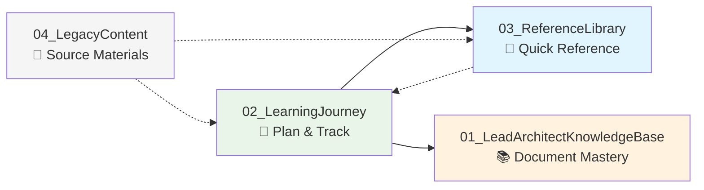
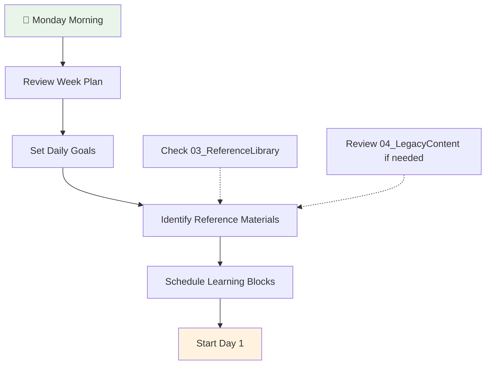
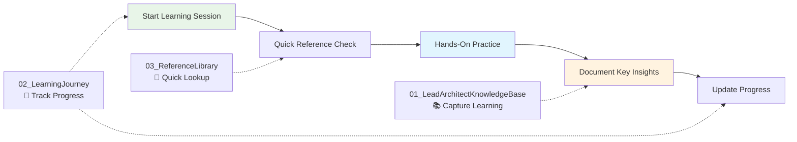
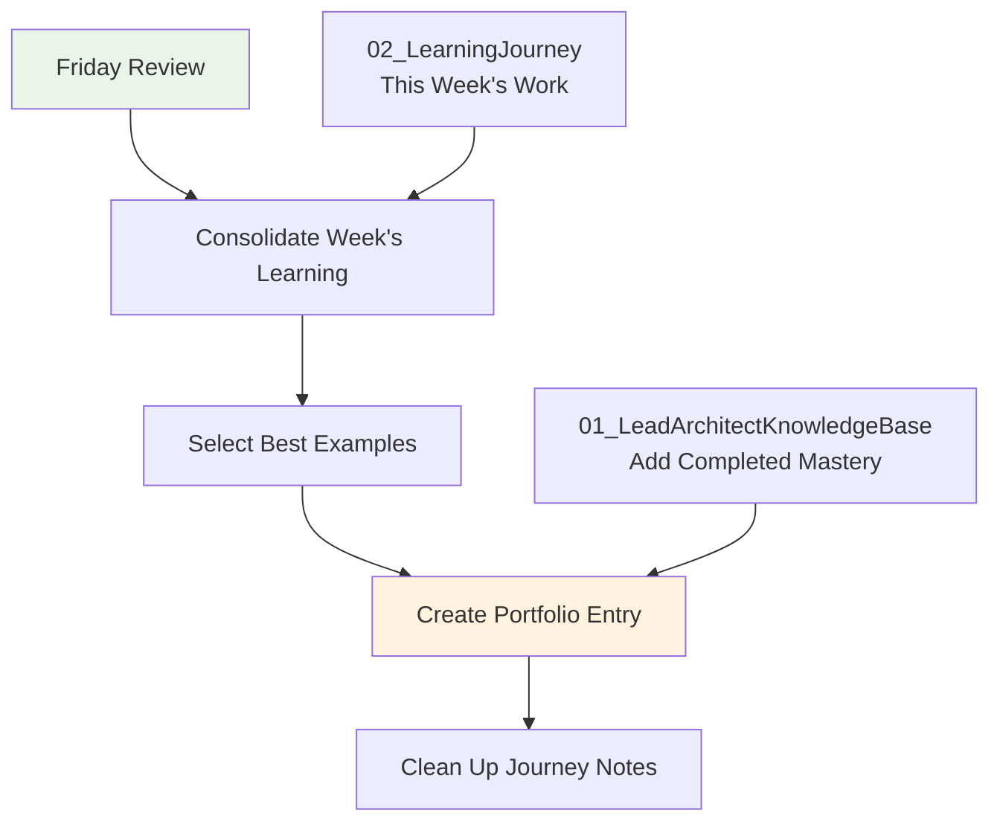
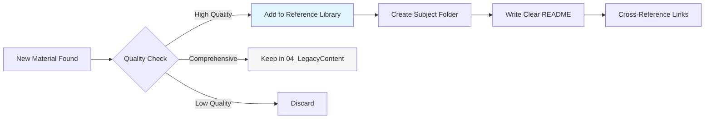
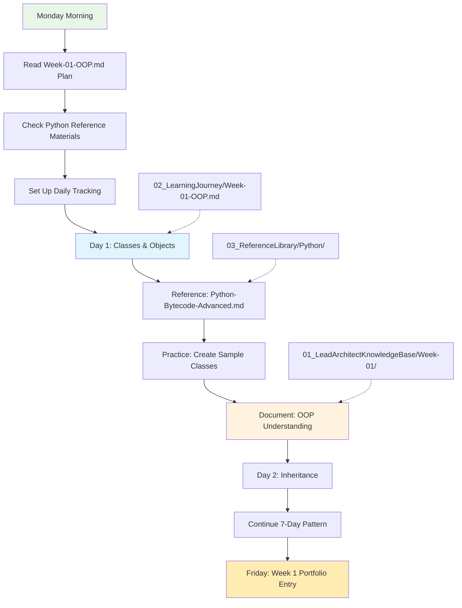
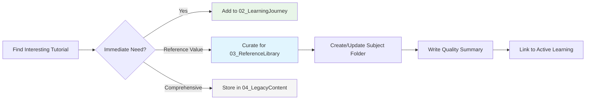
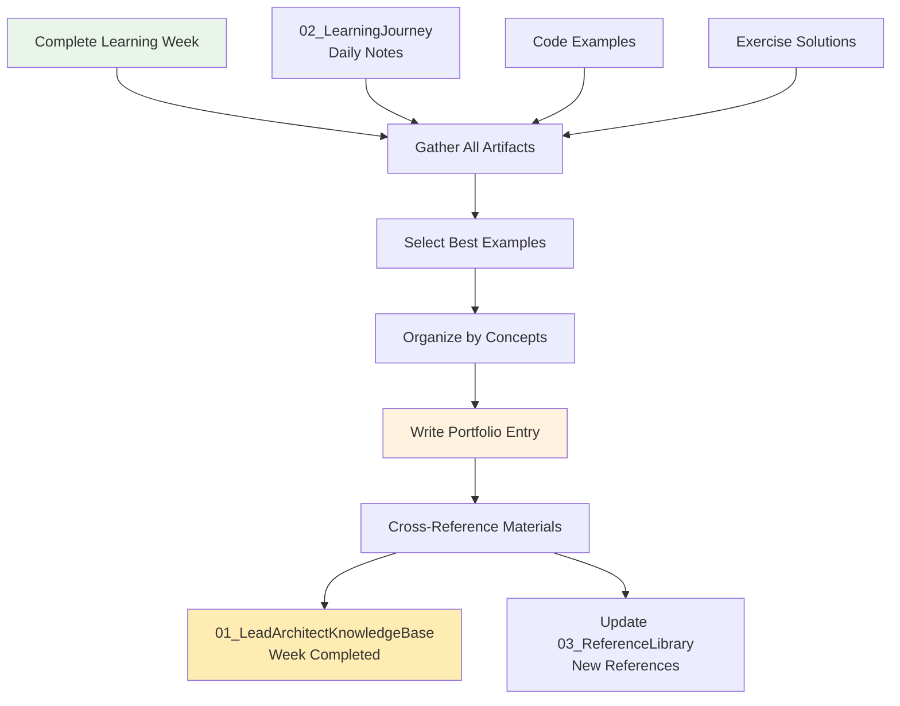

# 🎓 Swamy's Tech Skills Academy

> 📖 **15-minute read** | 🕐 **Last updated**: July 22, 2025 | 🎯 **Ready to start**: Week 1 OOP

## 🧭 Quick Navigation

| Section                     | Purpose                             | Go To                                                                 |
| --------------------------- | ----------------------------------- | --------------------------------------------------------------------- |
| **🎯 Start Learning**       | Begin your journey today            | [Quick Start](#-quick-start)                                          |
| **📋 Understanding System** | Learn how the 4-pillar system works | [Four-Pillar System](#-understanding-the-four-pillar-system)          |
| **⚡ Daily Workflows**      | Master productive learning habits   | [Learning System Guide](#-learning-system-guide-your-success-formula) |
| **📊 Track Progress**       | Monitor and document your growth    | [Progress Tracking](#-progress-tracking-methodologies)                |
| **🎪 See It in Action**     | Real learning scenarios             | [System in Action](#-your-learning-system-in-action)                  |

---

## 🔍 Understanding the Four-Pillar System

### **Why Four Folders? Are They Redundant?**

**NO - Each serves a distinct, non-overlapping purpose:**

| Folder                            | Purpose                  | Content Type                                               | When You Use It                                          |
| --------------------------------- | ------------------------ | ---------------------------------------------------------- | -------------------------------------------------------- |
| **01_LeadArchitectKnowledgeBase** | **Portfolio of Mastery** | Your completed work, implementations, evidence of learning | When showcasing what you've accomplished and mastered    |
| **02_LearningJourney**            | **Active Workspace**     | Current learning plans, daily tracking, active work        | When you're actively learning and need to track progress |
| **03_ReferenceLibrary**           | **Quick Reference Desk** | Curated materials you actively use                         | When you need quick reference during learning or work    |
| **04_LegacyContent**              | **Complete Archive**     | All original materials and comprehensive resources         | When you need to explore comprehensive materials         |

### **How They Work Together**



### **Typical Learning Workflow**

1. **Plan** your week in `02_LearningJourney`
2. **Reference** curated materials from `03_ReferenceLibrary` while learning
3. **Explore** comprehensive materials in `04_LegacyContent` when needed
4. **Document** completed work and mastery in `01_LeadArchitectKnowledgeBase`

### **Real Example: Week 1 OOP Learning**

- **02_LearningJourney**: "Week 1 daily plan + OOP exercises tracking"
- **03_ReferenceLibrary**: "Python internals guide for quick reference"
- **04_LegacyContent**: "Complete OOP tutorials and comprehensive materials"
- **01_LeadArchitectKnowledgeBase**: "Completed Week 1 OOP implementation + documentation"

**Each folder captures a different stage and type of learning activity - no redundancy!**

---

## 🌟 Learning System Guide: Your Success Formula

### **The 3-Step Daily Rhythm**

1. **📋 Plan** (5 min) → Review today's goals in `02_LearningJourney`
2. **🔍 Reference** (as needed) → Use curated materials in `03_ReferenceLibrary`
3. **📝 Document** (10 min) → Capture learning in `01_LeadArchitectKnowledgeBase`

---

## 🔄 Detailed Workflow Examples

### **🗓️ Monday Planning Session (30 minutes)**

**Location**: `02_LearningJourney/Week-XX-Topic.md`



**Your Weekly Kickoff Checklist:**

- [ ] Read the week's learning objectives
- [ ] Scan reference materials in `03_ReferenceLibrary`
- [ ] Set up your daily tracking template
- [ ] Block time for 1-hour daily sessions
- [ ] Identify what will go into your portfolio

### **⚡ Daily Learning Rhythm (1 hour focus blocks)**



**Your Productive Learning Flow:**

1. **⚡ Start (2 min)**: Check today's focus in `02_LearningJourney`
2. **🔍 Reference (5 min)**: Quick lookup in `03_ReferenceLibrary`
3. **🛠️ Practice (45 min)**: Hands-on coding, exercises, implementation
4. **📝 Document (8 min)**: Key insights and code examples into `01_LeadArchitectKnowledgeBase`

### **📈 Weekly Portfolio Update (Friday, 20 minutes)**



**Portfolio Building Process:**

- [ ] Review all work completed in `02_LearningJourney`
- [ ] Select your best implementations and insights
- [ ] Create organized documentation in `01_LeadArchitectKnowledgeBase`
- [ ] Clean up and archive weekly notes
- [ ] Plan next week's learning focus

---

## ⚡ Best Practices for Each Folder

### **📝 02_LearningJourney - Your Active Workspace**

**Purpose**: Current week planning, daily tracking, and work-in-progress

#### **Daily Tracking Template**

```markdown
## Day X - [Date]

### 🎯 Today's Focus

- [ ] Main learning objective
- [ ] Practice exercise
- [ ] Key concept to master

### 🔍 Reference Materials Used

- Link to 03_ReferenceLibrary materials

### ✅ Completed

- What I learned
- Code I wrote
- Problems I solved

### 📝 Insights & Notes

- Key takeaways
- Questions for tomorrow
- What to document in Knowledge Base
```

#### **Weekly Structure**

- One file per week: `Week-01-OOP.md`, `Week-02-DesignPatterns.md`
- Daily sections with consistent tracking
- Links to reference materials and resources
- Progress indicators and retrospectives

### **📖 03_ReferenceLibrary - Your Quick Reference Desk**

**Purpose**: Curated, actively-used materials for efficient learning

#### **Curation Strategy**



#### **Organization Standards**

- **Subject-based folders**: `Python/`, `AI/`, `Architecture/`
- **Quality over quantity**: Only materials you actively use
- **Clear README files**: Purpose and usage for each section
- **Quick access**: Optimized for fast reference during learning

#### **Reference Library Checklist**

- [ ] Is this material something I reference weekly?
- [ ] Does it provide quick answers to common questions?
- [ ] Is it well-organized and easy to scan?
- [ ] Does it complement my active learning?

### **📚 01_LeadArchitectKnowledgeBase - Your Portfolio of Mastery**

**Purpose**: Documented evidence of completed learning and implemented solutions

#### **Documentation Standards**

```markdown
# Week X: [Topic] Mastery

## 🎯 Learning Objectives Achieved

- [ ] Objective 1 with evidence
- [ ] Objective 2 with implementation
- [ ] Objective 3 with examples

## 🛠️ Implementations Created

### Project/Exercise 1

- **Purpose**: What it demonstrates
- **Code**: Link or embedded examples
- **Learning**: Key insights gained

## 🧠 Conceptual Understanding

### Key Concepts Mastered

1. **Concept 1**: Explanation + practical application
2. **Concept 2**: Real-world usage + examples

## 📈 Skills Progression

- **Before**: What I couldn't do
- **After**: What I can now accomplish
- **Evidence**: Concrete examples and implementations
```

#### **Portfolio Building Rules**

- Only document **completed and understood** material
- Include **working code examples** and implementations
- Demonstrate **practical application** of concepts
- Show **progression and skill development**
- Maintain **professional presentation** standards

---

## 🎯 Real Scenarios with Workflow Diagrams

### **Scenario 1: Starting Week 1 OOP Learning (Your Immediate Need!)**



**Week 1 Success Plan:**

1. **Monday**: Read your 21-day OOP plan, set up tracking
2. **Daily**: 1-hour focus blocks with reference materials
3. **Each Day**: Practice exercises → Document key learning
4. **Friday**: Consolidate week's work into portfolio entry
5. **Weekend**: Review progress, plan Week 2

### **Scenario 2: Discovering New Reference Material**



**Material Curation Workflow:**

- **Immediate learning need** → Add to current week in `02_LearningJourney`
- **Quick reference value** → Curate and add to `03_ReferenceLibrary`
- **Comprehensive resource** → Archive in `04_LegacyContent` for future exploration

### **Scenario 3: Knowledge Consolidation Process**



---

## 📊 Progress Tracking Methodologies

### **Weekly Retrospective Template**

**Location**: End of each `02_LearningJourney/Week-XX.md` file

```markdown
## 📊 Week X Retrospective

### ✅ Completed Objectives

- [x] Objective 1: Evidence of completion
- [x] Objective 2: Implementation created
- [ ] Objective 3: Needs more work (carry to next week)

### 🏆 Key Achievements

1. **Technical Skill**: What I can now build/do
2. **Conceptual Understanding**: What I now understand deeply
3. **Practical Application**: How I'll use this in real work

### 🔍 What Worked Well

- Learning strategies that were effective
- Reference materials that were most helpful
- Time management approaches that worked

### 🎯 Areas for Improvement

- Concepts that need more practice
- Skills that need reinforcement
- Learning approaches to adjust

### ➡️ Next Week Planning

- Carry-forward objectives
- New learning focus
- Reference materials needed
- Time allocation adjustments
```

### **Skill Progression Matrix**

**Location**: `01_LeadArchitectKnowledgeBase/SKILL_PROGRESSION.md`

| Skill Area           | Week 1              | Week 2            | Week 3            | Week 4             | Evidence                |
| -------------------- | ------------------- | ----------------- | ----------------- | ------------------ | ----------------------- |
| **OOP Mastery**      | Classes & Objects   | Inheritance       | Polymorphism      | Design Patterns    | Link to implementations |
| **Python Internals** | Basic Understanding | Bytecode Analysis | Memory Management | Performance Tuning | Code examples           |
| **Architecture**     | Monolithic          | Layered           | Microservices     | Domain-Driven      | Real project examples   |

---

## 🚀 Success Tips & Common Pitfalls

### **🎯 Success Accelerators**

1. **Consistency Over Intensity**: 1 hour daily beats 7 hours once weekly
2. **Active Documentation**: Write while you learn, not after
3. **Quality References**: Curate ruthlessly, keep only what you use
4. **Portfolio Focus**: Always ask "How will I document this mastery?"
5. **Weekly Reviews**: Friday retrospectives prevent drift and confusion

### **⚠️ Common Pitfalls to Avoid**

1. **Hoarding Content**: Don't put everything in Reference Library
2. **Skipping Documentation**: Active learning without capture loses value
3. **Week Planning Neglect**: Jumping in without clear objectives wastes time
4. **Portfolio Procrastination**: Don't wait until "later" to document mastery
5. **Single Folder Usage**: Use the system as designed - each folder has a purpose

---

## 🎪 Your Learning System in Action

### **Perfect Week Example: Week 1 OOP**

**Monday**: Plan week, set up tracking, start Day 1 Classes & Objects
**Tuesday-Thursday**: Daily 1-hour practice sessions with documentation
**Friday**: Consolidate learning into portfolio, plan Week 2
**Weekend**: Light review and preparation for Week 2 Inheritance focus

**Folder Activity**:

- `02_LearningJourney`: Active daily tracking and practice
- `03_ReferenceLibrary`: Quick Python reference lookups
- `01_LeadArchitectKnowledgeBase`: Growing portfolio of OOP mastery
- `04_LegacyContent`: Occasional deep-dive when needed

---

## 🎯 What You'll Find Here

This repository contains a **four-pillar learning system** designed to transform you from your current role into a confident, capable Lead Architect.

---

## 🚀 Quick Start

**Ready to begin your Lead Architect journey?**

### **🎯 Start Learning Now**

🎯 **[Start Active Learning](02_LearningJourney/Week-01-OOP.md)** - Begin Week 1: OOP Mastery

📚 **[View Knowledge Base](01_LeadArchitectKnowledgeBase/KNOWLEDGE_BASE_README.md)** - Document your learning achievements

📖 **[Access References](03_ReferenceLibrary/)** - Essential guides and templates

📁 **[Browse Legacy](04_LegacyContent/)** - Complete archive of all materials

### **�️ Choose Your Learning Path**

#### **For Complete Mastery (Learn Everything!)**

🌟 **[Complete Mastery Path](04_LegacyContent/09_Documentation/COMPLETE_MASTERY_PATH.md)** - Comprehensive 18-week journey covering all 8 knowledge areas

#### **For New Architects**

Explore legacy foundation materials in `04_LegacyContent/01_Foundation/` → `04_LegacyContent/02_Architecture/` → `04_LegacyContent/03_Development/`

#### **For AI-Focused Roles**

Reference `04_LegacyContent/04_AI/AIFoundations/` → `04_LegacyContent/04_AI/GenerativeAI/` → `04_LegacyContent/05_Data/` → `04_LegacyContent/03_Development/`

#### **For Cloud Architecture**

Explore `04_LegacyContent/06_Cloud/` → `04_LegacyContent/02_Architecture/` → `04_LegacyContent/07_DevOps/`

## 📚 Knowledge Categories

_All original materials are safely archived in [04_LegacyContent](04_LegacyContent/) and will be selectively moved to [03_ReferenceLibrary](03_ReferenceLibrary/) as needed during active learning. The Knowledge Base will be populated as you complete each week of learning._

**Current Status**: Ready to begin Week 1 - OOP Mastery (July 22, 2025)

## 📖 How to Use This Knowledge Base

1. **Start with Active Learning**: Begin at [02_LearningJourney/](02_LearningJourney/) for structured weekly learning
2. **Follow Learning Paths**: Use the quick start paths above to explore legacy materials as needed
3. **Cross-Reference**: Use [04_LegacyContent/](04_LegacyContent/) to explore comprehensive materials when needed
4. **Document Achievements**: Record proven mastery in [01_LeadArchitectKnowledgeBase/](01_LeadArchitectKnowledgeBase/)
5. **Curate References**: Move useful materials to [03_ReferenceLibrary/](03_ReferenceLibrary/) as you discover them

## 🎓 About the Academy

### **Mission**

Accelerate your growth as a technology leader through structured learning, hands-on practice, and real-world application.

### **Approach**

- **Action-oriented learning** over theoretical planning
- **Daily practice** with 60-minute focused sessions
- **Progressive skill building** across all technology domains
- **Portfolio development** with tangible outcomes

### **Author**

Viswanatha Swamy

- 🔗 [LinkedIn Profile](https://www.linkedin.com/in/viswanatha-swamy-b57326128/)
- 🏆 [Microsoft MVP](https://mvp.microsoft.com/en-US/MVP/profile/e5303266-fa36-ec11-b6e6-00224825194e)

## 🗂️ Repository Structure

```text
swamy-tech-skills-academy-main/
├── README.md                          ← You are here (Complete Guide)
├── 01_LeadArchitectKnowledgeBase/     ← 📚 Documented achievements
│   └── KNOWLEDGE_BASE_README.md       ← Clean slate, ready for Week 1
├── 02_LearningJourney/                ← 🎯 Active learning & tracking
│   ├── Week-01-OOP.md                 ← Current focus: OOP Mastery
│   └── README.md                      ← Learning system overview
├── 03_ReferenceLibrary/               ← � Curated reference materials
│   └── (Populated as needed)          ← Essential guides and templates
├── 04_LegacyContent/                  ← 📁 Complete archive
│   ├── 01_Foundation/                 ← All original knowledge areas
│   ├── 02_Architecture/               ← Design patterns and principles
│   ├── 03_Development/                ← Development best practices
│   ├── 04_AI/                         ← AI and machine learning
│   ├── 05_Data/                       ← Data architecture and analytics
│   ├── 06_Cloud/                      ← Cloud platforms and services
│   ├── 07_DevOps/                     ← DevOps and infrastructure
│   ├── 08_Projects/                   ← Project templates
│   ├── QuickReference/                ← Cheat sheets and guides
│   ├── Templates/                     ← Reusable templates
│   └── ProcessDocs/                   ← Process documentation
└── LICENSE                           ← Repository license
```

## 🏁 Getting Started

### Step 1: Begin Active Learning

- **Start Now**: Open [Week 1 Learning Journey](02_LearningJourney/Week-01-OOP.md)
- **Understand System**: Read [Learning Journey Overview](02_LearningJourney/README.md)
- **Access Legacy**: Browse [Legacy Content](04_LegacyContent/) when you need specific materials

### Step 2: Track Your Progress

- **Daily Tracking**: Update your daily progress in the current week file
- **Document Learning**: Add achievements to [Knowledge Base](01_LeadArchitectKnowledgeBase/)
- **Curate References**: Move useful materials to [Reference Library](03_ReferenceLibrary/)

### Step 3: Build Knowledge

- **Prove Mastery**: Document actual implementations and understanding
- **Apply Learning**: Use knowledge in practical projects and solutions
- **Iterate**: Use retrospectives to improve your learning approach

## 📖 License

This project is licensed under the terms specified in the [LICENSE](LICENSE) file.

---

**Ready to become a Lead Architect?** 🚀
**[Start your journey now →](02_LearningJourney/Week-01-OOP.md)**
