# Lead Architect Reimagination Pathway (V2 Clean Slate)

**Learning Level**: Senior Engineer preparing for enterprise-wide architecture ownership  
**Starting Point**: Willingness to reconstruct personal playbooks without relying on prior documentation  
**Estimated Time Commitment**: 9 phases × 36 hours ≈ 324 hours  
**Cadence**: Each phase contains 9 clusters (~4.5 hours each) to fit within focused 36-hour design sprints  
**North Star**: Build a self-authored body of knowledge, assets, and decision frameworks from scratch

## 🏗️ Learning Architecture

This workspace follows a **foundation-first hierarchy**:

- **`01_ReferenceLibrary/`** - Technical knowledge foundation across all domains
- **`02_LeadArchitect-Learning/`** - Strategic pathway applying foundational knowledge

**Learning Flow**: Master technical concepts → Apply strategically → Create architectural leadership artifacts

## How to Use This Blueprint

1. Start every phase by framing the questions you need answered; gather only primary sources you can evaluate yourself.  
2. Treat each cluster as a research → experiment → artifact loop; produce a new tangible output at the end of every 4.5-hour block.  
3. Revisit completed clusters monthly to refine conclusions and retire superseded artifacts; show the evolution deliberately.  
4. Keep this README as the single index; extend it with the notes, diagrams, and code repositories you create on the journey.

```text
[Phase01_Reboot]
    ├─ Cluster01 Reorient Mindset
    ├─ Cluster02 Craft Fresh Practices
    ├─ ...
    └─ Cluster09 Publish Personal Doctrine
        ↓
[Phase02_Frameworks] → … → [Phase09_Leadership Impact]
        ↓
Repeat cycles with new evidence, updated heuristics, and refreshed assets
```


## Cluster Lattice

| Cluster | Intent | Focus Questions | Evidence to Produce |
| --- | --- | --- | --- |
| 01 | Reset & Mindset | What assumptions should be retired or reframed? | Reflection brief, belief inventory |
| 02 | Practice Crafting | Which new disciplines must be prototyped immediately? | Practice experiments plan |
| 03 | Tooling Forge | Which tools enable leverage for the next horizon? | Tool selection dossier |
| 04 | System Lens | Which systemic effects must be understood end to end? | System sketchbook |
| 05 | Lab Build | How will new approaches be proven rapidly? | Sandbox implementation notes |
| 06 | Evidence Review | What real-world signals validate or invalidate choices? | Insight digest |
| 07 | Guardrails | What protects quality, security, and observability by default? | Guardrail matrix |
| 08 | Frontier Scan | Which frontiers should I test for future-ready capabilities? | Frontier experiment log |
| 09 | Doctrine & Assets | How will I socialize and reuse what I have learned? | Playbook bundle |

---

## Phase Navigation (Current Repositories)

- [Phase 01 – Reboot](02_LeadArchitect-Learning/Phase01_Reboot/README.md)
- [Phase 02 – Frameworks](02_LeadArchitect-Learning/Phase02_Frameworks/README.md)
- [Phase 03 – Pattern Studio](02_LeadArchitect-Learning/Phase03_Pattern_Studio/README.md)
- [Phase 04 – Scale Systems](02_LeadArchitect-Learning/Phase04_Scale_Systems/README.md)
- [Phase 05 – Delivery Engine](02_LeadArchitect-Learning/Phase05_Delivery_Engine/README.md)
- [Phase 06 – Data & Trust](02_LeadArchitect-Learning/Phase06_Data_Trust/README.md)
- [Phase 07 – Polyglot Delivery](02_LeadArchitect-Learning/Phase07_Polyglot_Delivery/README.md)
- [Phase 08 – Intelligent Futures](02_LeadArchitect-Learning/Phase08_Intelligent_Futures/README.md)
- [Phase 09 – Leadership Impact](02_LeadArchitect-Learning/Phase09_Leadership_Impact/README.md)

## Progress Tracker

- [ ] Phase 01 – Reboot
- [ ] Phase 02 – Frameworks
- [ ] Phase 03 – Pattern Studio
- [ ] Phase 04 – Scale Systems
- [ ] Phase 05 – Delivery Engine
- [ ] Phase 06 – Data & Trust
- [ ] Phase 07 – Polyglot Delivery
- [ ] Phase 08 – Intelligent Futures
- [ ] Phase 09 – Leadership Impact

---

## Operational Rhythms You Can Reuse

### Active Week Playbook

```mermaid
graph TD
    A[Monday: Reboot Intentions] --> B[Review current phase questions]
    B --> C[Select next cluster]
    C --> D[Design research → experiment → artifact loop]
    D --> E[Execute 4.5h sprint]
    E --> F[Publish artifact draft]
    F --> G[Schedule guardrail review]
    G --> H[Log insights and assumptions]
    H --> I[Friday: Synthesize doctrine update]

    style A fill:#e8f5e8
    style D fill:#fff3e0
    style F fill:#e1f5fe
    style I fill:#ffecb3
```



- **Monday reset**: Calibrate phase questions, reaffirm constraints, and log the last week's evidence you are replacing.  
- **Cluster sprint**: Execute the research → experiment → artifact loop; finish with a published update (even if draft).  
- **Friday doctrine**: Summarize what stays, what changes, and what needs escalation to leadership peers.

### Evidence Lattice Template

```markdown
# Cluster X Artifact Evidence

## 1. Question Framed
- What hypothesis am I testing?
- Stakeholders affected?

## 2. Research Notes
- Primary sources evaluated (link + credibility)
- Contrasting viewpoints considered

## 3. Experiment Log
- Prototype / simulation summary
- Signals captured (metrics, interviews, architecture reviews)

## 4. Artifact Shipped
- URL / repository / diagram location
- Guardrails applied (security, quality, observability)

## 5. Next Review Cycle
- Date of next revisit
- Triggers that would force an earlier review
```

Store the evidence lattice inside the relevant phase folder (for example `02_LeadArchitect-Learning/Phase04_Scale_Systems/Evidence/Cluster05.md`) so that every doctrine entry has traceable proof.

---

## Support Folders at a Glance

- `01_ReferenceLibrary/` — Technical knowledge foundation across all domains.
- `02_LeadArchitect-Learning/` — Strategic pathway content, organized by phase.  
- `tools/` — PowerShell utilities for daily learning system management.

Use the folders together:

1. Sketch intent and capture outputs in the pathway folder.  
2. Track execution details inside `02_LearningJourney`.  
3. Promote any reusable insight into `03_ReferenceLibrary` once it proves evergreen.  
4. Retire superseded material into `04_LegacyContent` for auditing.

---

## Quick Start for Today

- **Foundation first**: Review technical concepts in `01_ReferenceLibrary/` for your current focus area.
- **Strategic application**: Read the appropriate phase README within `02_LeadArchitect-Learning/`.  
- **Integration**: Connect technical knowledge to strategic architectural decisions.
- **Quality assurance**: Use `tools/` utilities for validation and progress tracking.

---

## Weekly Retrospective Prompt (Drop-In Snippet)

```markdown
## 📊 Week X Reflection

### Highlights
- Impact move delivered this week
- Architecture trade-off I can now defend

### Guardrail Check
- Security & reliability implications
- Observability + feedback loops adjusted

### Doctrine Updates
- Which doctrine entries changed?
- What new assets were published?

### Forward View
- Cluster focus for next sprint
- Emerging frontier that needs scouting
```

Capture retrospectives at the end of each sprint inside `02_LearningJourney/Week-XX.md` so that phase summaries have a dependable input.

---

## Quality Gates & Tooling

```powershell
# Targeted markdown lint (will include repo-wide defaults)
npx markdownlint-cli2 "README.md"

# Optional: curated docs lint helper
./tools/docs-lint.ps1

# Link validation
docker run --rm -w /input -v "${PWD}:/input" lycheeverse/lychee:latest --config lychee.toml --no-progress README.md
```

Expect markdownlint to surface pre-existing legacy violations; focus on keeping this README clean and track the broader cleanup separately.

---

## Few Commands

> 1. <D:\STSA\swamy-tech-skills-academy-main\01_ReferenceLibrary>
> 1. <D:\STSA\swamy-tech-skills-academy-main\02_LeadArchitect-Learning>

```text
Verify that content inside the folders mentioned above
A. Ensure that the content is according to our rules
B. Ensure that the content is accurate and complete. 
C. Ensure that the content follows our style guidelines.
D. Ensure that the content has no broken links.
E. Ensure that the content is free of spelling and grammar errors.
F. Ensure that there is no redundant content.
G. List any files which are not relevant and can be removed
H. Ensure that the content is well-structured and easy to navigate.
I. Ensure that the content is up-to-date with the latest information.
J. Provide suggestions for improvement if any.
K. Ensure that there are no encoding issues.
L. Ensure go into each file and verify.

Do deep dive. Do ReAct, and Reasoning before performing your work. Take time do not rush.
---

## License

This project is licensed under the terms specified in the [LICENSE](LICENSE) file.

---

**Ready to architect your own doctrine?**  [Open the next cluster →](02_LearningJourney/Notes/)
