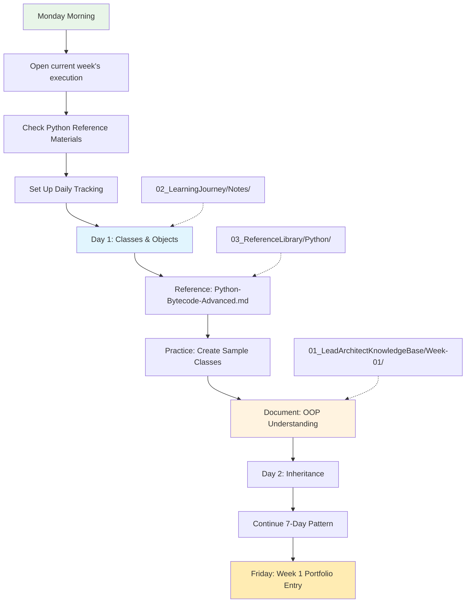

# 🎓 Swamy's Tech Skills Academy

> 📖 **15-minute read** | 🕐 **Last updated**: August 26, 2025 | 🎯 **Ready to start**: Week 1 OOP

## 🧭 Quick Navigation

| Section                     | Purpose                             | Go To                                                                 |
| --------------------------- | ----------------------------------- | --------------------------------------------------------------------- |
| **🎯 Start Learning**       | Begin your journey today            | [Quick Start](#-quick-start)                                          |
| **📋 Understanding System** | Learn how the 4-pillar system works | [Four-Pillar System](#-understanding-the-four-pillar-system)          |
| **⚡ Daily Workflows**      | Master productive learning habits   | [Learning System Guide](#-learning-system-guide-your-success-formula) |
| **📊 Track Progress**       | Monitor and document your growth    | [Progress Tracking](#-progress-tracking-methodologies)                |
| **🎪 See It in Action**     | Real learning scenarios             | [System in Action](#-your-learning-system-in-action)                  |

---

## 🔍 Understanding the Four-Pillar System

### **Why Four Folders? Are They Redundant?**

**NO - Each serves a distinct, non-overlapping purpose:**

| Folder                            | Purpose                  | Content Type                                               | When You Use It                                          |
| --------------------------------- | ------------------------ | ---------------------------------------------------------- | -------------------------------------------------------- |
| **01_LeadArchitectKnowledgeBase** | **Portfolio of Mastery** | Your completed work, implementations, evidence of learning | When showcasing what you've accomplished and mastered    |
| **02_LearningJourney**            | **Active Workspace**     | Current learning plans, daily tracking, active work        | When you're actively learning and need to track progress |
| **03_ReferenceLibrary**           | **Quick Reference Desk** | Curated materials you actively use                         | When you need quick reference during learning or work    |
| **04_LegacyContent**              | **Complete Archive**     | All original materials and comprehensive resources         | When you need to explore comprehensive materials         |

### **How They Work Together**

```mermaid
graph LR
    A[02_LearningJourney<br/>📝 Plan & Track] --> B[03_ReferenceLibrary<br/>📖 Quick Reference]
    A --> C[01_LeadArchitectKnowledgeBase<br/>📚 Document Mastery]
    B -.-> A
    D[04_LegacyContent<br/>📁 Source Materials] -.-> B
    D -.-> A

    style A fill:#e8f5e8
    style B fill:#e1f5fe
    style C fill:#fff3e0
    style D fill:#f5f5f5
```



### **Typical Learning Workflow**

1. **Plan** your week in `02_LearningJourney`
2. **Reference** curated materials from `03_ReferenceLibrary` while learning
3. **Explore** comprehensive materials in `04_LegacyContent` when needed
4. **Document** completed work and mastery in `01_LeadArchitectKnowledgeBase`

### **Real Example: Week 1 OOP Learning**

- **02_LearningJourney**: "Week 1 daily plan + OOP exercises tracking"
- **03_ReferenceLibrary**: "Python internals guide for quick reference"
- **04_LegacyContent**: "Complete OOP tutorials and comprehensive materials"
- **01_LeadArchitectKnowledgeBase**: "Completed Week 1 OOP implementation + documentation"

**Each folder captures a different stage and type of learning activity - no redundancy!**

---

## 🧭 Portal: Strategy ↔ Learning

Use this quick portal to move between strategy, learning, and active work:

- 🧠 Strategy (guardrails & decisions): [01_LeadArchitectKnowledgeBase/](01_LeadArchitectKnowledgeBase/)
- 📚 Learning (tracks & references): [03_ReferenceLibrary/](03_ReferenceLibrary/)
- 🗓️ Active week (plan & track): [02_LearningJourney/](02_LearningJourney/)

```mermaid
graph LR
    S[01_LeadArchitectKnowledgeBase<br/>🧠 Strategy] --> L[03_ReferenceLibrary<br/>📚 Learning]
    L --> A[02_LearningJourney<br/>🗓️ Active Work]
    A --> P[01_LeadArchitectKnowledgeBase<br/>📁 Portfolio]
    P -. Feedback .-> S

    style S fill:#fff3e0
    style L fill:#e1f5fe
    style A fill:#e8f5e8
    style P fill:#fff3e0
```



---

## 🌟 Learning System Guide: Your Success Formula

### **The 3-Step Daily Rhythm**

1. **📋 Plan** (5 min) → Review today's goals in `02_LearningJourney`
2. **🔍 Reference** (as needed) → Use curated materials in `03_ReferenceLibrary`
3. **📝 Document** (10 min) → Capture learning in `01_LeadArchitectKnowledgeBase`

---

## 🔄 Detailed Workflow Examples

### **🗓️ Monday Planning Session (30 minutes)**

**Location**: `02_LearningJourney/Week-XX-Topic.md`

```mermaid
graph TD
    A[📅 Monday Morning] --> B[Review Week Plan]
    B --> C[Set Daily Goals]
    C --> D[Identify Reference Materials]
    D --> E[Schedule Learning Blocks]
    E --> F[Start Day 1]

    B1[Check 03_ReferenceLibrary] -.-> D
    B2[Review 04_LegacyContent if needed] -.-> D

    style A fill:#e8f5e8
    style F fill:#fff3e0
```



**Your Weekly Kickoff Checklist:**

- [ ] Read the week's learning objectives
- [ ] Scan reference materials in `03_ReferenceLibrary`
- [ ] Set up your daily tracking template
- [ ] Block time for 1-hour daily sessions
- [ ] Identify what will go into your portfolio

### **⚡ Daily Learning Rhythm (1 hour focus blocks)**

```mermaid
graph LR
    A[Start Learning Session] --> B[Quick Reference Check]
    B --> C[Hands-On Practice]
    C --> D[Document Key Insights]
    D --> E[Update Progress]

    R[03_ReferenceLibrary<br/>📖 Quick Lookup] -.-> B
    J[02_LearningJourney<br/>📝 Track Progress] -.-> A
    J -.-> E
    K[01_LeadArchitectKnowledgeBase<br/>📚 Capture Learning] -.-> D

    style A fill:#e8f5e8
    style C fill:#e1f5fe
    style D fill:#fff3e0
```



**Your Productive Learning Flow:**

1. **⚡ Start (2 min)**: Check today's focus in `02_LearningJourney`
2. **🔍 Reference (5 min)**: Quick lookup in `03_ReferenceLibrary`
3. **🛠️ Practice (45 min)**: Hands-on coding, exercises, implementation
4. **📝 Document (8 min)**: Key insights and code examples into `01_LeadArchitectKnowledgeBase`

### **📈 Weekly Portfolio Update (Friday, 20 minutes)**


**Portfolio Building Process:**

- [ ] Review all work completed in `02_LearningJourney`
- [ ] Select your best implementations and insights
- [ ] Create organized documentation in `01_LeadArchitectKnowledgeBase`
- [ ] Clean up and archive weekly notes
- [ ] Plan next week's learning focus

---

## ⚡ Best Practices for Each Folder

### **📝 02_LearningJourney - Your Active Workspace**

**Purpose**: Current week planning, daily tracking, and work-in-progress

#### **Daily Tracking Template**

```markdown
## Day X - [Date]

### 🎯 Today's Focus

- [ ] Main learning objective
- [ ] Practice exercise
- [ ] Key concept to master

### 🔍 Reference Materials Used

- Link to 03_ReferenceLibrary materials

### ✅ Completed

- What I learned
- Code I wrote
- Problems I solved

### 📝 Insights & Notes

- Key takeaways
- Questions for tomorrow
- What to document in Knowledge Base
```

#### **Weekly Structure**

- Daily notes in `02_LearningJourney/Notes/`
- Capture-only entries with evidence (code/notes)
- Links to reference materials and resources
- Optional end-of-week retrospective

### **📖 03_ReferenceLibrary - Your Quick Reference Desk**

**Purpose**: Curated, actively-used materials for efficient learning

#### **Curation Strategy**


#### **Organization Standards**

- **Subject-based folders**: `Python/`, `AI/`, `Architecture/`
- **Quality over quantity**: Only materials you actively use
- **Clear README files**: Purpose and usage for each section
- **Quick access**: Optimized for fast reference during learning

#### **Reference Library Checklist**

- [ ] Is this material something I reference weekly?
- [ ] Does it provide quick answers to common questions?
- [ ] Is it well-organized and easy to scan?
- [ ] Does it complement my active learning?

### **📚 01_LeadArchitectKnowledgeBase - Your Portfolio of Mastery**

**Purpose**: Documented evidence of completed learning and implemented solutions

#### **Documentation Standards**

```markdown
# Week X: [Topic] Mastery

## 🎯 Learning Objectives Achieved

- [ ] Objective 1 with evidence
- [ ] Objective 2 with implementation
- [ ] Objective 3 with examples

## 🛠️ Implementations Created

### Project/Exercise 1

- **Purpose**: What it demonstrates
- **Code**: Link or embedded examples
- **Learning**: Key insights gained

## 🧠 Conceptual Understanding

### Key Concepts Mastered

1. **Concept 1**: Explanation + practical application
2. **Concept 2**: Real-world usage + examples

## 📈 Skills Progression

- **Before**: What I couldn't do
- **After**: What I can now accomplish
- **Evidence**: Concrete examples and implementations
```

#### **Portfolio Building Rules**

- Only document **completed and understood** material
- Include **working code examples** and implementations
- Demonstrate **practical application** of concepts
- Show **progression and skill development**
- Maintain **professional presentation** standards

---

## 🎯 Real Scenarios with Workflow Diagrams

### **Scenario 1: Kicking Off a New Week**



**Week 1 Success Plan:**

1. **Monday**: Read your 21-day OOP plan, set up tracking
2. **Daily**: 1-hour focus blocks with reference materials
3. **Each Day**: Practice exercises → Document key learning
4. **Friday**: Consolidate week's work into portfolio entry
5. **Weekend**: Review progress, plan Week 2

### **Scenario 2: Discovering New Reference Material**


**Material Curation Workflow:**

- **Immediate learning need** → Add to current week in `02_LearningJourney`
- **Quick reference value** → Curate and add to `03_ReferenceLibrary`
- **Comprehensive resource** → Archive in `04_LegacyContent` for future exploration

### **Scenario 3: Knowledge Consolidation Process**


---

## 📊 Progress Tracking Methodologies

### **Weekly Retrospective Template**

**Location**: End of each `02_LearningJourney/Week-XX.md` file

```markdown
## 📊 Week X Retrospective

### ✅ Completed Objectives

- [x] Objective 1: Evidence of completion
- [x] Objective 2: Implementation created
- [ ] Objective 3: Needs more work (carry to next week)

### 🏆 Key Achievements

1. **Technical Skill**: What I can now build/do
2. **Conceptual Understanding**: What I now understand deeply
3. **Practical Application**: How I'll use this in real work

### 🔍 What Worked Well

- Learning strategies that were effective
- Reference materials that were most helpful
- Time management approaches that worked

### 🎯 Areas for Improvement

- Concepts that need more practice
- Skills that need reinforcement
- Learning approaches to adjust

### ➡️ Next Week Planning

- Carry-forward objectives
- New learning focus
- Reference materials needed
- Time allocation adjustments
```

---

## ℹ️ Citation & Sources

We learn from many high‑quality public resources (books, courses, blogs, talks, standards). All materials in this repository are written in our own words and structure, with original diagrams and examples, following our Zero‑Copy and Transformative Content policy. When we reference ideas, we synthesize and teach them differently rather than reproducing source text.

### **Skill Progression Matrix**

**Location**: `01_LeadArchitectKnowledgeBase/SKILL_PROGRESSION.md`

| Skill Area           | Week 1              | Week 2            | Week 3            | Week 4             | Evidence                |
| -------------------- | ------------------- | ----------------- | ----------------- | ------------------ | ----------------------- |
| **OOP Mastery**      | Classes & Objects   | Inheritance       | Polymorphism      | Design Patterns    | Link to implementations |
| **Python Internals** | Basic Understanding | Bytecode Analysis | Memory Management | Performance Tuning | Code examples           |
| **Architecture**     | Monolithic          | Layered           | Microservices     | Domain-Driven      | Real project examples   |

---

## 🚀 Success Tips & Common Pitfalls

### **🎯 Success Accelerators**

1. **Consistency Over Intensity**: 1 hour daily beats 7 hours once weekly
2. **Active Documentation**: Write while you learn, not after
3. **Quality References**: Curate ruthlessly, keep only what you use
4. **Portfolio Focus**: Always ask "How will I document this mastery?"
5. **Weekly Reviews**: Friday retrospectives prevent drift and confusion

### **⚠️ Common Pitfalls to Avoid**

1. **Hoarding Content**: Don't put everything in Reference Library
2. **Skipping Documentation**: Active learning without capture loses value
3. **Week Planning Neglect**: Jumping in without clear objectives wastes time
4. **Portfolio Procrastination**: Don't wait until "later" to document mastery
5. **Single Folder Usage**: Use the system as designed - each folder has a purpose

---

## 🎪 Your Learning System in Action

### **Perfect Week Example: Week 1 OOP**

**Monday**: Plan week, set up tracking, start Day 1 Classes & Objects
**Tuesday-Thursday**: Daily 1-hour practice sessions with documentation
**Friday**: Consolidate learning into portfolio, plan Week 2
**Weekend**: Light review and preparation for Week 2 Inheritance focus

**Folder Activity**:

- `02_LearningJourney`: Active daily tracking and practice
- `03_ReferenceLibrary`: Quick Python reference lookups
- `01_LeadArchitectKnowledgeBase`: Growing portfolio of OOP mastery
- `04_LegacyContent`: Occasional deep-dive when needed

---

## 🎯 What You'll Find Here

This repository contains a **four-pillar learning system** designed to transform you from your current role into a confident, capable Lead Architect.

---

## 🚀 Quick Start

**Ready to begin your Lead Architect journey?**

### **🎯 Start Learning Now**

🎯 **[Start Active Learning](02_LearningJourney/Notes/)** - Open daily capture notes

📚 **[View Knowledge Base](01_LeadArchitectKnowledgeBase/README.md)** - Document your learning achievements

📖 **[Access References](03_ReferenceLibrary/)** - Essential guides and templates

📁 **[Browse Legacy](04_LegacyContent/)** - Complete archive of all materials

### **�️ Choose Your Learning Path**

#### **For Complete Mastery (Learn Everything!)**

🌟 **[Complete Mastery Path](04_LegacyContent/_Backup/ProcessDocs/COMPLETE_MASTERY_PATH.md)** - Comprehensive 18-week journey covering all 8 knowledge areas

#### **For New Architects**

Explore legacy foundation materials in `04_LegacyContent/01_Foundation/` → `04_LegacyContent/02_Architecture/` → `04_LegacyContent/03_Development/`

#### **For AI-Focused Roles**

Reference `04_LegacyContent/04_AI/AIFoundations/` → `04_LegacyContent/04_AI/GenerativeAI/` → `04_LegacyContent/05_Data/` → `04_LegacyContent/03_Development/`

#### **For Cloud Architecture**

Explore `04_LegacyContent/06_Cloud/` → `04_LegacyContent/02_Architecture/` → `04_LegacyContent/07_DevOps/`

## 📚 Knowledge Categories

_All original materials are safely archived in [04_LegacyContent](04_LegacyContent/) and will be selectively moved to [03_ReferenceLibrary](03_ReferenceLibrary/) as needed during active learning. The Knowledge Base will be populated as you complete each week of learning._

**Current Status**: Ready to begin Week 1 - OOP Mastery (July 22, 2025)

## 📖 How to Use This Knowledge Base

1. **Start with Active Learning**: Begin at [02_LearningJourney/](02_LearningJourney/) for structured weekly learning
2. **Follow Learning Paths**: Use the quick start paths above to explore legacy materials as needed
3. **Cross-Reference**: Use [04_LegacyContent/](04_LegacyContent/) to explore comprehensive materials when needed
4. **Document Achievements**: Record proven mastery in [01_LeadArchitectKnowledgeBase/](01_LeadArchitectKnowledgeBase/)
5. **Curate References**: Move useful materials to [03_ReferenceLibrary/](03_ReferenceLibrary/) as you discover them

## 🎓 About the Academy

### **Mission**

Accelerate your growth as a technology leader through structured learning, hands-on practice, and real-world application.

### **Approach**

- **Action-oriented learning** over theoretical planning
- **Daily practice** with 60-minute focused sessions
- **Progressive skill building** across all technology domains
- **Portfolio development** with tangible outcomes

### **Author**

Viswanatha Swamy

- 🔗 [LinkedIn Profile](https://www.linkedin.com/in/viswanatha-swamy-b57326128/)
- 🏆 [Microsoft MVP](https://mvp.microsoft.com/en-US/MVP/profile/e5303266-fa36-ec11-b6e6-00224825194e)

## 🗂️ Repository Structure

```mermaid
graph TD
    R[swamy-tech-skills-academy-main/]

    R --> RMD[README.md\n(Complete Guide)]

    R --> LAKB[01_LeadArchitectKnowledgeBase/\n📚 Documented achievements]
    LAKB --> KBR[README.md\n(Clean slate, ready for Week 1)]

    R --> LJ[02_LearningJourney/\n🎯 Active learning & tracking]
    LJ --> DN[Notes/\n(Daily capture)]
    LJ --> LJMD[README.md\n(Learning system overview)]

    R --> RL[03_ReferenceLibrary/\n📖 Curated reference materials]
    RL --> RLN[(Populated as needed)\nEssential guides and templates]

    R --> LC[04_LegacyContent/\n📁 Complete archive]
    LC --> LC01[01_Foundation/]
    LC --> LC02[02_Architecture/]
    LC --> LC03[03_Development/]
    LC --> LC04[04_AI/]
    LC --> LC05[05_Data/]
    LC --> LC06[06_Cloud/]
    LC --> LC07[07_DevOps/]
    LC --> LC08[08_Projects/]
    LC --> LQR[QuickReference/]
    LC --> LTM[Templates/]
    LC --> LPD[ProcessDocs/]

    R --> LIC[LICENSE]

    style R fill:#f5f5f5
    style LAKB fill:#fff3e0
    style LJ fill:#e8f5e8
    style RL fill:#e1f5fe
    style LC fill:#f5f5f5
```

## 🏁 Getting Started

### Step 1: Begin Active Learning

- **Start Now**: Open [daily notes](02_LearningJourney/Notes/)
- **Understand System**: Read [Learning Journey Overview](02_LearningJourney/README.md)
- **Access Legacy**: Browse [Legacy Content](04_LegacyContent/) when you need specific materials

### Step 2: Track Your Progress

- **Daily Tracking**: Update your daily progress in the current week file
- **Document Learning**: Add achievements to [Knowledge Base](01_LeadArchitectKnowledgeBase/)
- **Curate References**: Move useful materials to [Reference Library](03_ReferenceLibrary/)

### Step 3: Build Knowledge

- **Prove Mastery**: Document actual implementations and understanding
- **Apply Learning**: Use knowledge in practical projects and solutions
- **Iterate**: Use retrospectives to improve your learning approach

## 📖 License

This project is licensed under the terms specified in the [LICENSE](LICENSE) file.

---

**Ready to become a Lead Architect?** 🚀
**[Start your journey now →](02_LearningJourney/Notes/)**

---

## Development

### Docs quality checks (local)

Run Markdown lint against README and all docs before opening a PR:

```powershell
# From repo root
npx --yes markdownlint-cli2 "README.md" "01_LeadArchitectKnowledgeBase/**/*.md" "02_LearningJourney/**/*.md" "03_ReferenceLibrary/**/*.md" "04_LegacyContent/**/*.md" "05_Todos/**/*.md" ".github/**/*.md"
```

This uses the repository's .markdownlint.json automatically.

### Link check (Lychee)

Run a quick local link check using Lychee (via Docker):

```powershell
# Extract links only (does not validate)
docker run --rm -w /input -v "${PWD}:/input" lycheeverse/lychee:latest --config lychee.toml --no-progress --dump README.md 01_LeadArchitectKnowledgeBase/**/*.md 02_LearningJourney/**/*.md 03_ReferenceLibrary/**/*.md 04_LegacyContent/**/*.md 05_Todos/**/*.md .github/**/*.md

# Validate links (recommended; matches CI behavior)
docker run --rm -w /input -v "${PWD}:/input" lycheeverse/lychee:latest --config lychee.toml --no-progress README.md 01_LeadArchitectKnowledgeBase/**/*.md 02_LearningJourney/**/*.md 03_ReferenceLibrary/**/*.md 04_LegacyContent/**/*.md 05_Todos/**/*.md .github/**/*.md
```

### Manual Docs Quality Workflow

CI runs automatically on PRs and pushes that modify documentation, but you can also trigger it manually:

1. Open GitHub → Actions → "Docs Quality" workflow
2. Click "Run workflow" (no inputs required)
3. View markdownlint + Lychee results; download the `lychee-report` artifact for details

Reason: Manual trigger accelerates iteration when adjusting large batches of links or performing structural renumbering.

### Deprecation & Renumbering Policy Reference

When content is renumbered (e.g., Agent modules) the old files become lightweight stubs that point to the canonical versions for 90–180 days. See the policy in `03_ReferenceLibrary/ORGANIZATION_GUIDE.md` (section: "Deprecation & Renumbering Policy"). Avoid adding new links to stub files; always point to the canonical module numbers.
