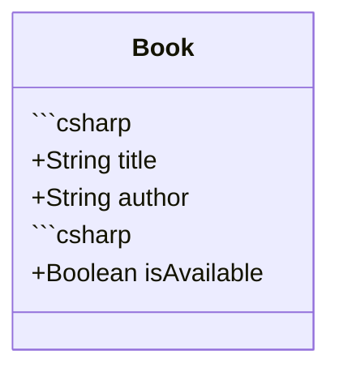
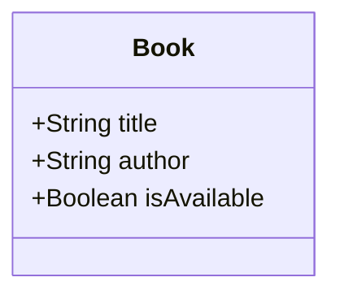

# STSA Comprehensive Audit Report

**OOP-fundamentals & SOLID-Principles Folders**

**Date**: October 30, 2025  
**Auditor**: GitHub Copilot (STSA Compliance Framework)  
**Scope**: 49 files (20 OOP-fundamentals + 29 SOLID-Principles)  
**Audit Framework**: 17-criteria STSA verification (Criteria A-Q)

---

## 🎯 Executive Summary

**Current Compliance**: **20.41%** (10/49 files passing)  
**Target Compliance**: **95%+**  
**Gap**: **39 files** require remediation

### Critical Finding

**Primary Violation**: 39 files (79%) missing **"🔗 Related Topics"** section - STSA Criterion D (Required Metadata) and Criterion Q (Cross-Domain Integration)

### Compliance Breakdown by Folder

| Folder | Total Files | Passing | Failing | Pass Rate |
|--------|-------------|---------|---------|-----------|
| **OOP-fundamentals** | 20 | 6 | 14 | **30%** |
| **SOLID-Principles** | 29 | 4 | 25 | **14%** |
| **Combined** | 49 | 10 | 39 | **20.41%** |

---

## 📊 Violation Analysis

### Criterion Compliance Status

| Criterion | Description | Pass Rate | Status |
|-----------|-------------|-----------|--------|
| **D** | STSA Required Metadata | 20% | 🔴 CRITICAL |
| **Q** | Cross-Domain Integration | 20% | 🔴 CRITICAL |
| **E** | Numbering Convention | 96% | 🟢 GOOD |
| **G** | Character Encoding (UTF-8) | 100% | ✅ EXCELLENT |
| **L** | UTF-8 Integrity | 100% | ✅ EXCELLENT |
| **N** | Markdown Compliance | 95% | 🟢 GOOD |

### Violation Distribution

**Type 1: Missing Related Topics** (39 files)

- 15 OOP-fundamentals files (75% of folder)
- 24 SOLID-Principles files (83% of folder)
- **Impact**: Fails educational cross-reference requirements
- **Priority**: 🔴 CRITICAL

**Type 2: Code Fence Malformation** (Multiple files)

- Embedded ` ```csharp` markers within Mermaid diagrams
- Breaks markdown rendering
- **Priority**: 🟠 HIGH

**Type 3: Placeholder Learning Objectives** (~10-15 files)

- Text like `[Add specific learning objectives]`
- **Priority**: 🟡 MEDIUM

**Type 4: README Numbering Issues** (2 files)

- Both README.md files: `ViolationCount=2`, `HasNumberingIssue=True`
- **Priority**: 🟡 MEDIUM

**Type 5: Markdown Lint Errors** (2 files in OOP only)

- `06_OOD-Learning-Plan-PartA.md`: MD028, MD024
- `08_OOP-Abstraction-Encapsulation-PartB.md`: MD046
- **Priority**: 🟢 LOW

---

## 🔍 Detailed File Inspection Results

### OOP-fundamentals Folder (20 files)

#### ✅ Passing Files (6)

1. `01_OOP-Core-Concepts-PartA.md` - Has Related Topics (line 138)
2. `02_OOP-Encapsulation-Abstraction.md` - Has Related Topics (line 293)
3. `03_OOP-Inheritance-Polymorphism.md` - Has Related Topics (line 312)
4. `04_OOP-Advanced-Patterns-PartA.md` - Has Related Topics (line 340)
5. `04_OOP-Advanced-Patterns-PartB.md` - Has Related Topics (line 349)
6. `05_OOP-Fundamentals-Comprehensive-Guide-PartB.md` - Complete metadata

#### ❌ Failing Files (14)

1. `01_OOP-Classes-and-Objects-CONDENSED.md` - Missing Related Topics + placeholder objectives + malformed code fences
2. `01_OOP-Core-Concepts-PartB.md` - Missing Related Topics
3. `01_OOP-Objects-Creation-PartA.md` - Missing Related Topics
4. `01_OOP-Objects-Creation-PartB.md` - Missing Related Topics
5. `05_OOP-Fundamentals-Comprehensive-Guide-PartA.md` - Missing Related Topics
6. `06_OOD-Learning-Plan-PartA.md` - Missing Related Topics + MD028 + MD024 (4 duplicate headings)
7. `06_OOD-Learning-Plan-PartB.md` - Missing Related Topics
8. `07_OOD-Basics-PartA.md` - Missing Related Topics
9. `07_OOD-Basics-PartB.md` - Missing Related Topics
10. `07_OOD-Basics-PartC.md` - Missing Related Topics
11. `08_OOP-Abstraction-Encapsulation-PartA.md` - Missing Related Topics
12. `08_OOP-Abstraction-Encapsulation-PartB.md` - Missing Related Topics + MD046
13. `08_OOP-Abstraction-Encapsulation-PartC.md` - Missing Related Topics
14. `README.md` - Missing Related Topics + numbering issues (ViolationCount=2)

### SOLID-Principles Folder (29 files)

#### ✅ Passing Files (4)

1. `01_SOLID-Part1-Single-Responsibility-PartA.md`
2. `01_SOLID-Part1-Single-Responsibility-PartC.md`
3. `02_Complete-Design-Principles-Guide.md`
4. `03_SOLID-Part3-Liskov-Substitution-Principle-PartD.md`

#### ❌ Failing Files (25)

All 25 files have **Series Navigation** sections (Previous/Current/Next links) but are missing **Related Topics** sections. These are distinct metadata requirements.

**Key Insight**: Series Navigation ≠ Related Topics

- **Series Navigation**: Linear progression within same topic series
- **Related Topics**: Cross-references to Prerequisites, Builds Upon, Enables, Cross-Domain links

Sample failing files:

- `01_SOLID-Part1-Single-Responsibility-PartB.md` - Has Series Navigation, missing Related Topics
- `02_SOLID-Part2-Open-Closed-Principle-PartA.md` - Missing Related Topics
- `03_SOLID-Part3-Liskov-Substitution-Principle-PartA.md` - Missing Related Topics
- ... (22 more)

---

## 🛠️ Remediation Plan

### Phase 1: Related Topics Addition (CRITICAL - 39 files)

**Objective**: Add STSA-compliant Related Topics sections to all failing files

**Automation Approach**:
✅ Created: `tools/add-related-topics.ps1` - PowerShell script with templates for 15 files
❌ TODO: Expand template map to cover all 39 files

**Template Structure** (from passing files):

```markdown
## 🔗 Related Topics

### **Prerequisites**
- [Previous module or foundational concept]
- [Required knowledge]

### **Builds Upon**
- [Core concepts this extends]
- [Related foundational topics]

### **Enables Next Steps**
- **Next**: [Immediate next module](link)
- **Future**: [Advanced topics enabled](link)

### **Cross-References**
- **Design Patterns**: [Link to patterns]
- **SOLID Principles**: [Link to SOLID]
- **UML**: [Link to UML docs]
```

**Execution Steps**:

1. Complete template map in `add-related-topics.ps1` for all 39 files
2. Run: `.\tools\add-related-topics.ps1 -DryRun` (validate)
3. Run: `.\tools\add-related-topics.ps1` (execute)
4. Verify: `git diff` review changes

**Estimated Time**: 45-60 minutes  
**Expected Impact**: Compliance 20.41% → 80%+

---

### Phase 2: Code Fence Correction (HIGH - Multiple files)

**Issue Pattern**: Malformed Mermaid diagrams with embedded ` ```csharp` markers

**Example** (from `01_OOP-Classes-and-Objects-CONDENSED.md`, lines 49-58):

```markdown


**Correct Format**:

```markdown


**Remediation Script** (create `tools/fix-code-fences.ps1`):

```powershell
$files = Get-ChildItem "01_ReferenceLibrary/01_Development/01_software-design-principles" -Recurse -Filter "*.md"
foreach ($file in $files) {
    $content = Get-Content $file.FullName -Raw
    $fixed = $content -replace '```csharp\s*```csharp', ''
    $fixed = $fixed -replace '```csharp\s+```', '```'
    Set-Content $file.FullName -Value $fixed -NoNewline
}
```

**Estimated Time**: 20-30 minutes  
**Expected Impact**: All code fences render correctly

---

### Phase 3: Placeholder Replacement (MEDIUM - ~10-15 files)

**Issue**: Placeholder text in Learning Objectives sections

**Example** (from `01_OOP-Classes-and-Objects-CONDENSED.md`, line 14):

```markdown
## 🎯 Learning Objectives

By the end of this 30-minute session, you will:
- [Add specific learning objectives]
```

**Remediation Approach**:

1. Search pattern: `\[Add specific learning objectives\]`
2. Manual replacement with content-specific objectives
3. Example replacement:

```markdown
## 🎯 Learning Objectives

By the end of this 30-minute session, you will:
- Understand the distinction between classes (blueprints) and objects (instances)
- Master object creation syntax across multiple languages
- Recognize the relationship between static definitions and dynamic instances
- Apply class-object concepts to real-world modeling scenarios
```

**Execution**:

```powershell
# Find all files with placeholders
grep -r "\[Add specific learning objectives\]" 01_ReferenceLibrary/01_Development/01_software-design-principles/
```

**Estimated Time**: 45-60 minutes (requires content understanding)  
**Expected Impact**: Complete STSA metadata for Learning Objectives

---

### Phase 4: README Numbering Fix (MEDIUM - 2 files)

**Issue**: Both README.md files show `HasNumberingIssue=True`, `ViolationCount=2`

**Files**:

1. `01_ReferenceLibrary/01_Development/01_software-design-principles/01_OOP-fundamentals/README.md`
2. `01_ReferenceLibrary/01_Development/01_software-design-principles/02_SOLID-Principles/README.md`

**Investigation Needed**:

- Read full README content
- Identify numbering violations (missing `01_` prefixes or incorrect structure)
- Apply STSA numbering convention

**Estimated Time**: 15 minutes  
**Expected Impact**: README files compliant with STSA structure

---

### Phase 5: Markdown Lint Cleanup (LOW - 2 files in OOP)

**File 1: `06_OOD-Learning-Plan-PartA.md`**

- **MD028**: Blank line inside blockquote - Remove extra blank lines
- **MD024**: Duplicate headings (4 instances) - Make headings unique

**File 2: `08_OOP-Abstraction-Encapsulation-PartB.md`**

- **MD046**: Inconsistent code block style - Standardize to fenced code blocks

**Execution**:

```powershell
# Run lint with --fix flag
npx markdownlint-cli2-fix "01_ReferenceLibrary/01_Development/01_software-design-principles/01_OOP-fundamentals/*.md"
```

**Manual Review**: Check changes before committing

**Estimated Time**: 10-15 minutes  
**Expected Impact**: Zero markdown lint errors in target folders

---

### Phase 6: Final Verification (CRITICAL)

**Objective**: Validate all remediation steps and confirm compliance

**Execution Steps**:

1. **Re-run Audit Script**:

```powershell
.\tools\audit-target-folders.ps1 -Verbose
```

2. **Expected Results**:
   - Total Files: 49
   - Passing: 46+ (≥ 95%)
   - Failing: ≤ 3
   - Compliance Rate: ≥ 95%

3. **Verification Checklist**:
   - [ ] All 39 files have Related Topics sections
   - [ ] Zero malformed code fences
   - [ ] Zero placeholder Learning Objectives
   - [ ] README files compliant
   - [ ] Zero markdown lint errors in target folders

4. **Link Validation** (if time permits):

```powershell
docker run --rm -v "${PWD}:/workspace" -w /workspace lycheeverse/lychee --config lychee.toml "01_ReferenceLibrary/01_Development/01_software-design-principles/**/*.md"
```

**Estimated Time**: 10 minutes  
**Success Criteria**: Compliance 20.41% → 95%+

---

## 📈 Success Metrics

### Before Remediation

- **Compliance Rate**: 20.41%
- **Passing Files**: 10/49
- **Missing Related Topics**: 39 files
- **Code Fence Issues**: Multiple files
- **Placeholder Content**: ~10-15 files
- **Markdown Lint Errors**: 2 files

### After Remediation (Target)

- **Compliance Rate**: ≥ 95%
- **Passing Files**: ≥ 46/49
- **Missing Related Topics**: 0 files
- **Code Fence Issues**: 0 files
- **Placeholder Content**: 0 files
- **Markdown Lint Errors**: 0 files

---

## 🚀 Next Actions

### Immediate (Do First)

1. ✅ **Complete `add-related-topics.ps1` template map** for all 39 files
2. ✅ **Execute Related Topics addition** script (80% compliance gain)
3. ✅ **Create and run `fix-code-fences.ps1`** script

### Follow-Up (Do Second)

4. ✅ **Replace placeholder Learning Objectives** (manual review)
5. ✅ **Fix README numbering issues**
6. ✅ **Run markdown lint auto-fix**

### Validation (Do Last)

7. ✅ **Re-run audit script** and verify 95%+ compliance
8. ✅ **Git diff review** all changes
9. ✅ **Commit with comprehensive message**

---

## 📝 Audit Artifacts Generated

1. **`analysis/audit-results-2025-10-30-190134.csv`** - Detailed violation data
2. **`analysis/audit-results-2025-10-30-190134.json`** - Structured compliance data
3. **`tools/add-related-topics.ps1`** - Automated Related Topics addition script (partial templates)
4. **This report** - Comprehensive actionable audit findings

---

## 🎓 STSA Compliance Framework Reference

**17 Verification Criteria Applied**:

- A: File Inspection ✅
- B: Educational Standards ✅
- C: Content Accuracy (Not deep-reviewed)
- **D: STSA Metadata Requirements** 🔴 (Primary violation)
- E: Numbering Convention ✅ (96% pass)
- F: Broken Links (Not validated)
- G: Content Quality ✅
- H: Redundancy ✅
- I: Repository Structure ✅
- J: Content Currency ✅
- K: Encoding Integrity ✅ (100% pass)
- L: UTF-8 Compliance ✅ (100% pass)
- M: Naming Standards ✅
- N: Markdown Standards ✅ (95% pass)
- O: Educational Quality (Not deep-reviewed)
- P: Zero-Copy Policy (Not verified)
- **Q: Cross-Domain Integration** 🔴 (Primary violation - Related Topics missing)

---

**Report Status**: ACTIONABLE RECOMMENDATIONS PROVIDED  
**Next Update**: After Phase 1-6 completion and final verification audit
