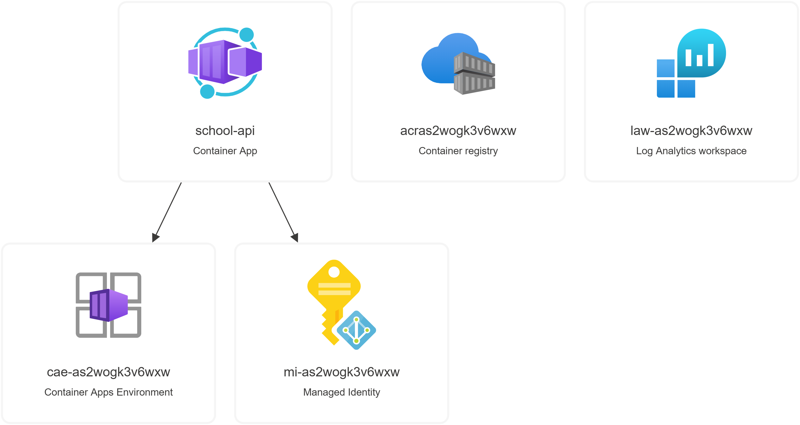

# .NET 8 Aspire Azure Container App Connecting to Azure SQL Database with Azure Entra ID

## Overview

This guide details the steps to configure a .NET 8 application deployed on Azure Container Apps to connect securely to an Azure SQL Database using Azure Entra ID for authentication. By leveraging Entra ID, you can improve security by eliminating the need to store database credentials within the application.

## Prerequisites

> 1. Azure Entra ID: Ensure you have an Azure Entra ID instance configured.
> 1. Azure SQL Database: Set up the SQL Database and configure it for Azure AD authentication.
> 1. Azure Container App: Deploy a .NET 8 application in Azure Container Apps.
> 1. .NET 8 SDK: Ensure the application uses .NET 8 SDK.

## Current Architecture

The architecture involves multiple Azure services interacting together to form a secure and scalable solution. The key components include:

> 1. Container App (school-api)
> 1. Azure SQL Database
> 1. Azure Container Registry (acras2wogk3v6wxw)
> 1. Azure Log Analytics Workspace (law-as2wogk3v6wxw)
> 1. Azure Managed Identity (mi-as2wogk3v6wxw) to access Azure SQL securely



## Solution Components

The key components of the .NET 8 Aspire solution include:

> 1. school-api: A containerized API built using .NET 8, deployed in Azure Container Apps.
> 1. Azure Container Registry: The registry that holds the container images.
> 1. Azure Managed Identity: Used to authenticate and manage access to resources like the Azure Container Registry and Azure SQL without needing explicit credentials.
> 1. Azure Log Analytics Workspace: Provides centralized logging for monitoring the application.

## Managed Identity Setup

Azure Managed Identity is employed for seamless authentication of services, ensuring a secure and passwordless experience.

### Role Assignments

For this architecture, the managed identity mi-as2wogk3v6wxw is assigned the following role:

> 1. Role: AcrPull
> 1. Resource Name: acras2wogk3v6wxw
> 1. Resource Type: Azure Container Registry
> 1. Assigned To: mi-as2wogk3v6wxw (Managed Identity)
> 1. Condition: None

This setup allows the school-api container to securely pull images from the Azure Container Registry without embedding credentials.

### Creating a System-Assigned Managed Identity for Azure SQL

A new `System-Assigned Managed Identity` will be created for school-api to authenticate against `Azure SQL`. This managed identity will handle secure database operations, eliminating the need for credentials in the API.

> 1. Role: SQL permissions (e.g., `db_datareader`, `db_datawriter`, `db_ddladmin`)
> 1. Resource: Azure SQL Database
> 1. Assigned To: `school-api` Managed Identity

This identity will have specific SQL roles assigned in the database, ensuring secure and controlled access to execute SQL queries from the API.

## Monitoring and Logging

All logs from the application, including API requests, database operations, and system metrics, are collected and stored in the Log Analytics Workspace (law-as2wogk3v6wxw). This provides a centralized dashboard for monitoring application health and identifying issues. Logs are automatically forwarded to the Log Analytics Workspace for centralized monitoring.

## 2. Adding Azure Entra ID Users to Azure SQL Database

To allow the application to authenticate with the Azure SQL Database, you need to add Azure Entra ID users. Follow these SQL commands to add users with specific roles.

### SQL Commands to Add Users

```sql
CREATE USER [app-schoolapi-dev-001] FROM EXTERNAL PROVIDER WITH DEFAULT_SCHEMA = dbo;
ALTER ROLE db_datareader ADD MEMBER [app-schoolapi-dev-001];
ALTER ROLE db_datawriter ADD MEMBER [app-schoolapi-dev-001];
ALTER ROLE db_ddladmin ADD MEMBER [app-schoolapi-dev-001];
GO

CREATE USER [school-api] FROM EXTERNAL PROVIDER WITH DEFAULT_SCHEMA = dbo;
ALTER ROLE db_datareader ADD MEMBER [school-api];
ALTER ROLE db_datawriter ADD MEMBER [school-api];
ALTER ROLE db_ddladmin ADD MEMBER [school-api];
GO
```

### Explanation:

- `CREATE USER FROM EXTERNAL PROVIDER`: Adds an Azure Entra ID user.
- Roles: Assign `db_datareader`, `db_datawriter`, and `db_ddladmin` roles for read, write, and DDL permissions.

---

## 3. Retrieving Users in Azure SQL Database

After adding users, you can use SQL queries to view and manage them within your Azure SQL Database.

### 3.1 View All Database Users

To list all users within the current database, including Azure AD users, use the following query:

```sql
SELECT name, type_desc, principal_id
FROM sys.database_principals
WHERE type IN ('S', 'E', 'X')
ORDER BY name;
```

- S: SQL local users
- E: External (Azure AD) users/groups
- X: External (Azure AD) groups

### 3.2 View Only External Users

Use this query to filter and display only Azure AD users:

```sql
SELECT name, type_desc, principal_id
FROM sys.database_principals
WHERE type_desc = 'EXTERNAL_USER'
ORDER BY name;
```

### 3.3 Check User Roles and Permissions

To view roles assigned to a particular user:

```sql
SELECT dp.name AS user_name,
       r.name AS role_name
FROM sys.database_principals dp
JOIN sys.database_role_members drm ON dp.principal_id = drm.member_principal_id
JOIN sys.database_principals r ON r.principal_id = drm.role_principal_id
WHERE dp.type_desc = 'EXTERNAL_USER'
ORDER BY dp.name;
```

### 3.4 List Server-Level Users

For server-level users and Azure AD admins, query `sys.server_principals`:

```sql
SELECT name, type_desc, principal_id
FROM sys.server_principals
WHERE type IN ('S', 'E', 'X')
ORDER BY name;
```

---

## 4. Configure the .NET 8 Application to Use Entra ID for SQL Database Access

### 4.1 Set Up the Connection String

In the application configuration file, set up a connection string that specifies Entra ID authentication.

```json
"ConnectionStrings": {
  "DefaultConnection": "Server=tcp:<YOUR_SERVER_NAME>.database.windows.net,1433;Database=<YOUR_DATABASE_NAME>;Authentication=Active Directory Default"
}
```

### 4.2 Set Up Azure Identity in Application Code

Use the `DefaultAzureCredential` class to allow the application to authenticate to Azure SQL Database.

---

## 5. Testing and Troubleshooting

1. Run the Application: Deploy the container and check if it can connect to the SQL database.
2. Azure Monitor: Use logs and Azure Monitor to track successful connections and troubleshoot errors.
3. Event Logs: Check Azure SQL Database and Entra ID logs for additional troubleshooting.

---

### Conclusion

By following these steps, you can configure a secure connection between your .NET 8 application on Azure Container Apps and Azure SQL Database using Azure Entra ID. This setup enhances security and removes the need for embedded credentials, aligning with best practices for modern cloud-native applications.
