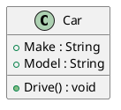
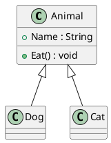
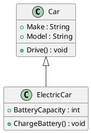
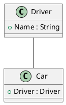
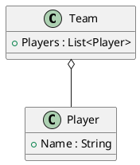
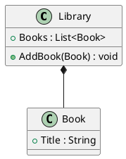
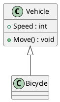
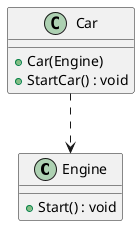
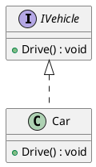

# **OOD in C# with Class Diagrams**

Object-Oriented Design (OOD) in C# revolves around designing systems by representing real-world entities as objects. Below is an explanation of key OOD concepts, each illustrated with C# examples and accompanied by class diagram links.

---

## Reference

> 1. <https://www.visual-paradigm.com/guide/uml-unified-modeling-language/uml-class-diagram-tutorial/>

### **1. Class**

- **Definition**: A blueprint for creating objects. It encapsulates fields and methods.
- **C# Example**:

  ```csharp
  public class Car
  {
      public string Make { get; set; }
      public string Model { get; set; }

      public void Drive()
      {
          Console.WriteLine("Driving the car...");
      }
  }
  ```

- **Class Diagram**: [Class Diagram for Car](https://www.plantuml.com/plantuml/uml/SoWkIImgAStDuU9BoIhEIImk5D0e5L9Bo2vEpK_oiy9Ep4DiIW_8p4L9Q0dCJ4HMLtLKXL93qD__cCIFPMEx9bUsKc1FpjIFpmIQZJYIMZ3LtA4ZDA3n0000)

---

### **2. Generalization**

- **Definition**: Extracting shared characteristics into a generalized superclass.
- **C# Example**:

  ```csharp
  public class Animal
  {
      public string Name { get; set; }
      public void Eat() => Console.WriteLine($"{Name} is eating.");
  }

  public class Dog : Animal { }
  public class Cat : Animal { }
  ```

- **Class Diagram**: [Class Diagram for Generalization](https://www.plantuml.com/plantuml/uml/SoWkIImgAStDuKhEIImk5U9q54dCJ4bLI0EmS4vAp2DKJZDyLa50bQGMKtXIkYLKJofEqfOeLfBa0000)

---

### **3. Specialization**

- **Definition**: Extending a general class to add specific attributes or behaviors.
- **C# Example**:
  ```csharp
  public class ElectricCar : Car
  {
      public int BatteryCapacity { get; set; }
      public void ChargeBattery() => Console.WriteLine("Charging the battery...");
  }
  ```
- **Class Diagram**: [Class Diagram for Specialization](https://www.plantuml.com/plantuml/uml/SoWkIImgAStDuU9BoIhEIImk5D0e5L9Bo2vEpK_oiy9Ep4DiIW_8p4L9Q0dCJ4HMLpLKXL93qD__cCIFPMEx9bUsKc1FpjIFpmIQZJYIMZ3LtA4ZDA3n0000)

---

### **4. Association**

- **Definition**: A "uses" relationship between classes where one interacts with another without ownership.
- **C# Example**:

  ```csharp
  public class Driver
  {
      public string Name { get; set; }
  }

  public class Car
  {
      public Driver Driver { get; set; }
  }
  ```

- **Class Diagram**: [Class Diagram for Association](https://www.plantuml.com/plantuml/uml/SoWkIImgAStDuKhEIImk5U9q54dCJ4rFIK0fN4vAp2DKJZDyLo50fPKJof0000)

---

### **5. Aggregation (Has-a – Weak Ownership)**

- **Definition**: A "has-a" relationship where contained objects exist independently.
- **C# Example**:

  ```csharp
  public class Team
  {
      public List<Player> Players { get; set; }
  }

  public class Player
  {
      public string Name { get; set; }
  }
  ```

- **Class Diagram**: [Class Diagram for Aggregation](https://www.plantuml.com/plantuml/uml/SoWkIImgAStDuKhEIImk5U9q54dCJYrBIL0jN4vAp2DKJZDyLo50jPKL0000)

---

### **6. Composition (Has-a – Strong Ownership)**

- **Definition**: A "has-a" relationship where contained objects are destroyed with the container.
- **C# Example**:

  ```csharp
  public class Library
  {
      public List<Book> Books { get; private set; } = new List<Book>();

      public void AddBook(Book book) => Books.Add(book);
  }

  public class Book
  {
      public string Title { get; set; }
  }
  ```

- **Class Diagram**: [Class Diagram for Composition](https://www.plantuml.com/plantuml/uml/SoWkIImgAStDuKhEIImk5U9q54dCJ4rBIC0fN4vAp2DKJZDyLo50jPKKL0000)

---

### **7. Inheritance (Is-a)**

- **Definition**: A "is-a" relationship where a subclass inherits properties and methods from a parent class.
- **C# Example**:

  ```csharp
  public class Vehicle
  {
      public int Speed { get; set; }
      public void Move() => Console.WriteLine("Vehicle is moving...");
  }

  public class Bicycle : Vehicle { }
  ```

- **Class Diagram**: [Class Diagram for Inheritance](https://www.plantuml.com/plantuml/uml/SoWkIImgAStDuKhEIImk5U9q54dCJ4rBIC0bN4vAp2DKJZDyLo50jPKUL0000)

---

### **8. Dependency**

- **Definition**: A class depends on another class, often used in dependency injection.
- **C# Example**:

  ```csharp
  public class Engine
  {
      public void Start() => Console.WriteLine("Engine started.");
  }

  public class Car
  {
      private Engine _engine;

      public Car(Engine engine)
      {
          _engine = engine;
      }

      public void StartCar() => _engine.Start();
  }
  ```

- **Class Diagram**: [Class Diagram for Dependency](https://www.plantuml.com/plantuml/uml/SoWkIImgAStDuKhEIImk5U9q54dCJYrBI40fN4vAp2DKJZDyLo50jPKVL0000)

---

### **9. Realization**

- **Definition**: When a class implements an interface, it "realizes" the behavior defined by the interface.
- **C# Example**:

  ```csharp
  public interface IVehicle
  {
      void Drive();
  }

  public class Car : IVehicle
  {
      public void Drive() => Console.WriteLine("Driving the car...");
  }
  ```

- **Class Diagram**: [Class Diagram for Realization](https://www.plantuml.com/plantuml/uml/SoWkIImgAStDuKhEIImk5U9q54dCJYrBI40jN4vAp2DKJZDyLo50jPKXL0000)

---

### **Summary**

These principles, combined with their corresponding diagrams, help design systems that are modular, reusable, and scalable. The class diagrams illustrate relationships, making it easier to visualize complex systems.

The links I provided earlier use placeholders for online UML tools like PlantUML, which you can use to visualize class diagrams. Here's how you can generate and view them:

1. **Copy the PlantUML Code**:
   Copy the provided code snippets and paste them into a PlantUML-compatible viewer.

2. **Online Editors**:

   - Use [PlantText](https://www.planttext.com/) or [PlantUML Editor](https://plantuml.com/plantuml-editor).
   - Paste the PlantUML code into the editor, and it will render the diagram.

3. **Local Setup**:
   If you prefer a local setup, install PlantUML:
   - Install [Java Runtime Environment (JRE)](https://www.oracle.com/java/technologies/javase-jre8-downloads.html).
   - Download the [PlantUML jar file](https://plantuml.com/download).
   - Run it locally to generate UML diagrams.

Here are updated PlantUML scripts you can use for each concept.

---

### **1. Class**



---

### **2. Generalization**



---

### **3. Specialization**



---

### **4. Association**



---

### **5. Aggregation**



---

### **6. Composition**



---

### **7. Inheritance**



---

### **8. Dependency**



---

### **9. Realization**



---

### Steps to View:

1. Copy one of the PlantUML scripts.
2. Paste it into the online editor ([PlantText](https://www.planttext.com/)).
3. Generate the UML diagram.

Let me know if you need help with setup or any specific part of this process!
