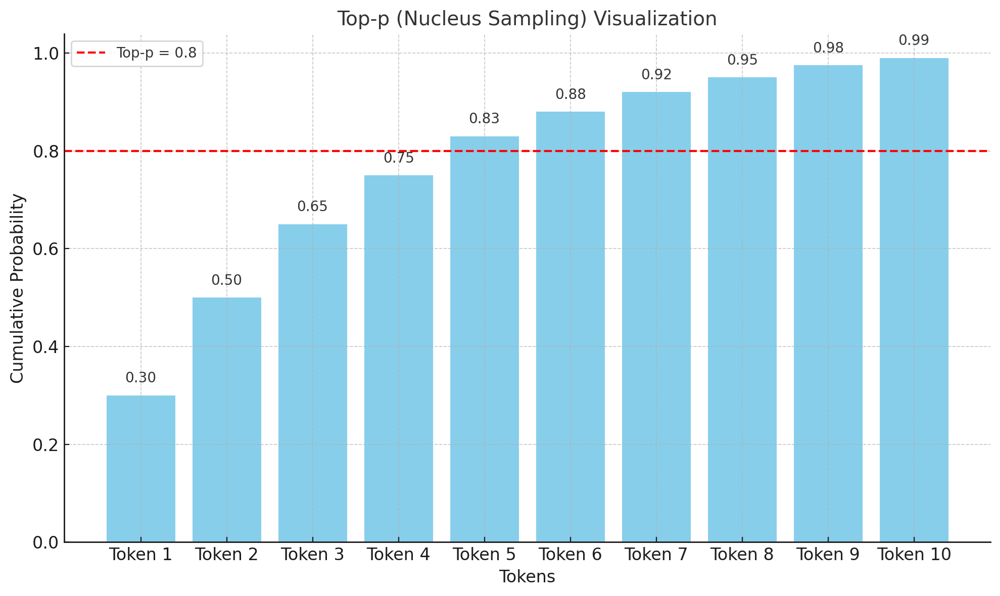

Certainly! Let’s break it down step by step, starting with **Top-p (Nucleus Sampling)** and then its connection to **hallucinations** in AI-generated text.

### 1. **Understanding Top-p (Nucleus Sampling)**

In natural language processing (NLP) models like GPT, the generation of text happens token by token (where each token could be a word or a piece of a word). When the model generates a token, it assigns probabilities to a range of possible next tokens. These probabilities represent how likely each token is to follow the previous ones, based on the model’s understanding of language.

**Top-p (Nucleus Sampling)** is a method for selecting the next token based on these probabilities.

#### **How Top-p Works:**

- **Probabilities**: For each token, the model computes a probability that indicates how likely it is to appear next in the sequence.
- **Cumulative Sum**: Top-p sampling sorts the tokens by their probability and starts summing their probabilities, beginning with the highest.
- **Threshold (p)**: You set a threshold value for p (e.g., 0.8). The model selects the smallest set of tokens whose cumulative probability is equal to or greater than p. This is called the "nucleus" of tokens.

For example:

- If p = 0.8, the model will consider tokens that collectively account for 80% of the probability mass.
- The model then samples from these tokens (randomly selecting one based on their relative probabilities).

**Key Points:**

- **Lower p**: Narrows the model’s choices to high-probability (likely) tokens.
- **Higher p**: Broadens the choices, allowing the model to select from both high-probability and some lower-probability tokens.

### 2. **Impact on Model's Text Generation**

- **Lower Top-p (e.g., 0.5 or 0.6)**: The model will only consider tokens with a high likelihood, leading to more conservative and predictable responses. It avoids tokens that are less likely to make sense in the context, making the generation more focused and stable.
- **Higher Top-p (e.g., 0.9 or 1.0)**: The model can include a wider range of tokens, including those with lower probabilities. This adds diversity and creativity to the output but can increase the risk of generating odd, irrelevant, or nonsensical tokens.

### 3. **What Are Hallucinations in AI?**

In the context of AI, **hallucinations** refer to instances when the model generates text that:

- **Is factually incorrect**.
- **Doesn’t make sense** in the context of the conversation or prompt.
- **Invents information**, such as making up facts, statistics, or even entities (like people, places, or events) that don’t exist.

Hallucinations occur because the model is designed to predict the next most likely word based on patterns in the data it was trained on. It doesn’t have a built-in sense of "truth" or "facts." Sometimes, patterns in the data can lead to plausible-sounding but false information.

### 4. **How Top-p Influences Hallucinations**

Top-p sampling can have an impact on hallucinations:

- **Lower Top-p**:

  - The model sticks to high-probability tokens, reducing the chance of hallucinations.
  - This is because high-probability tokens are more likely to be grounded in patterns that make sense, either linguistically or factually.

- **Higher Top-p**:
  - The model has a wider range of tokens to choose from, including some low-probability ones.
  - This increases the risk of hallucinations, as low-probability tokens might not always be the most sensible or accurate continuation of the sentence.

### 5. **Practical Example**

Imagine the model is answering a question about a famous historical figure:

- **Lower Top-p (e.g., 0.5)**: The model is likely to stick to the most common and accurate information about that figure (e.g., birthdate, notable achievements, etc.).
- **Higher Top-p (e.g., 0.9)**: The model might introduce less likely information, perhaps even inventing a quote or an event that isn’t factually true, leading to a hallucination.

### 6. **Balancing Creativity and Accuracy**

- When **Top-p** is set lower, the model is more reliable, grounded, and less prone to hallucination but may become repetitive or dull.
- With a **higher Top-p**, the model becomes more creative and diverse but also more prone to generating hallucinations.

To **reduce hallucinations**, it's usually recommended to:

- Use a **lower Top-p** or **lower temperature**.
- Adjust other parameters like temperature to balance between creativity and factual accuracy.

### Summary

- **Top-p** controls how many tokens the model considers when generating the next word, based on cumulative probability.
- A **lower Top-p** leads to safer, more likely choices, reducing hallucinations.
- A **higher Top-p** introduces more diversity but can lead to hallucinations.

In this graph, the x-axis represents tokens, while the y-axis represents cumulative probabilities. The red dashed line shows a threshold for Top-p (in this case, 0.8 or 80%).

Top-p (nucleus sampling) works by selecting tokens based on their cumulative probability until the total reaches a certain threshold (e.g., 0.8). Here’s how it operates step by step:

1. **Token Probability**: Each token has a probability assigned to it, based on the model’s confidence.
2. **Cumulative Probability**: The model sums these probabilities starting with the most likely tokens.
3. **Top-p Cutoff**: When the cumulative sum reaches a certain percentage, say 80%, the model only selects from the tokens whose cumulative probability lies under this threshold (tokens to the left of the red line).
4. **Hallucination Impact**: If Top-p is set too high, the model might pick tokens with very low likelihood, potentially increasing the chance of generating "hallucinations" (incorrect or less grounded answers). Setting Top-p lower reduces randomness by excluding these lower probability tokens.

Let me know if you need more details!
